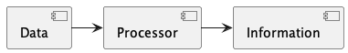
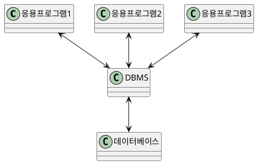
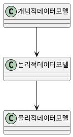
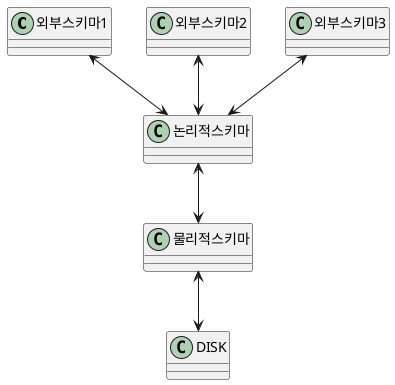
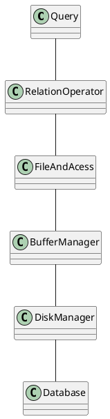

# 데이터베이스 개요

## 목차

1. 정보와 데이터
2. 정보 시스템
3. 데이터베이스 개요
4. 데이터베이스 관리 시스템

## 데이터와 정보

- 데이터

  - 현실세계로부터 단순한 관찰이나 측정을 통해 수집된 사실 이나 값
- 정보

  - 데이터를 처리해서 얻어진 결과
- 데이터에서 정보를 추출하는 방법을 데이터 처리, 넓은 의미로 `

  ``정보 처리 

  ` hi `

  $$
  I = P(D)
  $$

  

### 데이터

- 관찰된 사실이나 값
- 값에는 숫자, 문자열, 문자가 포함

### 정보

- 적절한 의사결정을 할 수 있게 하는 지식
- 데이터의 유효한 해석이나 데이터 상호간의 관계
- 정보 추출 방법
  - ``정보 처리 ``= ``자료 처리 ``

## 정보 시스템

- 조직체에 필요한 데이터를 수집, 조직, 저장하고 필요시 유효한 정보 생성 및 분배
- 조직의 운영과 외부적 상황에 관련된 과거, 현재, 예측적 미래에 대한 정보를 조직적으로 제공
  - 의사 결정 과정에 적시에 정확한 정보 제공
  - 조직의 관리, 기획 통제, 운영을 조정
- MIS(Management Information System) - 경엉 정보 시스템
  - 조직 내에서 발생한 데이터를 수집하여 정보화된 시스템으로 관리하여 경영에 필요한 의사 결정 정보를 생성하는 시스템
- ERP(Enterprise Resource Planing) - 전사적 자원 관리
  - 조직 내 모든 부서에서 발생하는 데이터를 통합하여 자원을 효율적으로 관리하고, 기업의 경쟁력 강화 및 비용 절감을 목적으로 하는 시스템
  - ex) oracle
- CRM(Customer Relationship Management) - 고객 관계 관리
  - 고객 관계 관리 시스템으로, 기업의 고객과 관련된 데이터를 수집하여 고객과의 관계를 유지하고 관리하는 시스템
  - ex) SAP, Oracle, 통신사
- SCM(Supply Chain Management) - 공급 사슬 관리
  - 공급 사슬 관리 시스템으로, 기업의 공급망 전 과정을 통제하고 관리하여 제품의 생산 및 배송을 효율적으로 관리하는 시스템

## 데이터베이스

- 같은 데이터가 다른 목적을 가진 여러 으용에 중복되어 사용될 수 있다는 공용 개념의 기초
- 한 조직의 여러 응용시스템들이 함께 사용 할 수 있도록 통합되고 저장된 데이터의 집합
  - 통합된 데이터
    - 데이터 베이스에서는 똑같은 데이터가 원칙적으로 중복되어 있지 않다는 것을 말함. 데이터의 중복은 일반적으로 관리상 복잡한 부작용을 초래
  - 저장된 데이터
    - 디스크 등과 같이 컴퓨터가 접근할 수 있는 저장 매체에 저장된 데이터
  - 운영 데이터
    - 조직의 존재목적이나 기능을 수행하는데 없어서는 안되는 데이터의 집합
    - 단순한 입출력 데이터나, 작업처리를 위해 일시적으로 필요한 임시적인 데이터는 운영데이터로 취급안함
  - 공용 데이터
    - 조직에 있는 여러 응용 시스템들이 공동으로 소유하고 유지, 서로 다른 목적으로 데이터를 공동으로 이용
- 통합 저장된 운영 데이터로서의 특징
  - 실시간 접근성
    - 임의적이고 비정형적인 질의에 대해 실시간으로 응답할 수 있어야 함.
    - 실시간 처리는 초 단위를 넘기면 안됨
  - 지속적인 변화
    - 어느 한 순간에 저장된 내용은 데이터베이스의 상태, 즉 상태는 동적임
    - 데이터 베이스는 삽입, 삭제, 갱신으로 항상 변하고, 현재 정확한 데이터를 유지해야함
  - 동시 사용
    - 여러 사용자가 동시에 데이터에 접근이 가능해야함
    - 한 가지 특정 목적으로 하나의 응용 프로그램에 의해 접근되는 데이터와 다름
    - 여러 응용 프로그램이 같은 데이터를 직렬적으로 공유하여 사용하는 개념과도 다름
    - 관리와 조직 측면에서 복잡해지는 이유
  - 내용 참조
    - 데이터가 가지고 있는 값에 따라 참조(레코드의 주소나 위치에 의해 참조되는게 아님)
    - 사용자가 참조하기를 원하는 데이터의 조건을 명세하면 , 이 조건을 만족하는 모든 레코드들은 위치에 상관없이 논리적 단위로 취급되고 접근

## DBMS 데이터베이스 관리 시스템

- DBMS(Data Base Management System)
- 방대한 데이터의 집합체를 유지, 관리, 이용하는데 도움을 주도록 설계된 소프트웨어
- 데이터의 종속성과 중복성의 문제를 해결하기 위해 제안된 시스템

# 데이터베이스 관리 시스템(DBMS)의 기능

데이터베이스 관리 시스템(Database Management System, DBMS)의 기능은 크게 데이터 정의 기능, 데이터 조작 기능, 데이터 제어 기능으로 나눌 수 있습니다.

## 데이터 정의 기능

- 데이터 모델과 데이터베이스를 물리적 저장 장치에 저장하는데 필요한 명세 포함
- 논리적 구조와 물리적 구조의 매핑을 명세
- 데이터의 무결성(Integrity)을 유지하기 위한 제약 조건(Constraint)을 정의

## 데이터 조작 기능

- 사용자와 데이터베이스 사이의 인터페이스를 위한 수단 제공
- 데이터 검색, 삽입, 수정, 삭제 등의 작업을 수행할 수 있는 데이터 조작 언어(DML, Data Manipulation Language)를 제공
- 사용하기 쉽고 자연스러워야 하며, 명확하고 완전해야 함
- 접근이나 처리가 비효율적 이어서는 안됨

## 데이터 제어 기능

- 데이터의 갱신, 삽입, 삭제 작업이 정확히 실행되며, 데이터의 무결성을 제공
- 보안과 권한 검사를 수행하여 불법적인 접근을 방지
- 동시 사용자에 대한 병행성(Concurrency) 제어를 수행하여 데이터 일관성을 유지
- 데이터베이스 백업과 복원, 회복 기능 제공

## 데이터베이스 관리 시스템

- 파일 시스템과 DBMS
- DBMS에서 데이터의 명세 및 저장
- 데이터 모델
- 데이터 독립성
- 데이터베이스 질의
- 동시 접근 및 복구
- 트랜잭션
- DBMS의 구조
- 상용/오픈소스 데이터베이스 관리 시스템

DBMS에서 데이터의 명세 및 저장

- 저장될 데이터를 데이터 모델 형식으로 정의
- 데이터모델
  - 디스크 수준에서 데이터 저장 내역을 감추고 수준을 데이터를 명세
  - 현실 세계의 정보들을 컴퓨터에 표현하기 위해 단순화, 추상화해 체계적으로 표현한 개념적 모형
  - DBMS의 데이터 저장 방식과 실제 세계의 간극을 좁히기 위해 개념 데이터 모델을 적용

## 데이터 모델

- 데이터 또는 정보를 설명하기 위한 표기법
  - 데이터의 구조
    - 컴퓨터에서 데이터를 구현하는데 사용되는 데이터 구조는 데이터베이스 시스템 관점에서 물리적 데이터 모델로 언급되기도 하지만, 데이터 관점에선 다르다
      . 데이터베이스 관점에선 데이터 모델은 데이터의 물리적 구조보다 높은 레벨인 개념적 관점에서 언급
  - 데이터에 대한 작업
    - 데이터 모델은 데이터에 수행 할 수 있는 작업을 제한. 데이터에 대한 작업을 제한해
      데이터베이스의 작업을 높은 수준에서 설명하며, 데이터베이스 관리 시스템이 작업을 효율적으로 구현할 수 있도록 함
  - 데이터에 대한 제약 조건
    - 데이터 모델은 일반적으로 데이터가 무엇인지에 대한 제약 사항을 설명하는 방법이 포함.
      이 제약 조건은 아주 복잡한 데이터 한계에 대해 단순한 방법으로 범위를 지정
- 주요 데이터 모델
  - 관계 데이터 모델
    - 논리적 데이터베이스 모델중 가장 널리 사용
    - 하나의 개체에 대한 데이터를 릴레이션이라 부르는 테이블 형태의 집합으로 데이터베이스에 저장
      . 관계형 모델은 데이터를 표현하는데 있어서 매우 강력한 표현력을 가짐
  - 반정형 데이터 모델
    - 반정형 데이터모델은 테이블, 배열보단 트리나 그래프와 유사, xml, json 형식처럼
      다양한 형태를 가질때 적용하면 좋음
- 기타 데이터 모델
  - 네트워크 데이터 모델
  - 계층형 데이터 모델
  - 객체 지향 데이터 모델

## 데이터 독립성

``내용추가해야함.``

## 데이터베이스 질의

- 데이터 베이스에서 정보를 얻기 위한 난이도에 따라 데이터베이스의 가치가 결정
- 데이터를 얻기 위한 일반적인 질문의 전산학적인 구현
- DBMS는 일반적으로 질의를 만들 수 있는 질의어를 제공

  - 데이터 조작어(DML)
  - 데이터 정의어(DDL)
  - 데이터 제어어(DCL)
- 데이터베이스 관리 시스템에선 SQL이란 질의어를 사용
- 관계해석

  - 수학적 논리, 정형 질의어, 직관적이고 정확한 의미
- 관계대수

  - 연산자들의 합성을 바탕, 정형 질의어, 표현력은 관계 해석과 동일
- 데이터 언어 3가지

  - DML : 삽입 삭제 수정 조회의 역할, 사용자가 입력한 언어를 처리
  - DDL : 저장된 데이터의 스키마를 정의해 데이터 저장형식을 정의
  - DCL : 데이터 베이스에 대한 접근을 제어하기 위한 언어요소로, 데이터 대해 접근 권한은 허가하고 박탈하는데 사용됩니다.

## 동시 접근 및 복구

- 데이터베이스에는 수 많은 사용자가 동일한 데이터에 동시 접근함.
  - 각 사용자의 요구사항을 상호 독립적으로 수행
  - DBMS는 다른 사용자가 동일한 데이터에 접근하고 있다는 것을 사용자 관점에서 무시해도 되도록 동작
- 시스템의 장애 순간에도 일관성을 유지할 수 있도록 동작
  - 장애 발생 순간에 동작에 참여중이던 데이터에 대한 일관성 유지
  - 시스템이 재시동된 후 모든 데이터를 일관성 있는 상태로 유지해야함.

공유 자원의 문제

1. 극장 좌석 예약
2. 은행 데이터베이스
   ``
   해결법
   - 동시접근을 제어
     - 동시 접근을 제어해 사용자들이 동일한 데이터에 동시에 접근하고 있다는 것을 무시해도 되도록 지원

## 트랜잭션

- 분해가 불가능한 프로그램의 실행 단위
- ACID

  1. Atomicity: 원자성
  2. Consistency : 일관성
  3. Isolation : 격리성
  4. Durability : 지속성
- 원자성과 지속성을 위해 데이터베이스 로그와 로그우선기록을 사용
- 격리성을 위해 잠급 규약을 사용
- 일관성을 위해 제약 조건 사용

### 로그 우선 쓰기

- 트랜잭션이 데이터베이스를 갱신하면 주기억 장치의 데이터베이스 버퍼에 갱신 사항을 기록하고,
  로그버퍼에는 이에 대응 되는 로그 레코드를 기록하는 방식
- 데이터 베이스 버퍼가 로그 버퍼보다 먼저 디스크에 기록되면 로그 버퍼가 디스크에 기록되기전에 시스템이 다운되었다가
  다시 기동되었을때 데이터베이스 버퍼와 로그 버퍼의 내용이 사라진다.
  이는 로그 레코드가 없어서 이전 값을 알 수 없으므로, 트랜잭션의 취소가 불가능

## 데이터베이스 관리 시스템 구조

- 쿼리 최적하기와 실행 : 데이터의 구조와 통계를 이용해 효율적인 수행 계획을 수립하고 실행
- 관계 연산자 : 데이터에 대한 질의를 생성
- 파일과 접근 방식 : 여러 형태의 파일내의 페이지를 추적감시하여 한 페이지 내에 정보들을 조직하는 방법을 수행
- 버퍼 관리자 : 메모리의 버퍼에 적재된 주 기억 장치 공간의 데이터를 프레임 단위로 구분해 처리
- 디스크 관리자 : 데이터가 저장될 디스크의 공간을 관리

## 데이터베이스 관리 시스템의 장점

- 데이터 독립성
- 효율적인 데이터 접근
- 데이터 무결성과 보안성
- 데이터 관리
- 동시성 제어 및 장애 복구
- 응용 프로그램 개발 시간 감소

## TIP!

- mysql은 전부다 멀티 바이트
-
