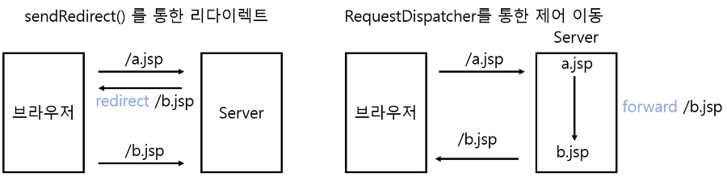
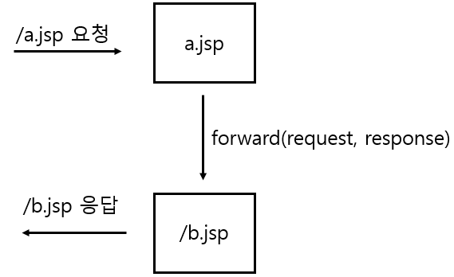

# RequestDispatcher

## HttpsServletResponse#sendRedirect()와의 차이점
- sendRedirect()를 통해 지정한 경로로 이동 가능
- 그러나 http리다이렉션을 이용해, 브라우저에 경로를 요청후 다시 재요청하는 방식
- 두번의 트랜잭션으로, 최초에 받은 요청중에 처리한 내용을 리다이렉트 된 요청안에서 공유 x

## RequestDispatcher 획득
1. ServletContext로 얻는 방법
```java
호출 대상을 web.xml에 지정한 서블릿 이름(<servlet-name>)으로 지정하는 방법

ServletContext context=this.getServletContext();

RequestDispatcher dispatcher = context.getNamedDispatcher("helloServlet");         

호출 대상을 URL 경로로 지정하는 방법. 웹어플리케이션 루트경로를 기준으로 절대경로만 지정할 수 있습니다.

ServletContext context = this.getServletContext(); 

RequestDispatcher dispatcher = context.getRequestDispatcher("/hello");       
```
2. SelvetRequest로 얻는 방법

```java
RequestDispatcher dispatcher = request.getRequestDispatcher("/hello");                    

```


## RequestDispatcher의 forward()
<p>forward()메서드는 대상 자원으로 제어를 넘기는 역할.
</br>
브라우저에서 /a.jsp로 요청 했을 때, /a.jsp는 forward를 실행하여 /b.jsp로 제어를 넘길수 있음.
<br/>
제어를 넘겨받은 /b.jsp는 

</p>
