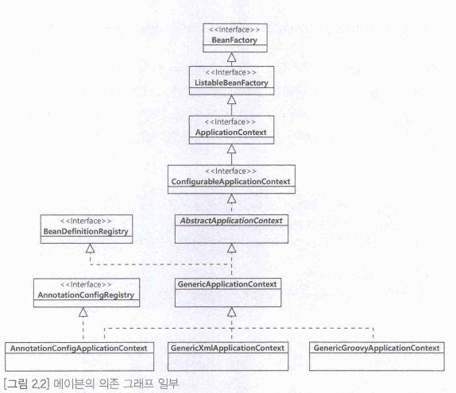

# IOC(Inversion of Control) 컨테이너
## Inversion of Control
- 의존 : 클래스내에 다른 클래스를 변수로 사용할 때, 설정된 속성을 통해 정의함.
- 설정된 속성을 통해 정의
  - 팩토리메소드의 반환값
  - 팩토리메소드의 파라미터에 의해 정의
  - 생성자로 정의
- Spring 컨테이너에서 빈을 생성할때 주입
  - 즉 컨테이너에서 생성한 MessageService를 MessagePrinter로 주입
```java
public class MessagePrinter {
    // MessagePrinter객체내에 MessageService 변수 생성
    private MessageService messageService;
    // MessagePrinter는 MessageService에 의존하는 객체
    public MessagePrinter(MessageService messageService) {
        this.messageService = messageService;
    }

    public void printMessage(String message) {
        this.messageService.sendMessage(message);
    }
}
```
@startuml

title MessagePrinter 클래스

class MessagePrinter {
    - messageService: MessageService
    + MessagePrinter(messageService: MessageService)
    + printMessage(message: String): void
}

class MessageService {
    + sendMessage(message: String): void
}

MessagePrinter -> MessageService : 의존

@enduml

# ApplicationContext 인터페이스
- 애플리케이션 구성 요소에 엑세스
- 파일 리소스를 로드 할 수 있는 기능
- 등록된 리스너에 이벤트를 게시 할 수 있는 기능
- 국제화를 지원하는 메시지를 해결하는 기능

```java
public class MainApp {

    public static void main(String[] args) {
        // 부모 ApplicationContext 생성
        ApplicationContext parentContext = new ClassPathXmlApplicationContext("parent-context.xml");

        // 자식 ApplicationContext 생성
        ApplicationContext childContext = new ClassPathXmlApplicationContext(new String[]{"child-context.xml"}, parentContext);

        // 자식 ApplicationContext에서 빈 참조
        MessagePrinter printer = childContext.getBean("printer", MessagePrinter.class);
        printer.printMessage("Hello, world!");
    }
}

```

