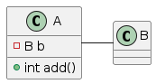
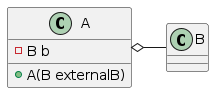
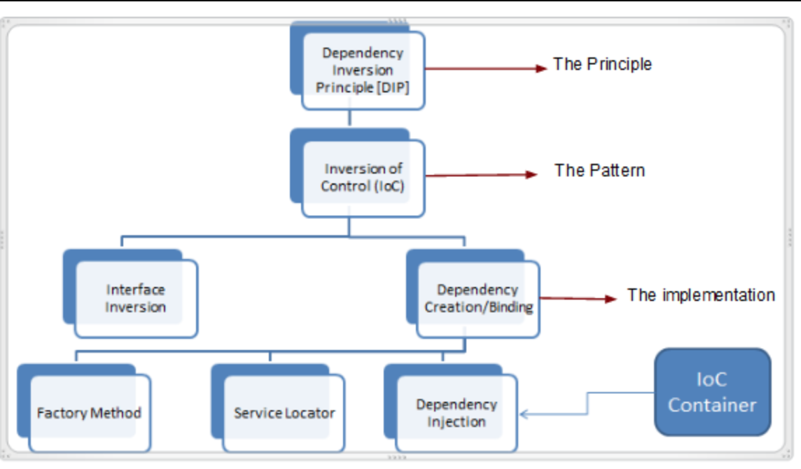
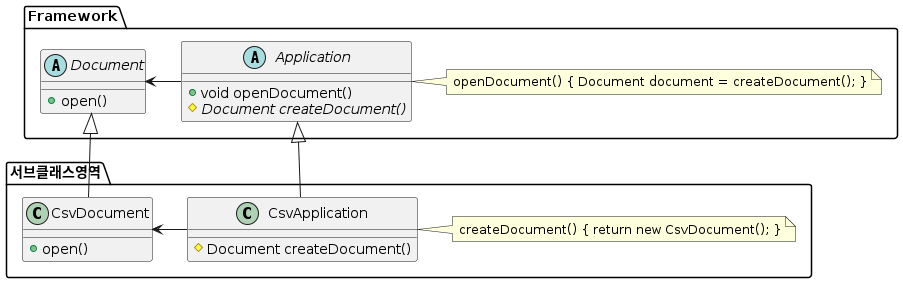

[스프링 프레임워크](https://docs.spring.io/spring-framework/docs/current/reference/html/index.html)
# 의존성
## 의존성 정의
- 코드에서 두 모듈간의 연결을 의존성이라고 합니다.
- 객체지향언어에서 두 클래스 간의 관계를 말하기도 합니다.
## 의존성 종류
- 의존관계
- 연관관계
- 집합관계
- 합성관계

## 의존관계
- 클래스 필드로 다른 클래스의 객체를 가지고 있는 관계


```java
public class B {
    private int numB;
    
    public int getNumB() {
      return this.numB;
    }
}

public class A {
    private int numA;
    
    // add 메소드가 반환한 이후에는 B 클래스의 b 객체는 제거된다. 
    public int add(B b) {
      return numA + b.getNumB();
    }
}
```

## 연관관계
- 클래스 필드로 다른 클래스의 객체를 가지고 있는 관계


```java
public class B {
    private int numB;
    
    public int getNumB() {
      return this.numB;
    }
}

public class A {
    private int numA;
    private B b;
    
    // add 메소드가 반환한 이후에도 B 클래스의 b 객체는 여전히 남아 있다.
    public int add() {
      return numA + this.b.getNumB();
    }
}
```

## 집합관계
- Assocation(연관관계) 의 특수한 형태
- 클래스 A 와 클래스 B 의 생명주기는 반드시 일치 하지 않는다



```java

public class B {
    private int numB;
    
    public int getNumB() {
      return this.numB;
    }
}

public class A {
    private int numA;
    private B b;
    
    public A(B externalB) {
        this.b = externalB;
    }
}
```

## 합성관계

# 의존성 주입
## Dependency Injection (DI)
- IoC 의 패턴 중에 하나
- DI = Dependency Injection
- Object 간의 의존성을 낮춘다.
- 외부에서 객체를 생성하고 전달한다.
  

## Dependency Inversion Princlple


- 상위 모듈이 하위 모듈에 의존관계를 가지지 않도록 구현해야 합니다.
- 추상클래스는 그 구현체의 내용에 의존관계를 가지지 않는다.
- 구현체가 추상클래스에 의존관계를 가질 수 있다.

## DI 의 예 - Factory Method 패턴
[FactoryMethod](https://ko.wikipedia.org/wiki/소프트웨어_디자인_패턴)

## Factory Method
### 문제
- 사용자에게 다양한 문서를 읽어서 객체로 결과를 반환하는 프레임워크 개발을 해야 합니다.
- Application 클래스와 Document 클래스로 추상화 할수 있는데, 이 두 클래스는 모두 추상 클래스이고 이 클래스들을 상속해서 문서의 종류에 따른 대응을 할 수 있습니다.
- Application 클래스는 언제 Document 클래스를 생성하고 사용해야 하는지는 알 수 있지만 프레임워크에서 구체적으로 어떤 문서를 처리할 Document 를 생성해야 하는지는 결정 할 수 없습니다.

### 해법
- Document 의 서브클래스 중 어느 클래스를 생성하는 지는 Application 클래스의 서브클래스가 결정하도록 설계합니다.
- Application 클래스의 서브클래스는 추상화된 createDocument()메소드를 정의하여 적당한 Document 클래스의 서브클래스를 반환하도록 합니다.
- createDocument() 메소드를 factory method 라고 부릅니다.



### 구현 코드
- feature/pattern_factory_method
- Application.java
  - 어떤 Document 를 처리할지 Application 추상 객체에서 결정하지 않습니다.
```java
package com.nhnacademy.edu.springframework.greeting.factorymethod.framework;

public abstract class Application {
    public void openDocument() {
        // do something
        Document document = createDocument();
        document.open();
        // do something
    }

    // 구현 객체가 runtime 에 결정된다.(Dependency Injection)
    protected abstract Document createDocument();
}

```
- Document.java
```java
package com.nhnacademy.edu.springframework.greeting.factorymethod.framework;

public abstract class Document {
    public abstract void open();
}
```

### 구현 코드
# Dependency Injection

- DI (Dependency Injection) 정의
>프로그래밍에서 구성 요소간의 의존관계가 소스코드 내부가 아닌 외부의 설정파일 등을 통해 정의되게 하는 디자인 패턴 중의 하나
프로그래밍에서 구성 요소간의 의존관계가 소스코드 내부가 아닌 외부의 설정파일 등을 통해 정의되게 하는 디자인 패턴 중의 하나
- DI는 디자인 패턴이다. 핵심 원칙은 의존성 이슈로부터 행동(behaviour)를 분리시키는 것이다.
- DI는 IoC의 구현일뿐이다.

## Spring framework Dependency Injection(Bean Wiring) 방법
- Constructor Injection : 생성자 주입
- Setter Injection : 수정자 주입
- Field Injection : 필드 주입
## 의존성 주입 개요
- 생성자 주입: 생성자 호출 시점에 1회 호출 되는 것이 보장.
    - 주입받은 객체가 변하지 않거나, 반드시 객체의 주입이 필요한 경우
- 수정자 주입 : setter를 통해 의존관계를 주입( 주입받는 객체가 변경될 가능성이 있는 경우)
- 필드 주입 : 필드에 바로 의존관계를 주입
## Constructor Injection
- 생성자를 통한 의존성 주입
- Bean을 정의할때 constructor-arg 태그를 추가하여 주입할 수 있다.

## Constructor Injection 의 예 (XML)
- feature/constructor_injection
- 생성자 주입 방식을 사용하여, GreetingService 스프링 빈에 Greeter 스프링 빈을 주입하는 예제.
- GreetingService 가 Greeter 를 생성자 인자로 받을 수 있도록 생성자를 추가합니다.
```java
    // 생성자 주입 방식을 사용하므로, 주입 대상 스프링빈에 적절한 생성자가 필요하다.
    public GreetingService(Greeter greeter) {
        this.greeter = greeter;
    }

```
- GreetingService 를 빈으로 등록합니다.
- GreetingService 의 생성자를 이용해서 koreanGreeter 빈을 주입합니다.
```xml
  <bean id="greetingService" class="com.nhnacademy.edu.springframework.greeting.GreetingService" >
        <constructor-arg ref="koreanGreeter" />
    </bean>
```
- GreetingService 빈을 greetingService 으로 빈을 선언하였기 때문에 런타임에 ApplicationContext 에 GreetingService객체가 생성되어 등록되어 있습니다.(IoC)
- constructor-arg 를 이용하여 koreanGreeter 를 의존성으로 주입합니다.
- 이를 조회하여 실행합니다.
```java
package com.nhnacademy.edu.springframework.greeting;

import org.springframework.context.support.ClassPathXmlApplicationContext;

public class ConstructorInjectionMain {

    public static void main(String[] args) {
        try (ClassPathXmlApplicationContext context = new ClassPathXmlApplicationContext("beans.xml")) {
            GreetingService service = context.getBean("greetingService", GreetingService.class);
            service.greet();
        }
    }
}
```
## Setter Injection
- feature/setter_injection
- setter 메서드를 이용하여 의존성 주입
- 클래스를 생성할때 setter 메소드를 작성하여 의존성을 주입하도록 한다.
## Setter Injection 의 예
- GreetingProcessor 가 Greeter 를 setter 메소드 인자로 받을 수 있도록 setter 메소드를 추가합니다.

```java
//    final keyword 이므로 객체를 생성한뒤 greeter 변수에 값을 할당할 수 없다.
//    private final Greeter greeter;
    private Greeter greeter;

//    Setter Injection 기본 생성자가 필요하다.
    public GreetingService() {
    }
    
    public void setGreeter(Greeter greeter) {
        System.out.println("setGreeter invoked!");
        this.greeter = greeter;
    }
```
- GreetingProcessor 의 setter 메소드를 이용해서 koreanGreeter 빈을 주입합니다.
```xml
  <bean id="greetingService" class="com.nhnacademy.edu.springframework.greeting.GreetingService" >
        <property name="greeter" ref="koreanGreeter" />
    </bean>
```
## Autowired Injection(Setter-Injection)
- autowired 속성을 사용하여 자동으로 주입
- autowired injection 은 다음의 방식을 사용할 수 있습니다.
  - byType : 적절한 타입을 찾아서 주입
  - byName : 이름이 같은걸 찾아서 주입
  - constructor : 
## Autowired Injection (byType)
- feature/autowired_injection_type
- GreetingService 에 autowire 설정을 추가합니다.
```java
<!--    byType으로 autowire 를 하려면 해당되는 type 의 bean 이 1개만 존재해야 합니다.-->
<!--    <bean id="englishGreeter" class="com.nhnacademy.edu.springframework.greeting.service.EnglishGreeter" scope="singleton">-->
<!--    </bean>-->

    <bean id="koreanGreeter" class="com.nhnacademy.edu.springframework.greeting.service.KoreanGreeter" scope="prototype">
    </bean>

    <bean id="greetingService" class="com.nhnacademy.edu.springframework.greeting.GreetingService" autowire="byType">
    </bean>
```
## Autowired Injection (byName)
- feature/autowired_injection_name
- GreetingService 에 autowire 설정을 추가합니다.
```xml
   <bean id="englishGreeter" class="com.nhnacademy.edu.springframework.greeting.service.EnglishGreeter" scope="singleton">
    </bean>

    <bean id="koreanGreeter" class="com.nhnacademy.edu.springframework.greeting.service.KoreanGreeter" scope="prototype">
    </bean>

    <bean id="greetingService" class="com.nhnacademy.edu.springframework.greeting.GreetingService" autowire="byName">
    </bean>
```
- autowire 속성을 byName 으로 설정했기 때문에 setter 메소드의 이름을 setKoreanGreeter 로 수정합니다.

```java
public class GreetingService {
    private Greeter greeter;

    public void setKoreanGreeter(Greeter greeter) {
        System.out.println("setGreeter invoked!");
        this.greeter = greeter;
    }

    // 기본 생성자가 필요하기 때문에 아래는 주석처리
//    public GreetingService(Greeter greeter) {
//        this.greeter = greeter;
//    }

    public void greet() {
        greeter.sayHello();
    }
}

```
# TIP
~~~

상위 모듈이 하위 모듈에 의존관계를 가지지 않도록 구현해야함.
순환 참조하면 안되는 이유
~~~

# Annotation
## Annotation 기반 설정
- feature/annotation_required
- XML 방식으로 Bean 의존성 주입을 Annotation으로 구현할 수 있습니다.
## Annotation 기반 설정
- Annotation 기반 설정을 가능하게 하려면 설정을 변경해야 합니다.

 - 지금까지 작성한 bean.xml 에 <context:annotation-config /> 을 추가합니다. 
 - context 네임스페이스가 동작하도록 도 수정해야 합니다.
```xml
<?xml version="1.0" encoding="UTF-8"?>
<beans xmlns="http://www.springframework.org/schema/beans"
       xmlns:xsi="http://www.w3.org/2001/XMLSchema-instance"
       xmlns:context="http://www.springframework.org/schema/context"
       xsi:schemaLocation="
        http://www.springframework.org/schema/beans http://www.springframework.org/schema/beans/spring-beans.xsd
        http://www.springframework.org/schema/context http://www.springframework.org/schema/context/spring-context.xsd">

    <!-- annotation설정을 위해 추가-->
    <context:annotation-config/>

    <bean id="englishGreeter" class="com.nhnacademy.edu.springframework.greeting.service.EnglishGreeter" scope="singleton">
    </bean>

    <bean id="koreanGreeter" class="com.nhnacademy.edu.springframework.greeting.service.KoreanGreeter" scope="prototype">
    </bean>

    <bean id="greetingService" class="com.nhnacademy.edu.springframework.greeting.GreetingService" autowire="byName">
    </bean>
    
</beans>
```
## Annotation 기반 설정 - @Required
- 반드시 의존성이 주입되어야 함을 강제하는 Annotation 이다.
- spring framework 5 부터 deplicated 되었습니다.
  - deplicated : "사용을 권장하지 않으며 차기 버전에서 삭제될 수 있습니다" 라는 뜻
  - 하지만 Legacy 어플리케이션에서는 사용하고 있을수 있으니 기억해 둡시다.
## Annotation 기반 설정 - @Required
## 사용법(bean.xml)
- bean.xml 에 RequiredAnnotationBeanPostProcessor 를 Bean 으로 등록합니다.
```xml
<?xml version="1.0" encoding="UTF-8"?>
<beans xmlns="http://www.springframework.org/schema/beans"
       xmlns:xsi="http://www.w3.org/2001/XMLSchema-instance"
       xmlns:context="http://www.springframework.org/schema/context"
       xsi:schemaLocation="
        http://www.springframework.org/schema/beans
        http://www.springframework.org/schema/beans/spring-beans.xsd
        http://www.springframework.org/schema/context
        http://www.springframework.org/schema/context/spring-context.xsd">

    <!-- annotation설정을 위해 추가-->
    <context:annotation-config />
    
    <!-- @Required 애너테이션 사용을 위해 추가 -->
    <bean class="org.springframework.beans.factory.annotation.RequiredAnnotationBeanPostProcessor" />
    
    .. 생략 ...
    
</beans>
```
## @Required
- 의존성 주입이 반드시 성공해야 한다는 보장이 필요한 setter 메소드에 @Required 를 설정합니다.
```java
public class GreetingService {
    private Greeter greeter;

    @Required
    public void setKoreanGreeter(Greeter greeter) {
        System.out.println("setGreeter invoked!");
        this.greeter = greeter;
    }
    
    -- 이하 생략 --
```
## bean.xml
- @Required 작동을 확인하기 위해 GreetingService 빈 설정에서 autowire 속성을 제거하고 실행 합니다.

```xml
    <bean id="greetingService" class="com.nhn.edu.springframework.ioc.GreetingService" >
    </bean>

```
- SetterInjectionMain 실행 결과
```prompt
Caused by: org.springframework.beans.factory.BeanInitializationException: Property 'koreanGreeter' is required for bean 'greetingService'
	at org.springframework.beans.factory.annotation.RequiredAnnotationBeanPostProcessor.postProcessPropertyValues(RequiredAnnotationBeanPostProcessor.java:158)
	at org.springframework.beans.factory.support.AbstractAutowireCapableBeanFactory.populateBean(AbstractAutowireCapableBeanFactory.java:1436)
	at org.springframework.beans.factory.support.AbstractAutowireCapableBeanFactory.doCreateBean(AbstractAutowireCapableBeanFactory.java:619)
	... 11 more
```
## Annotation 기반 설정 - @Autowired


## bean.xml
- @Autowired 를 이용하여 XML 의 autowire 속성을 대신할 수 있습니다.
- 아래에서 autowire 속성을 제거합니다.
```xml

<?xml version="1.0" encoding="UTF-8"?>
<beans xmlns="http://www.springframework.org/schema/beans"
       xmlns:xsi="http://www.w3.org/2001/XMLSchema-instance"
       xmlns:context="http://www.springframework.org/schema/context"
       xsi:schemaLocation="
        http://www.springframework.org/schema/beans
        http://www.springframework.org/schema/beans/spring-beans.xsd
        http://www.springframework.org/schema/context
        http://www.springframework.org/schema/context/spring-context.xsd">

    <!-- annotation설정을 위해 추가-->
    <context:annotation-config />

<!--    <bean id="englishGreeter" class="com.nhn.edu.springframework.ioc.helloworld.EnglishGreeter" scope="singleton" init-method="init">-->
<!--    </bean>-->

    <bean id="koreanGreeter" class="com.nhn.edu.springframework.ioc.helloworld.KoreanGreeter" scope="prototype" >
    </bean>

    <bean id="greetingService" class="com.nhn.edu.springframework.ioc.GreetingService" >
    </bean>

    <bean class="org.springframework.beans.factory.annotation.RequiredAnnotationBeanPostProcessor" />

</beans>
```
- @Target 에 정의된 위치에 @Autowired 애너테이션을 사용할 수 있다.

```java
@Target({ElementType.CONSTRUCTOR, ElementType.METHOD, ElementType.PARAMETER, ElementType.FIELD, ElementType.ANNOTATION_TYPE})
@Retention(RetentionPolicy.RUNTIME)
@Documented
public @interface Autowired {
    boolean required() default true;
}
```
## GreetingService.java

- setter 메소드에 @Autowired 를 설정하여 의존성을 주입합니다.
- Setter Injection

```java
public class GreetingService {
    private Greeter greeter;

    @Autowired
    public void setKoreanGreeter(Greeter greeter) {
        System.out.println("setGreeter invoked!");
        this.greeter = greeter;
    }

    public void greet() {
        greeter.sayHello();
    }
}
```
## GreetingService.java
- setter 메소드가 없더라도 field 에 직접 @Autowired 를 설정하여 의존성을 주입할 수 있습니다.
- Field Injection
```java
public class GreetingService {
    @Autowired
    private Greeter greeter;

    public void greet() {
        greeter.sayHello();
    }
}
```
## GreetingService.java
- 생성자에 @Autowired 를 설정합니다.
- Constructor Injection
- Spring Framework 에서 권장하는 생성자 방식으로 의존성을 주입합니다.
  - Spring 4.3 부터 생성자가 1개인 경우 생략 가능
```java
public class GreetingService {
    private final Greeter greeter;

    @Autowired
    public GreetingService(Greeter greeter) {
        this.greeter = greeter;
    }

    public void greet() {
        greeter.sayHello();
    }
}
```
## GreetingService.java
- 같은 타입의 객체가 여러개 존재하는 경우, 배열이나 Collection 으로 의존성을 주입할 수 있습니다.
```java
public class GreetingService {
    private final List<Greeter> greeters;

    @Autowired
    public GreetingService(List<Greeter> greeters) {
        // EnglishGreeter, KoreanGreeter 스프링 빈이 주입 됨.
        // 순서는 알 수 없다.
        this.greeters = greeters;
    }

    public void greet() {
        greeters.forEach(Greeter::sayHello);
    }
}
```

## Annotation 기반 설정 - @Autowired 미세조정

## required 속성
- @Required 어노테이션과 동일한 효과를 가진다.
- 기본 값은 true 이다.
```java
@Autowired(required = true)
public void setKoreanGreeter(Greeter greeter) {
    System.out.println("setGreeter invoked!");
    this.greeter = greeter;
}
```
## Optional 타입
- 스프링빈을 Optional 타입으로 받으면 자동으로 required=false 옵션이 설정된다고 볼수 있다.
```java
public void setKoreanGreeter(Optional<Greeter> greeter) {
    System.out.println("setGreeter invoked!");
    this.greeter = greeter.orElseThrow();
}
```
- type 으로 autowire 한 경우, 같은 타입의 여러 빈이 존재할 경우에 오류가 발생한다. 이 때, 특정 빈을 지정하는 방법을 제공한다.
## primary 속성
- feature/annotation_primary
- 빈설정에 **primary** 를 설정해 주면 같은 타입의 빈이 있더라도 우선 적용할 수 있다.
- 
```xml
    <bean id="koreanGreeter" class="com.nhn.edu.springframework.ioc.helloworld.KoreanGreeter" scope="prototype" primary="true" >
    </bean>
```
## @Qualifier
- @Autowire 할때, @Qualifier 를 지정하여 빈의 이름으로 의존성을 주입 할 수 있다.
```java
package com.nhn.edu.springframework.greeting;

public class GreetingService {

    private final Greeter greeter;

    @Autowired
    public GreetingService(@Qualifier("englishGreeter") Greeter greeter) {
        this.greeter = greeter;
    }

    public boolean greet() {
        // 인터페이스의 메소드를 호출하지만 실제 구현 객체의 메소드가 실행됩니다.
        return greeter.sayHello();
    }
}
```
## Annotation 기반 설정 - 커스텀 @Qualifier
- feature/custom_qualifier
- 개발자가 직접 @Qualifier 를 대신하는 어노테이션을 만들 수 있다.
```java
@Target({ElementType.FIELD, ElementType.PARAMETER})
@Retention(RetentionPolicy.RUNTIME)
@Qualifier
public @interface Lang {
    String value();
}
```
- 위에서 선언한 @Lang 어노테이션을 다음과 같이 사용하면 @Qualifier 역할을 하도록 한다.
```java
  @Autowired
    public GreetingService(@Lang("englishGreeter") Greeter greeter) {
        this.greeter = greeter;
    }
    
```

- feature/custom_qualifier_novalue
- value 없는 Annotation 을 생성하여 Annotation 을 설정하는 것 만으로도 처리를 할 수 있다.
```java
@Target({ElementType.FIELD, ElementType.PARAMETER})
@Retention(RetentionPolicy.RUNTIME)
@Qualifier
public @interface Lang {

}
```
- 위에서 선언한 @Lang 어노테이션을 다음과 같이 사용하면 @Qualifier 역할을 하도록 한다.
 ```java
    @Autowired
    public GreetingService(@Lang Greeter greeter) {
        this.greeter = greeter;
    }
```
- @Korean 어노테이션을 동작하게 하려면 Bean 설정에서 Qualifier 설정을 추가한다.
```xml
    <bean id="englishGreeter" class="com.nhnacademy.edu.springframework.greeting.service.EnglishGreeter" scope="singleton">
        <qualifier type="com.nhnacademy.edu.springframework.greeting.annotation.Lang"/>
    </bean>

    <bean id="koreanGreeter" class="com.nhnacademy.edu.springframework.greeting.service.KoreanGreeter" scope="prototype">
    </bean>

    <bean id="greetingService" class="com.nhnacademy.edu.springframework.greeting.GreetingService">
    </bean>
```

커스텀 Qualifier 는 value 뿐만아니라 다른이름의 속성들을 정의하여 지정할 수 있다.
```java
@Target({ElementType.FIELD, ElementType.PARAMETER})
@Retention(RetentionPolicy.RUNTIME)
@Qualifier
public @interface GreeterQualifier {
  Language language();
  boolean dummy();
}
```
```java
@Target({ElementType.FIELD, ElementType.PARAMETER})
@Retention(RetentionPolicy.RUNTIME)
@Qualifier
public enum Language {
  KOREAN, ENGLISH
}
```
- 위에서 선언한 @GreeterQualifier 어노테이션을 다음과 같이 사용하면 
@Qualifier 역할을 하도록 한다.
- 
```java
    @Autowired
    public GreetingProcessor(@GreeterQualifier(language = Language.ENGLISH, dummy = false) Greeter greeter) {
        this.greeter = greeter;
    }
```
- @GreeterQualifier 어노테이션을 동작하게 하려면 Bean 설정에서 Qualifier 설정을 추가한다.
```xml
    <bean id="englishGreeter" class="com.nhn.edu.springframework.ioc.helloworld.EnglishGreeter" scope="singleton" init-method="init">
        <qualifier type="GreeterQualifier">
            <attribute key="language" value="ENGLISH"/>
            <attribute key="dummy" value="false"/>
        </qualifier>
    </bean>

    <bean id="koreanGreeter" class="com.nhn.edu.springframework.ioc.helloworld.KoreanGreeter" scope="prototype" primary="true" >
        <qualifier type="GreeterQualifier">
            <attribute key="language" value="KOREAN"/>
            <attribute key="dummy" value="false"/>
        </qualifier>
    </bean>
```

## CustomAutowireConfigurer
- 커스텀 Qualifier 를 등록하기 위한 BeanFactoryPostProcessor 의 구현체입니다.
- Custom Qualifier 에 @Qualifer 를 설정하지 않아도 동작하도록 구성할 수 있습니다.
 ```xml
    <bean class="org.springframework.beans.factory.annotation.CustomAutowireConfigurer">
        <property name="customQualifierTypes">
            <set>
                <value>com.nhn.edu.springframework.ioc.stereotype.GreeterQualifier</value>
            </set>
        </property>
    </bean>
```
```java
@Target({ElementType.FIELD, ElementType.PARAMETER})
@Retention(RetentionPolicy.RUNTIME)
//@Qualifier  <-- 주석처리를 해도 CustomAutowireConfigurer 때문에 동작합니다.
public @interface GreeterQualifier {
    Language language();
    boolean dummy();
}
```
## @Value 
- feature/properties_value
- property(key = value)
- @Value 는 주로 외부 속성을 주입하기 위해서 사용합니다.
- 외부 속성은 src/main/resource 디렉토리에 greeting.properties 에 다음과 같이 설정할 수 있습니다.
- greeter.properties
>from=Manty
- beans.xml
```xml
<beans>
  ....
  <context:property-placeholder location="classpath:greeter.properties" />
</beans>  
```
- 이속성을 주입하려면 @Value 어노테이션을 사용합니다.

```java
public class GreetingService {

    private final Greeter greeter;

    @Value("${from}")// 여기 안에 Manty가 들어온다
    private String from;

    @Autowired
    public GreetingService(@Qualifier("koreanGreeter") Greeter greeter) {
        this.greeter = greeter;
    }

    public boolean greet() {
        // 인터페이스의 메소드를 호출하지만 실제 구현 객체의 메소드가 실행됩니다.
        System.out.println("From : " + from);
        return greeter.sayHello();
    }
}
```
- SetterInjectionMain.java

>From : Manty

>안녕 세상! 
# 생각해볼 주제
- Annotation 기반 설정이 XML 보다 항상 좋은가?
## 장점
- 짧고 간결하게 설정을 할 수 있습니다.
- java 코드와 동일한 방식으로 구성할 수 있어 배우기 쉽습니다.
## 단점
- 침습적(invasive) : Annotation 을 사용하면 스프링 빈 코드에 Spring - Framework 의 의존성이 발생한다. 더이상 POJO 가 아니라고 할 수 있습니다.
- 설정을 변경하려면 컴파일을 해야 한다. (XML 은 컴파일이 필요하지 않다.)
- 설정이 여기저기 분산되어서 관리가 어렵다는 의견이 있습니다.
>상황에 따라 가장 좋은 방법을 선택합니다. 혼합해서 사용할 수 있습니다.

# Java Configuration
## Java Based Bean Configuration
- spring-javaconfig 라는 모듈 개발되었으며 2009년 springframework 3.0 부터 core 에 포함하여 제공하기 시작했습니다. (당시에 XML 지옥에서 벗어날 수 있다고 ....)

- https://docs.spring.io/spring-javaconfig/docs/1.0.0.M4/reference/htmlsingle/spring-javaconfig-reference.html

- Spring IoC 컨테이너 설정을 순수한 Java 로만 작성할 수 있는 도구입니다.

## Spring JavaConfig 클래스 작성
- Spring JavaConfig 클래스에는 @Configuration 어노테이션을 설정해야 합니다.
- 자바 설정이라는것을 명시
- Spring JavaConfig 클래스는 @Bean 어노테이션을 설정한 메소드로 구성됩니다.
```
자바 설정이라는 것을 명시
```
## Bean 생성
## @Bean (Java Config)
- Java Configuration 은 다음과 같이 작성합니다.
```java
@Configuration
public class JavaConfig {
    @Bean/*(name = "dbms")*/
    public String dbms() {
        return new String("MYSQL");
    }
}
```
```
@Configuration는 xml을 자바로 만들수 있고
이름, 타입 객체
이름 : 선언된 함수명 또는 Bean(name), 리턴타입이 스프링빈의 타입, 
@Bean/*(name = "dbms")*/ => 스프링 이름을 명시
스프링 빈의 타입은  return new String("MYSQL"); 즉 스트링
빈의 value는 "MYSQL##"
```
- 위의 설정은 다음의 XML 설정과 동일합니다.
```xml
  <bean id="dbms" class="java.lang.String">
        <constructor-arg type="java.lang.String" value="MYSQL" />
  </bean>
```
## Bean 생성 - default method
## default
- default 메소드를 가진 인터페이스를 구현하는 방식으로 두 설정을 합성할 수 있습니다.
- 아래 예제를 확인하세요.
```java
public interface BaseJavaConfig {
    @Bean
    default String dbms() {
        return new String("MYSQL");
    }
}
@Configuration
public class JavaConfig implements BaseJavaConfig{
}
```
## AnnotationConfigApplicationContext
- AnnotationConfigApplicationContext의 생성자 파라미터로 받을 수 있는 클래스는 다음과 같습니다.

>AnnotationConfigApplicationContext(Class<?>... componentClasses)

- @Configuration 설정한 클래스
- @Component 설정한 클래스

```
ApplicationContext를 생성할때 xml파일을 넣은것과 동일
```
- AnnotationConfigApplicationContext의 생성자 파라미터에 basePackages(문자열) 를 사용하면 패키지 하위의 Component 설정한 클래스를 검색하여 등록합니다.

>AnnotationConfigApplicationContext(String... basePackages)
- JSR-330 Annotation 을 처리할 수 있습니다. (@Inject)

## [시연] java 기반 설정 (java based configuration)
- feature/javaconfig
- XML 대신 java 기반 설정을 위해서는 AnnotationConfigApplicationContext 를 사용합니다.
```java
package com.nhnacademy.edu.springframework.greeting;

import org.springframework.context.annotation.AnnotationConfigApplicationContext;

public class AnnotationMain {

    public static void main(String[] args) {
        AnnotationConfigApplicationContext context =
                new AnnotationConfigApplicationContext("com.nhnent.edu.spring.greeting");
    }
}
```
## [시연] xml configuration 가져오기
- JavaConfiguration 에서 XML 설정을 사용할 수 있습니다.
```java
@Configuration
@ImportResource("classpath:/beans.xml")
public class MainConfig {
}
```
## [실습]
- AnnotationConfigApplicationContext
- Bean Lifecycle
- @Bean Annotation에 빈의 생성, 소멸의 콜백 메소드를 지정할 수 있습니다.
- XML 설정의 init-method, destroy-method 속성과 동일한 기능을 제공합니다.
```java
public class GreetingService {
    private final Greeter greeter;

    @Autowired
    public GreetingService(@GreeterQualifier(language = Language.KOREAN, dummy = false) Greeter greeter) {
        this.greeter = greeter;
    }

    public void greet() {
        greeter.sayHello();
    }

    public void init() {
        System.out.println(this.getClass().getCanonicalName()+ ": init!!");
    }

    public void cleanup() {
        System.out.println(this.getClass().getCanonicalName()+ ": cleanup!!");
    }
}


@Configuration
public class BeanConfig {
    @Bean(initMethod = "init", destroyMethod = "cleanup")
    public GreetingService greetingService(Greeter greeter) {
        GreetingService greetingService = new GreetingService(greeter);
        return greetingService;
    }
}
```
## Bean Lifecycle
## 암묵적인 destroyMethod
- 빈 클래스에 public 인 close, shutdown 메소드가 존재하면 자동으로 소멸 callback 으로 등록됩니다.
- 이 동작을 비활성화 하려면 다음과 같이 @Bean(destroyMethod="") 를 설정하면 됩니다.
```java
@Bean(destroyMethod="")
public DataSource dataSource() throws NamingException {
    return (DataSource) jndiTemplate.lookup("MyDS");
}
```
## Bean Scope
- @Bean annotation 을 사용한 경우, @Scope 을 설정해서 scope 을 설정할 수 있습니다.
```java
    @Bean
    @Scope("prototype")
    public Greeter koreanGreeter() {
        return new KoreanGreeter();
    }
```

## Bean Naming
- java configuration 에서 선언한 스프링빈의 이름은 메소드 이름입니다.
```java
    // 아래 스프링빈의 이름은 koreanGreeter 입니다.
    @Bean
    public Greeter koreanGreeter() {
        return new KoreanGreeter();
    }
```
- 이 이름은 @Bean annotation 의 name 속성으로 변경할 수 있습니다.
```java
    // 아래 스프링빈의 이름은 korean 입니다.
    @Bean(name="korean")
    public Greeter koreanGreeter() {
        return new KoreanGreeter();
    }
```
## Bean Aliasing
- java configuration 에서 선언한 스프링빈의 이름을 2개 이상 설정할 수 있습니다.
```java
    // 아래 스프링빈의 alias 는 korean, koreanGreeter 입니다.
    @Bean(name={"korean", "koreanGreeter"})
    public Greeter koreanGreeter() {
       
    }
```
## [시연] KoreanGreeter 를 JavaConfig 로 변경하기
- feature/javaconfig2
- MainJavaConfig 클래스를 생성합니다.
- @Configuration 을 사용해야 하고 @ImportResource 로 xml 설정을 가져옵니다.
- JavaConfig 로 koreanGreeter 를 생성합니다.
- xml 에서는 koreanGreeter 를 주석처리합니다.
```java
@Configuration
@ImportResource("classpath:/beans.xml")
public class MainConfig {

    @Bean("koreanGreeter")
    public Greeter koreanGreeter() {
        return new KoreanGreeter();
    }

}
```
## Test!!
## [실습]
- Spring JavaConfig
- Bean Dependencies
- 메서드 파라미터 전달
```java
@Configuration
public class JavaConfig {
    @Bean
    public ARepository aRepository() {
        return new ARepositoryImpl();
    }

    @Bean
    public AService aService(ARepository aRepository) {
        return new ASergice(aRepository);
    }
}
```

## Bean Dependencies
- 메서드 호출
- 빈이 같은 클래스 내에서 선언된 경우에만 사용할 수 있다.
```java
@Configuration
public class JavaConfig {
    @Bean
    public ARepository aRepository() {
        return new ARepositoryImpl();
    }

    // with method parameter
    @Bean
    public AService aService() {
        return new AService(aRepository());
    }
}
```
## Bean Dependencies
- 메서드 호출에서 주의할 것
- 아래 코드에서 aRepository() 메소드가 두번 호출되었습니다.
- ARepository 빈은 몇개가 만들어 질까요?

- @Configuration annotation에서 의존성 주입을 위해서 호출된 메소드는 CGLIB 기술을 사용하여 scope 에따라 스프링빈을 반환합니다.


```java
@Configuration
public class JavaConfig
{
  @Bean(name="smsMessageSender")
  public MyMessageSender smsMessageSender(){
  return new MySmsMessageSender();
}
  @Bean(name="emailMessageSender")
  public MyMessageSender emailMesssageSender(){
    return new MyEmailMesssageSender();
  }
  @Bean(name="messageSenderService")
  public MyMessageSenderService senderService(MyMessageSender messageSender){
    return new MyMessageSenderService();
  }


}
```
```java
@Configuration
public class JavaConfig {
    @Bean
    @Scope("singleton")
    public ARepository aRepository() {
        return new ARepositoryImpl();
    }

    @Bean
    public AService aService() {
        return new AService(aRepository());
    }
    
    @Bean
    public BService bService() {
        return new ASergice(aRepository());
    }
}
```
## Bean Dependencies
## @Autowired
- 다른 곳에서 설정된 Bean으로 의존성 주입을 하기 위해 @Autowired annotation 을 사용할 수 있습니다.
```java
@Configuration
public class JavaConfig {
    @Autowired
    private ARepository aRepository;

    @Bean
    public AService aService() {
        return new AService(aRepository);
    }
    
    @Bean
    public BService bService() {
        return new ASergice(aRepository);
    }
}
```

## Bean Dependencies
## 생성자 주입
- 다른 곳에서 설정된 Bean으로 의존성 주입을 하기 위해 생성자를 사용할 수 있습니다.
```java
@Configuration
public class JavaConfig {
    @Autowired
    private ARepositoryConfig aRepositoryConfig;

    @Bean
    public AService aService() {
        return new AService(aRepositoryConfig.aRepository());
    }
}
```
## Bean Dependencies
- fully qualifying 주입
- 다른 곳에서 설정된 Bean으로 의존성 주입을 하기 위해 Configuration 객체 자체를 가져올 수 있습니다.
```java
@Configuration
public class JavaConfig {
    private final ARepository aRepository;
    
    public JavaConfig(ARepository aRepository) {
        this.aRepository = aRepository;
    }

    @Bean
    public AService aService() {
        return new AService(aRepository);
    }
    
    @Bean
    public BService bService() {
        return new ASergice(aRepository);
    }
}
```
## [시연] GreetingService 를 JavaConfig 로 변경하기
- feature/javaconfig3
- MainConfig 클래스를 수정합니다.
- JavaConfig 로 greetingService 를 생성합니다.
- xml 에서는 greetingService 를 주석처리합니다.
```java
@Configuration
@ImportResource("classpath:/beans.xml")
public class MainConfig {

    @Bean("koreanGreeter")
    public Greeter koreanGreeter() {
        return new KoreanGreeter();
    }

    @Bean
    public GreetingService greetingService() {
        return new GreetingService(koreanGreeter());
    }

}
```

## 빈 생성의 조건

## @Conditional 어노테이션
- 조건에 따라 @Configuration 이나 @Bean 이 동작하거나 동작하지 않도록 설정할수 있다.(from Spring 4)
- @Conditional 은 Condition 인터페이스 구현을 설정 해야 합니다.
- Condition 인터페이스는 matches 메소드를 제공하는데. 반환값이 true 이면 설정은 동작합니다. 반대로 반환값이 false 이면 설정은 동작하지 않습니다.
```java
    @Conditional(TestCondition.class)
    @Bean
    public GreetingService greetingService(Greeter greeter) {
        GreetingService greetingService = new GreetingService(greeter);
        return greetingProcessor;
    }
class TestCondition implements Condition {

    @Override
    public boolean matches(ConditionContext context, AnnotatedTypeMetadata metadata) {
        return true;
    }
}
```
- @Profile 어노테이션이 @Conditional 을 활용한 대표적인 예 입니다.
## Bean Scanning
- Q. 실제로 XML 이나 Java Configuration에서 비지니스 로직을 포함한 모든 bean을 일일이 등록해서 사용해야 하나요?
- Bean Scanning 을 이용한 방법
>Bean Scanning = Componenent Scanning = Classpath Scanning
## Component Scan
- @Configuration 을 지정한 클래스에 @ComponentScan 을 설정하여 스캐닝을 활성화 할 수 있습니다.
```JAVA
@Configuration
@ComponentScan(basePackages = "com.nhnacademy.edu.springframework.greeting")
public class BeanConfig {
  // .. 생략 ..
}
```
```
스캔 후 빈으로 만들어줘~~
```

## Stereotype annotations
## Bean Scanning 의 대상이 되는 어노테이션들
- @Configuration
- @Component - 기본 스프링 관리 컴포넌트
- @Controller - Spring Web Mvc 에서 Controller
- @Service - Service layer 의 컴포넌트 마커
- @Repository - Data Access Object를 의미하는 marker 어노테이션 (Exception Translation 기능 제공)
## Component Scan - Filter
- @ComponentScan 어노테이션은 includeFilters 와 excludeFilters 속성으로 스캔할 대상 빈을 선벌합니다.
## includeFilters 와 excludeFilters 의 사용예
- 정규식으로 "*Stub.*Repository " 는 포함하고 Repository.class 어노테이션이 설정된 클래스는 검색에서 제외합니다.
```java
@Configuration
@ComponentScan(basePackages = "org.example",
        includeFilters = @Filter(type = FilterType.REGEX, pattern = ".*Stub.*Repository"),
        excludeFilters = @Filter(Repository.class))
public class AppConfig {
    // ...
}
```
| Filter type          | Example Expression       | 설명                                                  |
|----------------------|--------------------------|-------------------------------------------------------|
| annotation(default)  | org.example.SomeAnnotation| 어노테이션이나 메타 어노테이션이 설정된 컴포넌트       |
| assignable           | org.example.SomeClass     | 특정 클래스를 상속/구현(extends/implements) 한 컴포넌트|
| aspectj              | org.example..*Service+    | AspectJ 표현식에 대응 되는 컴포넌트                   |
| regex                | org\.example\.Default.*   | 정규식 표현에 대응되는 컴포넌트                         |
| custom               | org.example.MyTypeFilter  | org.springframework.core.type.TypeFilter 인터페이스의 커스텀 구현체 |

## Component 내부에서 Bean 사용
- @Component 클래스에서도 @Configuration 과 동일하게 @Bean 을 선언할 수 있습니다.
- @Configuration 클래스에서 작성한 것과 마찬가지로 @Scope, @Qualifier, @Lazy 등을 사용할 수 있습니다.
```java
@Component
public class FactoryMethodComponent {

    @Bean
    @Qualifier("public")
    public TestBean publicInstance() {
        return new TestBean("publicInstance");
    }

    public void doWork() {
        // Component method implementation omitted
    }
}
```
## @Component 빈 이름
- @ComponentScan 으로 @Component 빈을 설정할때 빈의 이름은 BeanNameGenerator 전략으로 생성이 됩니다.
- @Component 의 이름이 지정되지 않으면 기본 BeanNameGenerator 가 소문자화된 클래스 이름으로 생성합니다.
## @Component 빈 이름
- 아래와 같이 설정하면 빈 이름은 simpleMovieLister 로 지정됩니다.
```java
@Service
public class SimpleMovieLister {
    // ...
}
```

## @Component 빈 이름 지정 예
- 아래와 같이 이름을 지정하면 빈 이름은 myMovieLister 로 지정됩니다.
```java
@Service("myMovieLister")
public class SimpleMovieLister {
    // ...
}
```
## @Component 빈 이름
- 기본 BeanNameGenerator 의 방식과 다른 이름을 쓰고 싶다면 BeanNameGenerator 를 재정의 할 수 있습니다.
- 개발자가 정의한 BeanNameGenerator 를 지정하고 싶으면 아래와 같이 설정할 수 있습니다.
```java
@Configuration
@ComponentScan(basePackages = "org.example", nameGenerator = MyNameGenerator.class)
public class AppConfig {
    // ...
}
```
## 시연 & 실습
- feature/javaconfig4
- AnnotationConfigApplicationContext 를 사용하여 AnnotationMain 클래스 생성
- beans.xml 에 있는 내용을 모두 java config 에 @Bean 을 사용하여 정의하거나 혹은  @Component 애너테이션을 사용하여 빈으로 생성.
```java
@Configuration
@ComponentScan(basePackages = {"com.nhnacademy.edu.springframework.greeting"})
@PropertySource("classpath:greeter.properties")
public class MainConfig {
    
}
```
# 생각해볼거리
- 어떤 기준으로 스프링 빈을 만들어야 하나요?
>ApplicationContext 는 스프링 빈의 Lifecycle 을 관리하고 의존성이 있는 스프링 빈을 주입합니다.

> @Autowired, @Qualifier 애너테이션.

>ApplicationContext 는 사용자가 생성한 스프링 빈 이외에도 프레임워크에서 제공하는 스프링 빈들도 있습니다.