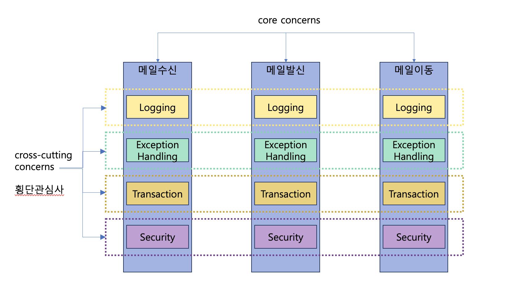
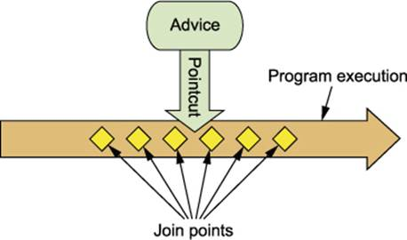
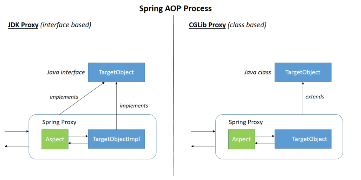

# Aspect Oriented Programming (AOP🐡)
## AOP prologue
### 운영 요구사항
- KoreanGreeter 의 실행속도를 📄로그로 남기려고 합니다.
- StopWatch 를 이용해서 다음과 같이 기록을 남겼습니다.
```java
public class KoreanGreeter implements Greeter {

    public KoreanGreeter() {
        System.out.println("KoreanGreeter initiated!!");
    }

    @Override
    public void sayHello() {
        StopWatch stopWatch = new StopWatch();
        try {
            stopWatch.start();
            
            // biz logic
            System.out.println("안녕 세상! ");
            
        }finally {
            stopWatch.stop();
            System.out.println(stopWatch.prettyPrint());
        }
    }
}

```
### 운영 요구사항 2
- KoreanGreeter의 sayHello() 실행시간 📄로그를 남기고 보니 전체 Greeter의 성능을 확인할 필요가 있는 것으로 판단되어 EnglishGreeter에도 수행시간 📄로그를 남기기로 했습니다.
```java
public class EnglishGreeter implements Greeter {

    public EnglishGreeter() {
        System.out.println("EnglishGreeter initiated!!");
    }

    @Override
    public void sayHello() {
        StopWatch stopWatch = new StopWatch();
        try {
            stopWatch.start();
            
            // biz logic
            System.out.println("Hello World!");
            
        }finally {
            stopWatch.stop();
            System.out.println(stopWatch.prettyPrint());
        }
    }
}
```
### 이 코드의 문제점
- 반복코드를 계속 작성해야 합니다.
  - 운영요구사항이 변경된다면?
  - 적용해야 할 Greeter 가 매우 많다면?
- Greeting 이라는 핵심 비즈니스 관심사에 해당하지 않는 소요시간 측정 코드가 비즈니스 코드에 섞이게 됩니다.


```
비기능적 요구사항을 지키기 위해 
불필요한 코드를 비즈니스 코드에 담기게 되는 문제가 발생.
```
## Aspect-Oriented Programming
- 관점지향 프📄로그래밍


## AOP
- AOP란 프📄로그램 구조를 다른 방식으로 생각하게 함으로써 OOP를 보완합니다.
- OOP에서 모듈화의 핵심단위는 클래스이지만 AOP에서 모듈화의 핵심단위는 관점(aspect)입니다.
- 관점은 다양한 타입과 객체에 걸친 트랜잭션 관리같은 관심(concern)을 모듈화할 수 있게 합니다.
  - crosscutting concerns: 횡단 관심사
  - core concerns : 주요 관심사


  



- 횡단 관심사와 주요 관심사를 분리하여 관점별로 각각 기능을 모듈화 할 수 있습니다.
- 설정을 추가하여 Weaving 합니다.


```
✨ 메일 시스템 : 발송, 이동, 수신
✨ AOP가 횡단 관심사를 뜯어냄
기능적 요구사항 비기능적요구사항
전산전공하면 나옴
그러면 aop로 만약에 클래스 메서드라고 생각하자 위의 덩어리들을
하나의 메소드안에 일일이 기능을 개발을했는데
aop로 개발하면 (Aspect가 단위)
Aspect를 각각으로 찢어놓을수 있음

로깅, 익셉션핸들링, 트랜잭션, security를 각각의 Aspect로 맏늘수있다
크로스 컷팅뭐시기


```


```

이상적인 형태로 구성할 수 있음. 
주입을 하려면 둘다 스프링 빈이여야함.

DI를 해주는 녀석이 어플리케이션 컨텍스트

만약에 찢어놨는데 조립을 하게 해주려면
위에있는 로깅 Aspect 자바도 스프링 빈이어야 할거같고 밑에있는거것도 모두 스프링 빈이여야할거 같다

모든 Asspect도 스프링 빈이어야 함.

스프링 프레임워크는 
트라이앵글을 보면
좌측 di
우측 aop 를 받아

삼위일체

모든것들이 대부분 Aop와 비슷한 기능으로 코드를 짠다.

OOP는 AOP의 상위

OOP는 클래스

AOP는 Asspect

```

### AOP 주요 용어
#### Chat Gpt Table
| 용어            | 설명                                                                                     |
|---------------|---------------------------------------------------------------------------------------|
| Aspect        | 횡단 관심사를 모듈화한 클래스. Pointcut과 Advice의 조합으로 구성됨                              |
| Join Point    | 프📄로그램 실행 중 특정 지점. Pointcut의 후보가 될 수 있음                                        |
| Advice        | 부가 기능을 담은 모듈. 특정 Join Point에서 Aspect가 취하는 행동                                  |
| 🔪Pointcut      | Advice를 적용할 Join Point를 선별하는 작업 또는 모듈                                          |
| Target Object | 부가 기능을 부여할 대상 객체. 하나 이상의 Aspect로 advised된 객체                             |
| AOP Proxy     | 클라이언트와 타겟 사이에 투명하게 존재하며 부가 기능을 제공하는 객체                              |
| Advisor       | Pointcut과 Advice를 하나씩 갖고 있는 객체. 스프링 AOP에서만 사용됨                              |
| Weaving       | 어플리케이션 타입이나 어드바이즈된 객체를 생성하는 객체와 관점을 연결하는 행위                    |

- Aspect
  - 여러 클래스에 걸친 횡단 관심사의 모듈 (클래스)
  - 하나 이상의 Pointcut과 Advice의 조합으로 만들어지는 AOP의 기본 모듈
  - Spring framework 에서는 @Aspect 를 사용하거나 XML 에서 설정할 수 있습니다.
- Join point
  - 프📄로그램 실행 중의 어떤 포인트를 의미 (메소드 실행, Exception 처리 등)
  - 🔪Pointcut 의 후보라고 생각할 수 있습니다.
  - Spring AOP 에서는 메소드 실행만 대상입니다.


```
자바에 컴파일 레벨에서 AOP 해주는 애가있음
퍼포먼스 애플리케이션 (성능측정) - ex 스카우터
조인포인트 대상은 메소드만 대상, 클래스,필드 x
인증인가 등등은 스프링빈의 메소드밖에 안됀다.

```
```java
package org.aspectj.lang;

public interface JoinPoint {

     /* 중간 생략 */

    /**
     * The legal return values from getKind()
     */
	String METHOD_EXECUTION = "method-execution";
    String METHOD_CALL = "method-call";
    String CONSTRUCTOR_EXECUTION = "constructor-execution";
    String CONSTRUCTOR_CALL = "constructor-call";
    String FIELD_GET = "field-get";
    String FIELD_SET = "field-set";
    String STATICINITIALIZATION = "staticinitialization";
    String PREINITIALIZATION = "preinitialization";
    String INITIALIZATION = "initialization";
    String EXCEPTION_HANDLER = "exception-handler";
    String SYNCHRONIZATION_LOCK = "lock";
    String SYNCHRONIZATION_UNLOCK = "unlock";

    String ADVICE_EXECUTION = "adviceexecution";
}
```

```
메소드 익스큐슨
```

- Advice
  - 타겟에 제공할 부가기능을 담은 모듈
  - 특정 Join Point에서 Aspect가 취하는 행동
  - Ex.) around, before, after

- 🔪Pointcut
  - Advice를 적용할 Join Point를 선별하는 작업 또는 그 기능을 적용한 모듈
  - Advice는 🔪Pointcut 표현식과 연결되고 Pointcut이 매치한 Join Point에서 실행된다

- Target object
  - 부가기능을 부여할 대상
  - 하나 이상의 Aspect로 어드바이된(advised) 객체
  - advised object라고 부르기도 함

- AOP Proxy
  - 클라이언트와 타겟 사이에 투명하게 존재하면서 부가기능을 제공하는 오브젝트
  - aspect 계약(어드바이스 메서드 실행 등)을 위해 AOP에 의해 생성된 객체

- Advisor
  - Pointcut과 Advice를 하나씩 갖고 있는 객체
  - 스프링 AOP에서만 사용되는 용어

- Weaving
  - 다른 어플리케이션 타입이나 어드바이즈된 객체를 생성하는 객체와 관점을 연결하는 행위를 의미





```
클래스의 메소드 = Advice
로깅 Aspect.java에 Advice가 있는데 걔는 메
메일 서비스라는 자바 클래스(AOP 대상 = Target) 
메일 서비스의 크리에이트 메일 메소드 (앞뒤로 로깅을 넣고싶다)
로깅 Asspect.java
로깅 Asspect.traceLog() <- Advice
> Asspect
- LogginAspect.java
- LoginAssepct.traceLog

>AOP Target
- MailCrrateService.java , MailMoveService,java
-MailService.createMail(...)

AOP TARGET
LoggingAspect.traceLog(
    로깅 시작지점 로깅(시간측정시작)
    MailService.createMail()
    로깅 종료지점 로깅(시간측정종료)
)
🔪Pointcut  Advce를 적용할 조인포인틀 선별 

리턴타입이 유저인 모든 메소드를 선별하고싶다 = > 포인트컷 표현식으로 위치를 잡음

스프링 프레임워크의 스프링 AOP가 이런
녀석들을 만들어줌
AOP PROXY
class $Proxy
{
    method(){
        stopwatch.start()...
        try{
            MailService.createMail()
        }finally{
            stopwatch.stop()
        }
    }
}
메소들 콜 : 클랄이언트
메서드 받는녀석 : 서버

스프링에서 exception이 발생해서
📄로그를 보면
$Proxy라는 녀석을 볼 수 있음

Advisor Aspect랑 거의 1대1로 매핑
```


## Spring AOP vs @AspectJ
- Spring AOP
  - AOP 개념을 스프링 빈(Spring Bean)에 적용하기 위한 것.
  - Spring Bean 대상이므로 ApplicationContext 가 처리한다
  - 런타임 Weaving

- AspectJ
  - AOP 개념을 모든 객체에 적용하기 위한것
  - 컴파일 시점, 로드시점 Weaving

```
런타임 위빙 ApplicationContext가 처리해서
Spring AOP를 주로 쓴다

AsspectJ
성능저하없이 빠르게 어플리케이션 측정이 가능하다.
```

## Spring AOP 설치
  - pom.xml 파일에 spring-aspects 라이브러리 의존성을 추가 합니다.


```java
    <dependency>
        <groupId>org.springframework</groupId>
        <artifactId>spring-aspects</artifactId>
        <version>5.3.15</version>
    </dependency>
```

### #@AspectJ (Annotation) 지원
- @AspectJ 스타일은 일반 java 에 annotation 을 설정하는 방식입니다.
- 스프링 프레임워크는 AspectJ 5 의 anntation 을 사용하지만 AspectJ의 컴파일러나 위버(Weaver) 를 사용하지 않습니다.
  - e.g. import org.aspectj.lang.annotation.Aspect

### @AspectJ 지원 활성화
- Java @configuration 에서 @AspectJ 지원을 활성화 하려면 @EnableAspectJAutoProxy 를 사용하여 설정합니다.

```
선언만 하면 작동하는게 스프링 특징
```
```java
@Configuration
@EnableAspectJAutoProxy
public class AppConfig {

}
```

- XML 설정에서 @AspectJ 지원을 활성화 하려면 aop:aspectj-autoproxy/ 를 사용하여 설정합니다.

```xml
<aop:aspectj-autoproxy/>
```

```
xml에선 이걸 쓰면 됨.
```

### Aspect 선언
- AspectJ 지원이 활성화 된 상태에서,
- Bean 으로 선언하고 @Aspect annotation 을 설정하면 해당 스프링빈은 Aspect 가 됩니다.


```java
@Aspect
@Component
public class LoggingAspect {
...
}
```
```
@로 Aspect로 선언
Aop도 스프링빈
aop 대상도 스프링 빈
+Component를 선언해줘야 동작을 함
```
```java
@Asspect  // 스프링 빈이어야 적용
@Component // 스ㅡ프링 빈이어야해서 달아줌

@🔪Pointcut = > 실행하는 과정 execution ( * ~~)//public이든 뭐든 상관없다
@Asspect랑 @Enable~~을 넣어주면 📄로그를 출력해줌
```

### AspectJ 사용 요약


- 간단한 시연 : feature/aop
```
대상 앞뒤로 Arround를 끼워 넣어줘야함. * *은 모든 메서드에 로깅 올 퍼블릭 어플리에이션을 잘 위빙해주라고 선언을 함
```
  
## 포인트컷
- 타겟의 여러 조인포인트 중에 어드바이스를 적용할 대상을 지정하는 키워드입니다.
- 스프링 AOP 는 스프링 빈의 메소드 실행 조인포인트만 지원합니다.
- 포인트컷 선언은 포인트컷 표현식과 포인트컷 시그니쳐로 구성됩니다.

```java

@🔪Pointcut("execution(* transfer(..))") // the pointcut expression
private void anyOldTransfer() {} // the pointcut signature

```


- 위의 예제는 anyOldTransfer 가 포인트컷의 이름이고 모든 스프링 빈에서의 transfer 메소드 실행에 매칭이 됩니다.
### 포인트컷 - 🔪Pointcut Designator
- 스프링 AOP에서 지원하는 포인트컷 지정자 (🔪Pointcut Desginator)

| 포인트컷 지정자 | 설명                                                                                   |
|--------------|--------------------------------------------------------------------------------------|
| execution    | 메소드 실행 조인포인트와 매칭. 스프링 AOP의 주요 포인트컷 지정자입니다.                        |
| within       | 주어진 타입(클래스)으로 조인 포인트 범위를 제한합니다.                                       |
| this         | 주어진 타입을 구현한 스프링 AOP Proxy 객체에 매칭. 보통 Proxy 객체를 Advice 파라미터에 바인딩하는 용도로 사용됩니다. |
| target       | 주어진 타입을 구현한 타겟 객체에 매칭. 보통 타겟 객체를 Advice 파라미터에 바인딩하는 용도로 사용됩니다. |
| args         | 주어진 타입의 인수들을 이용해 매칭. 보통 메소드 인자를 Advice 파라미터에 바인딩하는 용도로 사용됩니다. |
| @target      | 주어진 타입의 애너테이션을 가진 클래스의 인스턴스를 매칭합니다.                               |
| @args        | 실제 인수의 런타임 타입이 주어진 타입의 애너테이션을 가질 경우 매칭합니다.                      |
| @within      | 주어진 타입의 애너테이션을 타입들로 제한하여 매칭합니다.                                     |
| @annotation  | 주어진 애너테이션을 가지고 있을 경우 매칭합니다.                                             |
| bean         | 스프링 AOP에서 지원하는 추가적인 포인트컷 지정자로, 스프링 빈의 이름에 해당하는 메서드 실행을 매칭합니다. |


### execution
- 메소드 실행 조인포인트와 매칭
- 스프링 AOP의 주요 포인트컷 지정자

```
createMail을 매칭할때 execution을 쓴다.
실행할 녀석을 잡아라
```

### within
- 주어진 타입(클래스)으로 조인 포인트 범위를 제한
```
이메일 메세지 센터를 구현하면 얘로 제한
```
### this
- 주어진 타입을 구현한 스프링 AOP Proxy 객체에 매칭
- 보통 Proxy 객체를 Advice 파라미터에 바인딩하는 용도로 쓰인다


### target
- 주어진 타입을 구현한 타겟 객체에 매칭
- 보통 타겟 객체를 Advice 파라미터에 바인딩하는 용도로 쓰인다.
### args
- 주어진 타입의 인수들을 이용해 매칭
- 보통 메소드 인자를 Advice 파라미터에 바인딩하는 용도로 쓰인다.

```
this, target, args는 잘안씀
```

### @taget
- 주어진 타입의 애너테이션을 가진 클래스의 인스턴스를 매칭
### @args
- 실제 인수의 런타임 타입이 주어진 타입의 애너테이션을 가질 경우 매칭
- 
```
@this, @target, @args는 잘씀
```
### @within
- 주어진 타입의 애너테이션을 타입들로 제한하여 매칭
### @annotation
- 주어진 애너테이션을 가지고 있을 경우 매칭
### bean
- 스프링 AOP 에서 지원하는 추가적인 포인트컷 지정자
- 스프링 빈의 이름에 해당하는 메서드 실행을 매칭
```
 bean(idOrNameOfBean) 
 ```
 ```
 이름은 모호해서
 클래스 이름을 스프링 빈의 이름으로 하는게 관례
 
 그러면 문제는 리팩토링 할때 자동으로 맵핑이 안되는게 문제

 클래스 레벨에서 검출하는게 좋음

 의도적으로 감지 할 수 있게 하는게 필요
 ```
 | 구분 | 예제 | 설명 |
|----|----------------------------------------|------------------------------------------------------------------------|
| 조합 | `@Pointcut("execution(public * *(..))")` | 모든 public 메소드에 대한 포인트컷 |
| | `@Pointcut("within(com.xyz.myapp.trading..*)")` | com.xyz.myapp.trading 패키지 내의 메소드 실행에 대한 포인트컷 |
| | `@Pointcut("anyPublicOperation() && inTrading()")` | com.xyz.myapp.trading 패키지 내의 public 메소드 실행에 대한 포인트컷 |
| 공통 포인트컷 공유 | `@Pointcut("within(com.xyz.myapp.web..*)")` | com.xyz.myapp.web 패키지와 서브패키지(web layer)를 지정하는 포인트컷 |
| | `@Pointcut("within(com.xyz.myapp.service..*)")` | com.xyz.myapp.service 패키지와 서브패키지(service layer)를 지정하는 포인트컷 |
| | `@Pointcut("within(com.xyz.myapp.dao..*)")` | com.xyz.myapp.dao 패키지와 서브패키지(data access layer)를 지정하는 포인트컷 |
| | `@Pointcut("execution(* com.xyz.myapp.service.*.*(..))")` | businessService 포인트컷 정의를 선언하는 포인트컷 |
| | `@Pointcut("execution(* com.xyz.myapp.dao.*.*(..))")` | dataAccessOperation 포인트컷 정의를 선언하는 포인트컷 |


 ### 포인트컷 - 조합
- 포인트컷 표현식은 &&, ||, ! 으로 조합할 수 있습니다.
```java
// anyPublicOperation 포인트컷은 모든 public 메소드 실행에 매칭 됩니다.
@🔪Pointcut("execution(public * *(..))") public *(어떤 타입) *(어떤 메소드)
private void anyPublicOperation() {} 

// inTrading 포인트컷은 com.xyz.myapp.trading 패키지 내의 메소드 실행에 매칭
@🔪Pointcut("within(com.xyz.myapp.trading..*)")(..* 하위 모든 경로를 포험)
private void inTrading() {} 

// tradingOperation 포인트컷은 com.xyz.myapp.trading 패키지 내의 퍼블릭 메소드 실행에 매칭
@🔪Pointcut("anyPublicOperation() && inTrading()")
private void tradingOperation() {} 
```
### 포인트컷 - 공통 포인트컷 공유
- 대규모 시스템에서 공통적인 포인트컷을 정의하여 참조하는 방식을 사용하는 것이 유리합니다.
```java
package com.xyz.myapp;

import org.aspectj.lang.annotation.Aspect;
import org.aspectj.lang.annotation.🔪Pointcut;

@Aspect
public class CommonPointcuts {

    /**
     * com.xyz.myapp.web 패키지와 서브패키지(web layer)를 
     * 지정하는 포인트컷
     */
    @🔪Pointcut("within(com.xyz.myapp.web..*)")
    public void inWebLayer() {}

    /**
     * com.xyz.myapp.service 패키지와 서브패키지(service layer)를 
     * 지정하는 포인트컷
     */
    @🔪Pointcut("within(com.xyz.myapp.service..*)")
    public void inServiceLayer() {}

    /**
     * com.xyz.myapp.dao 패키지와 서브패키지(data access layer)를 
     * 지정하는 포인트컷
     */
    @🔪Pointcut("within(com.xyz.myapp.dao..*)")
    public void inDataAccessLayer() {}

    /**
     * 아래 businessService 포인트컷 정의는 서비스인터페이스가 service 패키지에 있고 
     * 구현체가 service 패키지 하위에 포한된 것을 가정하고 선언되어 있습니다.
     *
     * com.xyz.myapp.send.service, com.xyz.myapp.receive.service 와 같이 기능단위의 패키지 구성이라면  "execution(* com.xyz.myapp..service.*.*(..))" 포인트컷 표현식을 사용할 수 있습니다.
     * 
     * 만약 스프링빈 이름이 Service 로 항상 끝난다면 "bean(*Service)" 표현식을 사용할 수도 있습니다.
     */
    @🔪Pointcut("execution(* com.xyz.myapp.service.*.*(..))")
    public void businessService() {}

    /**
     * 아래 dataAccessOperation 포인트컷 정의는 Dao 인터페이스가 dao 패키지에 있고 
     * 구현체가 dao 패키지 하위에 포한된 것을 가정하고 선언되어 있습니다.
     */
    @🔪Pointcut("execution(* com.xyz.myapp.dao.*.*(..))")
    public void dataAccessOperation() {}

}

```
```
```
### 포인트컷 - 공통 포인트컷 참조
- 공유된 포인트컷 Aspect 는 다른 설정에서 참조 할 수 있습니다.
```xml
<aop:config>
    <aop:advisor
        pointcut="com.xyz.myapp.CommonPointcuts.businessService()"
        advice-ref="tx-advice"/>
</aop:config>

<tx:advice id="tx-advice">
    <tx:attributes>
        <tx:method name="*" propagation="REQUIRED"/>
    </tx:attributes>
</tx:advice>
```

### 포인트컷 - 표현식 예제
- Spring AOP 는 주로 execution 포인트컷 지정자를 사용합니다.

> execution(modifiers-pattern? ret-type-pattern declaring-type-pattern?name-pattern(param-pattern) throws-pattern?)

| 구성 요소                | 설명                                                      |
|-----------------------|-----------------------------------------------------------|
| execution             | 실행 중인 메소드에 대한 조인 포인트를 선택합니다.            |
| modifiers-pattern?    | 선택적으로 메소드의 접근 제한자를 지정합니다. (예: public, private)  |
| ret-type-pattern      | 반환 타입을 지정합니다. (예: *, void, java.lang.String)   |
| declaring-type-pattern? | 선택적으로 메소드를 선언한 클래스 또는 인터페이스를 지정합니다.      |
| name-pattern          | 메소드 이름 패턴을 지정합니다. (예: *, get*, find*)          |
| param-pattern         | 메소드의 매개변수 패턴을 지정합니다. (예: (), (int, String)) |
| throws-pattern?       | 선택적으로 메소드가 던지는 예외 패턴을 지정합니다.            |

- 모든 public 메소드

> execution(public * *(..))

```
public 만잡음
execution(public *(모든 리턴타입)(클래스는 생략) *(모든 메소드)(..(와도 그만 안와도그만)))
```
- get~ 으로 시작하는 모든 메소드

> execution(* get*(..))

```
> execution(*(모든 리턴타입) get*(get으로 시작하는 모든 메소드)(..(와도 그만 안와도그만)))
```
- com.nhnent.edu.spring_core 패키지에 있는 모든 메소드

>execution(* com.nhnent.edu.spring_core.*.*(..))

```
>execution(* (모든 타입)com.nhnent.edu.spring_core.*(모든클래스).*(모든 메소드)(..(와도 그만 안와도 그만)))
core 내부

```
- com.nhnent.edu.spring_core.service.MemberService 인터페이스에 정의된 모든 메소드
> execution(* com.nhnent.edu.spring_core.service.MemberService.*(..))

```
MemberService클래스내의 모든 메소드
```
- com.nhnent.edu.spring_core.service 패키지의 모든 메소드실행

> within(com.nhnent.edu.spring_core.service.*)


- TestService 프록시 구현체의 메소드 실행

> this(com.nhnent.edu.spring_core.service.TestService)

- TestService 인터페이스의 구현 객체의 메소드 실행
> target(com.nhnent.edu.spring_core.service.TestService)


- 런타임에 Serializable 타입의 단일 파라미터가 전달되는 메소드 실행 (인자값 검사 기능에 많이 사용됩니다.)

> args(java.io.Serializable)

- @Transactional 어노테이션을 가진 모든 타겟 객체의 메소드 실행

>@target(org.springframework.transaction.annotation.Transactional)

## Advice
- Advice 는 포인트컷과 관련하여 메소드 실행 전, 후, 전/후 를 결정하기위해 사용합니다.

| Advice 형태 | 설명 |
| --- | --- |
| Before | Join Point 앞에서 실행할 Advice |
| After | Join Point 뒤에서 실행할 Advice |
| AfterReturning | Join Point가 완전히 정상 종료한 후 실행하는 Advice |
| Around | Join Point 앞과 뒤에서 실행되는 Advice |
| AfterThrowing | Join Point에서 예외가 발생했을때 실행되는 Advice |

### ex
| Advice 형태 | 설명 |
| --- | --- |
| Before | sayHello() 앞에서 실행할 Advice |
| After | sayHello() 뒤에서 실행할 Advice |
| AfterReturning | sayHello()가 완전히 정상 종료한 후 실행하는 Advice |
| Around | sayHello() 앞과 뒤에서 실행되는 Advice |
| AfterThrowing | sayHello()에서 예외가 발생했을때 실행되는 Advice |


### Advice - Advice 선언
- Advice 의 포인트컷은 미리 선언한 포인트컷을 참조하거나 직접 포인트컷 표현식을 사용할 수 있습니다.
### Advice - Before
- Aspect 내에 조인포인트 전에 실행을 위한 @Before Advice 를 다음과 같이 선언합니다.

```java
@Aspect
public class BeforeExample {

    @Before("com.xyz.myapp.CommonPointcuts.dataAccessOperation()")
    public void doAccessCheck() {
        // ...
    }
    
    @Before("execution(* com.xyz.myapp.dao.*.*(..))")
    public void doAccessCheck() {
        // ...
    }
}
```

### Advice - AfterReturning
- Aspect 내에 조인포인트(메소드 실행) 반환 후에 실행을 위한 @AfterReturning Advice 를 다음과 같이 선언합니다.
- 메소드 실행중에 Exception 이 발생하여 throw 될때는 @AfterReturning Advice가 실행되지 않습니다.

```java
@Aspect
public class AfterReturningExample {

    @AfterReturning("com.xyz.myapp.CommonPointcuts.dataAccessOperation()")
    public void doAccessCheck() {
        // ...
    }
}
```

- Advice 내부에서 반환 값에 접근해야 하는 경우, returning 속성을 이용해서 advice 메소드 파라미터에 바인드 할 수 있습니다.

```java
@Aspect
public class AfterReturningExample {

    @AfterReturning(
        pointcut="com.xyz.myapp.CommonPointcuts.dataAccessOperation()",
        returning="retVal")
    public void doAccessCheck(Object retVal) {
        // ...
    }
}
```
```

```
```
조인 포인트가 정상적으로 작동할때
스프링 aop 장점 
런타임에 들어오는 인자, 리턴값 모두 참조가능
after런타임 : 해당 메소드가 리턴하는 객체, 값을 참조할 수 있어야함

값을 변경시키고싶을때, 값을 받아와야함
Object retVal을 적어주면 됨.

실행해야할 어드바이스에 인자로 넣어주면 됨.

After Returning의 속성에 returning = "retVal"을 적고
그걸 인자로 넣어줌

Object retVal인 이유 : 많은 메소드를 잡기에 특정 타입만 명시해서 받을 수 없음
```
### Advice - After Throwing Advice
- Aspect 내에 조인포인트(메소드 실행) 에서 Exception 이 발생한 후에 실행을 위한 @AfterThrowing Advice 를 다음과 같이 선언합니다.

```java
@Aspect
public class AfterThrowingExample {

    @AfterThrowing("com.xyz.myapp.CommonPointcuts.dataAccessOperation()")
    public void doRecoveryActions() {
        // ...
    }
}
```

- 원하는 타입의 Exception 이 발생할때만 매칭이 되고, 발생한 Exception 에 접근하기를 원한다면 throwing 속성을 추가할 수 있습니다.

```java
@Aspect
public class AfterThrowingExample {

    @AfterThrowing(
        pointcut="com.xyz.myapp.CommonPointcuts.dataAccessOperation()",
        throwing="ex")
    public void doRecoveryActions(DataAccessException ex) {
        // ...
    }
}
```
```
오류 발생시에만 동작하는것
```
### Advice - After (Finally) Advice
- Aspect 내에 조인포인트(메소드 실행) 에서 종료될때 실행을 위한 @After Advice 를 다음과 같이 선언합니다.
- try-catch 구문의 finally 구문과 유사하기 때문에 메소드 실행중에 exception이 발생하더라도 실행합니다.

```java
@Aspect
public class AfterFinallyExample {

    @After("com.xyz.myapp.CommonPointcuts.dataAccessOperation()")
    public void doReleaseLock() {
        // ...
    }
}
```
```
조인 포인트에서 종료할때 실행을 위한 애프털 어드바이스를 위처럼 선언
Exception이 발생해도 실행
```
### Advice - Around Advice
- 메소드 실행의 전, 후에 advice를 실행할 수 있는 기회를 제공합니다.
- 심지어 대상 메소드가 실행하거나 하지 않도록 제어할 수도 있습니다.
- Around Advice 는 Object 를 반환해야 하고 첫번째 인자는 ProceedingJoinPoint 이어야 합니다.
- ProceedingJoinPoint 의 proceed() 를 호출하면 타겟메소드가 실행됩니다.
```java
@Aspect
public class AroundExample {

    @Around("com.xyz.myapp.CommonPointcuts.businessService()")
    public Object doBasicProfiling(ProceedingJoinPoint pjp) throws Throwable {
        // start stopwatch
        Object retVal = pjp.proceed();
        // stop stopwatch
        return retVal;
    }
}
```
```
커버리지가 가장 높음
반드시 정상적으로 컨트롤을 하기 위해선 Object와 ProceedingJoinPoint를 인자로 받아야함

1. 어라운드를 잡음
2. pjp.proceed()가 실행 되어야만
3. businessService()를 실행 할 수있음
4. proceed가 실행되고 retVal가 리턴되어야만 누군가가 ProceedingJoinPoint를 불러올 수 있다.
```
### Advice - JoinPoint 활용하기
- 모든 Advice 메소드에는 첫번째 인자로 JoinPoint 를 받을 수 있습니다. ( Around Advice 는 JoinPoint의 서브클래스인 ProceedingJoinPoint 를 반드시 사용해야 합니다.)

```
AFTERFINALLY에 첫번째 인자에 조인포인트를 적으면
그 안에 조인포인트를 넣을 수 있다.
```
### JoinPoint 의 메소드
- getArgs() : 타겟 메소드의 인자
- getThis() : 프록시 객체
- getTarget() : 타겟 객체
- getSignature() : 타겟 객체의 메소드 시그니쳐
- toString() : 타겟 객체의 메소드 정보

```
조인포인트를 넣으면
위의 5개를 할수 있다.
- getArgs() : 타겟 메소드의 인자
LoggingAspect.traceLog(JoinPoint jp){
    //로기 시작지점 ㄹ
    jp.getArgs()
    mail.createMail(createMail얘는 시그니처)(...(타겟객체))
    //로깅 종료지점
}
- getThis() : 프록시 객체
- getTarget() : 타겟 객체
- getSignature() : 타겟 객체의 메소드 시그니쳐
- toString() : 타겟 객체의 메소드 정보
```
### Advice - Advice에 파라미터 넘기기
- args 포인트컷 지정자를 이용해서 Advice에 파라미터를 넘길 수 있습니다.
```java
@Before("com.xyz.myapp.CommonPointcuts.dataAccessOperation() && args(account,..)")
public void validateAccount(Account account) {
    // ...
}
```
- args(account,..) 표현식은 두가지 의미를 내포합니다.
  - 1개 이상의 파라미터를 받는 메소드 실행에 매칭, 첫번째 인자는 Account 클래스의 인스턴스 이어야 합니다.
  - Account 객체는 Advice의 account 파라미터에 바인딩합니다.

```
args >> 첫번째 인자가 account 그 인자의 타입을 봄
```
### Advice - Advice에 파라미터 넘기기
- 포인트컷과 Advice 를 분리해서 선언하는 경우는 다음과 같이 설정할 수 있습니다.
```java
@🔪Pointcut("com.xyz.myapp.CommonPointcuts.dataAccessOperation() && args(account,..)")
private void accountDataAccessOperation(Account account) {}

@Before("accountDataAccessOperation(account)")
public void validateAccount(Account account) {
    // ...
}
```
```
인자가 넘어온다
```
### Advice - Custom Annotation 매칭
- Annotation 을 기준으로 매칭한 경우의 예제는 다음과 같습니다.
- Auditable.java 로 Annotation 을 작성합니다.
```java
@Retention(RetentionPolicy.RUNTIME)
@Target(ElementType.METHOD)
public @interface Auditable {
    AuditCode value();
}
```

- @annotation 포인트컷 지정자로 설정된 Annotation 을 Advice 파라미터로 참조 할 수 있습니다.
```java
@Before("com.xyz.lib.Pointcuts.anyPublicMethod() && @annotation(auditable)")
public void audit(Auditable auditable) {
    AuditCode code = auditable.value();
    // ...
}
```
### Advice - 파라미터와 제네릭
- 스프링 AOP 는 제네릭도 지원합니다.
```java
public interface Sample<T> {
    void sampleGenericMethod(T param);
    void sampleGenericCollectionMethod(Collection<T> param);
}
```
```
Sample<T> 제네릭을 잡으려면 +키워드가 필요
```
- Advice의 파라미터의 타입으로 매칭을 제한할 수 있습니다.
```java
@Before("execution(* ..Sample+.sampleGenericMethod(*)) && args(param)")
public void beforeSampleMethod(MyType param) {
    // Advice implementation
}
```
- 아래의 Collection 은 내부의 모든 엘리먼트를 검사해야하고 null 이 포함되면 결정할 수 없기 때문에 지원하지 않습니다.

```java
@Before("execution(* ..Sample+.sampleGenericCollectionMethod(*)) && args(param)")
public void beforeSampleMethod(Collection<MyType> param) {
    // Advice implementation
}
```
- 꼭! 해야 한다면 Advice의 파라미터 타입을 Collection<?> 으로 지정하고 Advice 내에서 검사할 수 있습니다.

```
특정 커스텀타입을 넣는건 불가능하다는 말
```
### Advice - argNames 속성
- 포인트컷 표현식에서 파라미터 이름으로 매칭하는 방법을 제공합니다.
- @🔪Pointcut 과 Advice 에는 모두 argNames 속성을 옵션으로 제공합니다.
```java
@Before(value="com.xyz.lib.Pointcuts.anyPublicMethod() && target(bean) && @annotation(auditable)",
        argNames="bean,auditable")
public void audit(Object bean, Auditable auditable) {
    AuditCode code = auditable.value();
    // ... use code and bean
}
```
### Advice - Argument 로 proceed 호출
- Around Advice 에서 Argument 를 넘기는 방법은 다음과 같습니다.
```java
@Around("execution(List<Account> find*(..)) && " +
        "com.xyz.myapp.CommonPointcuts.inDataAccessLayer() && " +
        "args(accountHolderNamePattern)")
public Object preProcessQueryPattern(ProceedingJoinPoint pjp,
        String accountHolderNamePattern) throws Throwable {
    String newPattern = preProcess(accountHolderNamePattern);
    return pjp.proceed(new Object[] {newPattern});
}
```
```

```
### Advice - Ordering
- 같은 조인포인트에 여러 Advice 가 적용된다면 org.springframework.core.Ordered 를 implements 하거나 @Order 로 우선순위를 결정할 수 있습니다.
- Order 의 우선순위는 숫자가 낮을 수록 높은 우선순위를 가집니다. ( org.springframework.core.Ordered 참고 )
### Introductions
- Introduction 을 사용하면 adviced 된 객체를 특정 인터페이스의 구현체 인것처럼 동작하게 만들 수 있습니다.
```java
@Aspect
@Component
public class UsageTracking {

    @DeclareParents(value="com.xzy.myapp.service.*+", defaultImpl=DefaultUsageTracked.class)
    public static UsageTracked mixin;

    @Before("com.xyz.myapp.CommonPointcuts.businessService() && this(usageTracked)")
    public void recordUsage(UsageTracked usageTracked) {
        usageTracked.incrementUseCount();
    }

}
```

- @DeclareParents를 통해 introduction을 생성 할 수 있으며 value 값인 com.xzy.myapp.service.*+ 패키지에 속한 bean들이 UsageTracked 인터페이스의 구현체가 됩니다.

- 다음의 코드로 UsageTracked 의 구현체 인지 확인 할 수 있습니다.

>  UsageTracked usageTracked = (UsageTracked) context.getBean("myService");

## AOP 시연

### 목표
- sayHello() 메소드를 실행할때 소요시간을 측정하여 콘솔에 📄로그를 남기도록 수정합니다.
### 과정
- KoreanGreeter, EnglishGreeter 에서 소요시간 측정 코드를 삭제합니다.
- 📄로그를 측정하는 Aspect 를 생성합니다. 🔪Pointcut 은 sayHello() 라는 이름을 가진 public 메소드가 실행할때로 설정합니다.
- Advice 는 around 를 사용하여 메소드 시작과 끝에서 시간을 측정합니다.
## AOP 실습
- [[TODO]]
### Schema-Based AOP
- XML 설정을 선호한다면 AOP 네임스페이스를 히용해서 AOP를 설정할 수 있습니다.
- XML 설정에서 AOP를 사용하기 위해서는 AOP Schema 를 설정해 주어야 합니다.
```xml
<?xml version="1.0" encoding="UTF-8"?>
<beans xmlns="http://www.springframework.org/schema/beans"
    xmlns:xsi="http://www.w3.org/2001/XMLSchema-instance"
    xmlns:aop="http://www.springframework.org/schema/aop"
    xsi:schemaLocation="
        http://www.springframework.org/schema/beans https://www.springframework.org/schema/beans/spring-beans.xsd
        http://www.springframework.org/schema/aop https://www.springframework.org/schema/aop/spring-aop.xsd">

    <!-- bean definitions here -->

</beans>
```
### XML Aspect 선언
- aspect 는 일반 스프링빈으로 설정할 수 있습니다.
```xml
<aop:config>
    <aop:aspect id="myAspect" ref="aBean">
        ...
    </aop:aspect>
</aop:config>

<bean id="aBean" class="...">
    ...
</bean>
```
### XML 🔪Pointcut 선언
- aop:config 내부에 이름을 붙인 🔪Pointcut 을 선언할 수 있습니다.
- 이름을 붙인 🔪Pointcut 은 aspect 와 advicor 에서 참조할 수 있습니다.
- 아래 🔪Pointcut 은 service layer 의 모든 메소드의 실행에 대해 적용됩니다.
```xml
<aop:config>

    <aop:pointcut id="businessService"
        expression="execution(* com.nhn.edu.springframework.service.*.*(..))"/>

</aop:config>
```
### XML 🔪Pointcut 참조
- Java 설정인 @Aspect 에서 작성한 포인트컷도 XML 설정에서 참조할 수 있습니다.
- package com.xyz.myapp;
```java
@Aspect
public class CommonPointcuts {

    @🔪Pointcut("execution(* com.xyz.myapp.service.*.*(..))")
    public void businessService() {}

}
```
```xml
<aop:config>
    <aop:pointcut id="businessService"
        expression="com.xyz.myapp.CommonPointcuts.businessService()"/>
</aop:config>
```
### XML 🔪Pointcut 선언
- 포인트컷을 Aspect 내에 선언할 수 있습니다.
```xml
<aop:config>
    <aop:aspect id="myAspect" ref="aBean">
        <aop:pointcut id="businessService"
            expression="execution(* com.xyz.myapp.service.*.*(..))"/>
        ...
    </aop:aspect>
</aop:config>
```
### XML 🔪Pointcut 선언 - 포인트컷 조합
- @AspectJ와 비슷하게 조인포인트를 조합할 수 있습니다.
- xml 문법상의 이유로 && 는 && 로 표기해야 합니다. xml 설정에서는 and, or, not 을 사용할 수 있습니다.
```xml
<aop:config>

    <aop:aspect id="myAspect" ref="aBean">

        <aop:pointcut id="businessService"
            expression="execution(* com.xyz.myapp.service.*.*(..)) &amp;&amp; this(service)"/>

        <aop:before pointcut-ref="businessService" method="monitor"/>

        ...
    </aop:aspect>

</aop:config>
```
### XML Advice - Before
- aop:aspect 내에서 aop:before 를 이용해서 선언할 수 있습니다.
```xml
<aop:aspect id="beforeExample" ref="aBean">

    <aop:before
        pointcut-ref="dataAccessOperation"
        method="doAccessCheck"/>

    ...

</aop:aspect>
```
- 포인트컷을 참조하지 않고 advice 내에 포인트컷을 작성할 수 있습니다. (포인트컷에 이름을 붙이고 참조하는 것이 가독성이 좋기 때문에 직접 작성하는 방식은 추천하지 않습니다.)
```xml
<aop:aspect id="beforeExample" ref="aBean">

    <aop:before
        pointcut="execution(* com.xyz.myapp.dao.*.*(..))"
        method="doAccessCheck"/>

    ...
</aop:aspect>
```
### XML Advice - After Returning
- 메소드 실행이 정상적으로 완료되었을때 매칭됩니다.
- aop:aspect 내에서 aop:after-returning 를 이용해서 선언할 수 있습니다.
```xml
<aop:aspect id="afterReturningExample" ref="aBean">

    <aop:after-returning
        pointcut-ref="dataAccessOperation"
        method="doAccessCheck"/>

    ...
</aop:aspect>
```
- AspectJ 와 같이 반환값을 Advice 메소드에 전달 할 수 있습니다.
```xml
<aop:aspect id="afterReturningExample" ref="aBean">

    <aop:after-returning
        pointcut-ref="dataAccessOperation"
        returning="retVal"
        method="doAccessCheck"/>

    ...
</aop:aspect>
```

> public void doAccessCheck(Object retVal) {...

### XML Advice - After Throwing
- 메소드 실행 중에 Exception을 던지면서 종료하는 경우 매칭됩니다.
- aop:aspect 내에서 aop:after-throwing 를 이용해서 선언할 수 있습니다.
```xml
<aop:aspect id="afterThrowingExample" ref="aBean">

    <aop:after-throwing
        pointcut-ref="dataAccessOperation"
        method="doRecoveryActions"/>

    ...
</aop:aspect>
```
- AspectJ 와 같이 던지는 Exception을 Advice 메소드에 전달 할 수 있습니다.
```xml
<aop:aspect id="afterThrowingExample" ref="aBean">

    <aop:after-throwing
        pointcut-ref="dataAccessOperation"
        throwing="dataAccessEx"
        method="doRecoveryActions"/>

    ...
</aop:aspect>
```
```java
public void doRecoveryActions(DataAccessException dataAccessEx) {...
```
### XML Advice - After (Finally)
- 메소드 실행 중에 Exception을 던지거나 정상종료되거나 상관없이 종료하면 매칭됩니다.
- aop:aspect 내에서 aop:after 를 이용해서 선언할 수 있습니다.
```xml
<aop:aspect id="afterFinallyExample" ref="aBean">

    <aop:after
        pointcut-ref="dataAccessOperation"
        method="doReleaseLock"/>

    ...
</aop:aspect>
```
### XML Advice - Around
- 메소드 실행 시작과 끝에서 매칭되는 Advice 입니다. around 에서는 타겟 객체 메소드 실행 여부도 결정할 수 있습니다.
- aop:aspect 내에서 aop:around 를 이용해서 선언할 수 있습니다.
```xml
<aop:aspect id="aroundExample" ref="aBean">

    <aop:around
        pointcut-ref="businessService"
        method="doBasicProfiling"/>

    ...
</aop:aspect>
```
- advice 구현체에 Object 를 반환하고 ProceedingJoinPoint 를 첫번째 인자로 가지는 doBasicProfiling 메소드를 작성해야 합니다.
```java
public Object doBasicProfiling(ProceedingJoinPoint pjp) throws Throwable {
    // start stopwatch
    Object retVal = pjp.proceed();
    // stop stopwatch
    return retVal;
}
```
### XML Advice - 파라미터
- 지정한 메소드가 실행하는 실행시간과 파라미터를 로깅하는 AOP 를 작성합니다.
먼저 비즈니스 로직을 다음과 같이 구현합니다.

```java
package x.y.service;

public interface PersonService {
    Person getPerson(String personName, int age);
}

public class DefaultPersonService implements PersonService {

    public Person getPerson(String name, int age) {
        return new Person(name, age);
    }
}
```
- 수행시간을 측정해야 하기 때문에 around advice 를 사용할 수 있는 aspect 를 작성합니다. ( profile 의 첫번째 인자는 ProceedingJoinPoint 인 것을 확인하세요.)
```java
package x.y;

import org.aspectj.lang.ProceedingJoinPoint;
import org.springframework.util.StopWatch;

public class SimpleProfiler {

    public Object profile(ProceedingJoinPoint call, String name, int age) throws Throwable {
        StopWatch clock = new StopWatch("Profiling for '" + name + "' and '" + age + "'");
        try {
            clock.start(call.toShortString());
            return call.proceed();
        } finally {
            clock.stop();
            System.out.println(clock.prettyPrint());
        }
    }
}
```

- XML 에 다음과 같이 작성합니다. 포인트컷 표현식에 args(name, age) 를 사용했기 때문에 Aspect 메소드에 인자가 전달 됩니다.

```xml
<beans xmlns="http://www.springframework.org/schema/beans"
    xmlns:xsi="http://www.w3.org/2001/XMLSchema-instance"
    xmlns:aop="http://www.springframework.org/schema/aop"
    xsi:schemaLocation="
        http://www.springframework.org/schema/beans https://www.springframework.org/schema/beans/spring-beans.xsd
        http://www.springframework.org/schema/aop https://www.springframework.org/schema/aop/spring-aop.xsd">

    <!-- this is the object that will be proxied by Spring's AOP infrastructure -->
    <bean id="personService" class="x.y.service.DefaultPersonService"/>

    <!-- this is the actual advice itself -->
    <bean id="profiler" class="x.y.SimpleProfiler"/>

    <aop:config>
        <aop:aspect ref="profiler">

            <aop:pointcut id="theExecutionOfSomePersonServiceMethod"
                expression="execution(* x.y.service.PersonService.getPerson(String,int))
                and args(name, age)"/>

            <aop:around pointcut-ref="theExecutionOfSomePersonServiceMethod"
                method="profile"/>

        </aop:aspect>
    </aop:config>

</beans>
```
- persionService 실행
```java
import org.springframework.beans.factory.BeanFactory;
import org.springframework.context.support.ClassPathXmlApplicationContext;
import x.y.service.PersonService;

public final class Boot {

    public static void main(final String[] args) throws Exception {
        BeanFactory ctx = new ClassPathXmlApplicationContext("x/y/plain.xml");
        PersonService person = (PersonService) ctx.getBean("personService");
        person.getPerson("Pengo", 12);
    }
}
```
- 실행 결과
```prompt
StopWatch 'Profiling for 'Pengo' and '12': running time (millis) = 0
-----------------------------------------
ms     %     Task name
-----------------------------------------
00000  ?  execution(getFoo)
```
### AOP 선택 - Spring AOP vs Full AspectJ
|| Spring AOP | AspectJ |
|-|------------|---------|
| 구현 | 순수 자바 | 자바 언어 확장 사용 |
| Goal | Simple Solution | Complete Solution |
| 특징 | 별도의 컴파일 과정 불필요 | AspectJ compiler(ajc)가 필요 |
| Weaving | Runtime weaving | compile-time, post-compile, load-time weaving 지원 |
| 대상 | Spring Container 에 의해서 관리되는 Spring Bean | 모든 객체들 |
| JoinPoint | Method 실행시에만 가능 | Method 실행시, Constructor 실행시, field 참조시, field 할당시 등등 |
| 성능 | 비교적 느리다 | 비교적 빠르다 |

### Spring AOP 선택 - @AspectJ vs XML
- XML 설정은 순수한 POJO 를 지원할 수 있습니다.
- XML 설정파일에서 Aspect 의 설정 내역을 명시적으로 확인할 수 있습니다.
- XML 과 Aspect의 설정이 분리되어 완벽하게 캡슐화되지 않는 단점이 있습니다.
- XML 설정은 @AspectJ 에 비해 포인트컷 표현식에 제약이 있습니다.
### Spring AOP Proxies
- Spring AOP 는 JDK Proxy 와 CGLIB 을 활용하여 AOP 기능을 제공합니다.
- Target 메소드가 실행되는 시점에 IoC 컨테이너에 의해 Proxy 빈을 생성합니다.(Runtime Weaving)
- TargetObject(스프링 빈)가 인터페이스를 구현한 경우 JDK Proxy 를 사용하고 그렇지 않은 경우는 CGLIB Proxy 를 사용합니다.
  




### CGLIB 프록시 강제
- 인터페이스의 존재와 상관없이 CGLIB 을 사용하도록 설정하려면 proxy-traget-class 를 사용할 수 있습니다.
```xml
<aop:config proxy-target-class="true">
    <!-- other beans defined here... -->
</aop:config>
```

- aspectj-autoproxy 를 사용하는 경우는 다음과 같이 설정합니다.
```xml
<aop:aspectj-autoproxy proxy-target-class="true"/>
```
- @EnableAspectJAutoProxy 어노테이션은 다음과 같이 사용할 수 있습니다.
```java
@Configuration
@EnableAspectJAutoProxy(proxyTargetClass = true)
public class AopConfig {
}
```
### AOP 가 동작하지 않는 경우
- 스프링 빈 내부에서 내부 메소드를 실행하는 경우, Proxy 가 개입할 수 없기 때문에 AOP 가 동작하지 않습니다.
### Aspect 설정
```java
@Aspect
@Component
public class AspectClass {

    @Around("@annotation(testAnnotation)")
    public void test(ProceedingJoinPoint pjp, TestAnnotation testAnnotation) {
        try{
            System.out.println("testAnnotaion 실행");
            pjp.proceed();
            System.out.println("testAnnotaion 종료");
        }catch (Throwable e) {
            e.printStackTrace();
        }
    }

}
```

### 업무 코드
- businessLogic() 메소드에서 test1() 메소드와 BService 의 test2() 메소드를 호출합니다.

```java
@Service
public class AService {

    @Autowired
    BService bService;

    public void businessLogic() {
        test1();
        bService.test2();
    }

    @TestAnnotation
    public void test1() {
        System.out.println("test1");
    }

}

@Service
public class BService {

    @TestAnnotation
    public void test2() {
        System.out.println("test2");
    }

}
```

### 실행결과
- 작성자는 다음과 같이 실행됨을 예상했지만
```prompt
testAnnotation 실행
test1
testAnnotation 종료
testAnnotation 실행
test2
testAnnotation 종료
```
```
testannotation을 포인트 컷을 썻다. 
만약에 여러분들이 a서비스에 비즈니스 로직을 써놨다.
```
- 실제 아래와 같이 실행됩니다.
```prompt
test1
testAnnotation 실행
test2
testAnnotation 종료
```
### Spring Framework에서 AOP 사용의 예
- Transaction Management
- Cache Abstraction