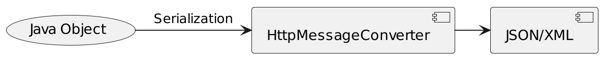
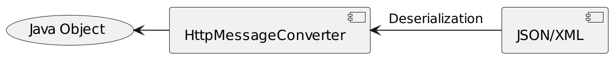

# HttpMessageConverter
## Overview
- HTTP 요청과 응답 본문(body)에 있는 데이터를 객체로 변환
- 객체를 HTTP 요청 또는 응답의 본문에 있는 데이터로 변환
- 요청과 응답
  - 일반적으로 텍스트, 바이너리 형태 데이터로 전송됨
  - HTTPMessageConverter는 이러한 데이터를 애플리케이션 내에서 처리하기 용이하게 해줌.





## Interface
- canRead(), canWrite()
  - messageConverter가 해당 class 또는 HTTP요청의 Content-Type mediaType을 지원하는지 체크
- read(), write()
  - messageConverter를 통해 메시지를 읽고 쓰는 기능을 지원
- List getSupportedMediaTypes();
  - 현재 지원하는 미디어 타입의 목록을 반환

```java
public interface HttpMessageConverter<T> {
 
  boolean canRead(Class<?> clazz, @Nullable MediaType mediaType);

  boolean canWrite(Class<?> clazz, @Nullable MediaType mediaType);

  List<MediaType> getSupportedMediaTypes();

  T read(Class<? extends T> clazz, HttpInputMessage inputMessage) /*..*/;

  void write(T t, @Nullable MediaType contentType, HttpOutputMessage outputMessage) /*..*/;
```

## @EnableWebMvc
- 자동 구성되어 구동되는 Spring Mvc 구성을 직접 제어 할 떄 사용
- @Configuration과 함께 사용
- WebMvcConfigurationSupport에서 구성한 설정을 불러옴
  - org.springframework.web.servlet.config.annotation,WebMvcConfigurationSupport;
## RestController
- RestController = @Controller + @ResponseBody
- RestAPI 개발에 사용
- ViewResolver를 사용하지 않고, HttpMessageConverter에 변환

## MappingJackson2HttpMessageConverter
- ObjectMapper parameter로 주입 받아서 생성
- ObjectMapper가 실제로 json <- -> Object사이에 변환해주는 역할을 함.
- UTF-8 지원, application/json 및 application/*+json 지원
- spring 5.3부터 Jackson 2.9 ~ 2.12와 호환 됨.

```java
public class MappingJackson2HttpMessageConverter extends AbstractJackson2HttpMessageConverter {
    @Nullable
    private String jsonPrefix;

    public MappingJackson2HttpMessageConverter() {
        this(Jackson2ObjectMapperBuilder.json().build());
    }

    public MappingJackson2HttpMessageConverter(ObjectMapper objectMapper) {
        super(objectMapper, new MediaType[]{MediaType.APPLICATION_JSON, new MediaType("application", "*+json")});
    }

    public void setJsonPrefix(String jsonPrefix) {
        this.jsonPrefix = jsonPrefix;
    }

    public void setPrefixJson(boolean prefixJson) {
        this.jsonPrefix = prefixJson ? ")]}', " : null;
    }

    protected void writePrefix(JsonGenerator generator, Object object) throws IOException {
        if (this.jsonPrefix != null) {
            generator.writeRaw(this.jsonPrefix);
        }

    }
}
```
# Spring MVC Components


### HandlerMapping
### HandlerAdapter
### HandlerExceptionResolver
### RequestToViewNameTranslator
### ViewResolver
### LocaleResolver
### LocaleContextResolver
### ThemeResolver
### MultipartResolver
### FlashMapManager

