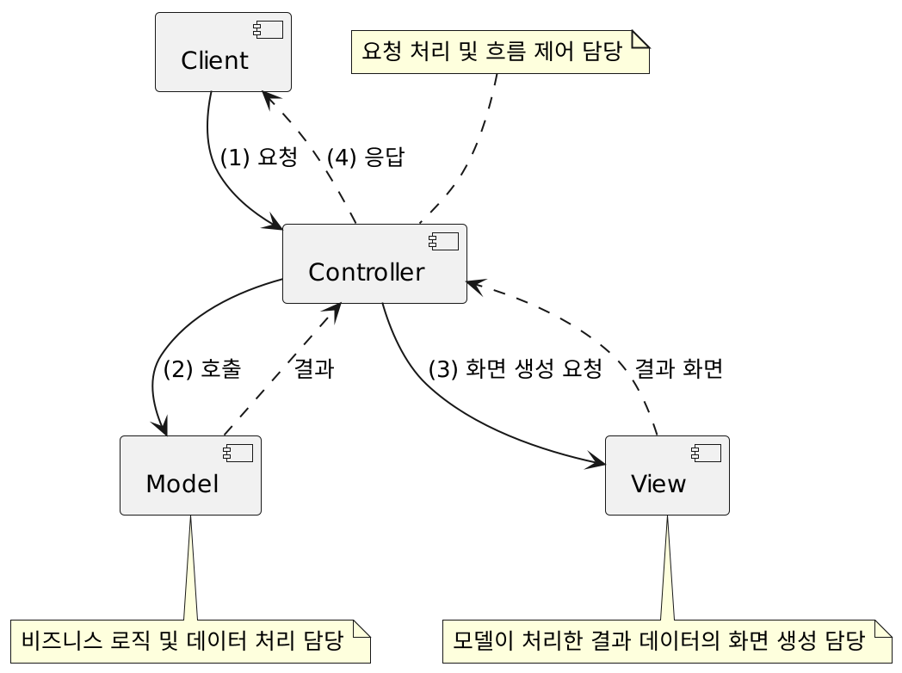
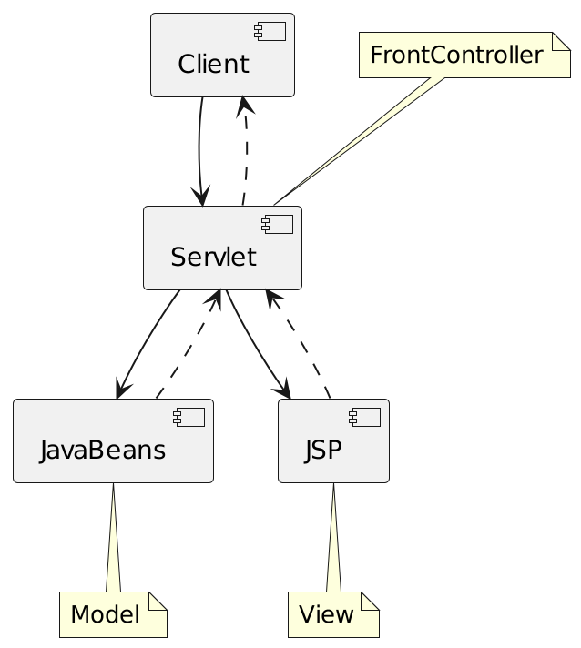
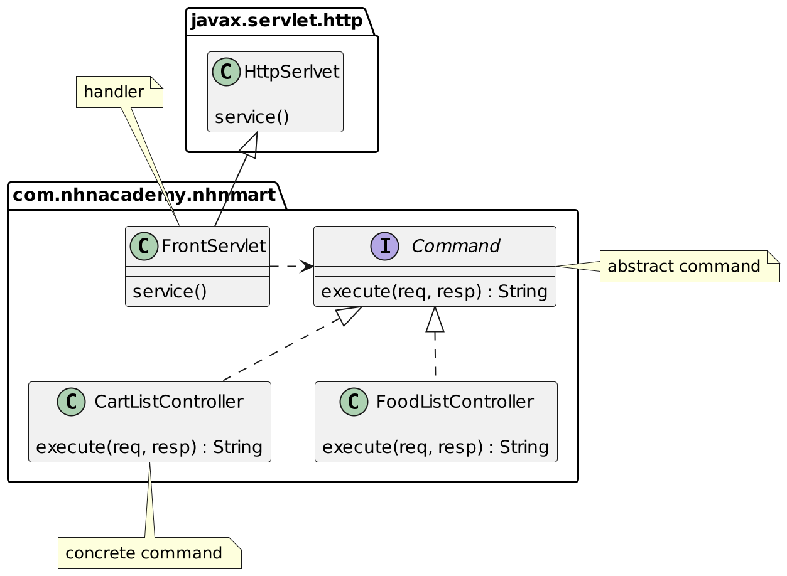

# MVC Pattern
## Model1


- JSP에서 모든 로직과 출력을 처리합니다.
- 즉 JSP 페이지에 비지니스 로직을 처리하기 위한 코드와 웹브라우저에 결과를 출력하는 코드가 섞여 있습니다.
  
```
jsp - view
sevlet - controller

```
## MVC- Model2


- 모든 요청을 서블릿이 받아 처리하고 JSP 페이지로 포워드 합니다.
- 서블릿은 클라이언트(브라우저) 요청을 구분하여 처리합니다.
## Model2 방식 = MVC pattern



- Model: 비즈니스 로직 및 데이터 처리 담당
- View: 모델이 처리한 결과 데이터의 화면 생성 담당
- Controller: 요청 처리 및 흐름 제어 담당
## JavaBeans/JSP/Servlet (JSP Model2)


# Spring MVC

- Spring Framework이 직접 제공하는 Servlet API 기반의 웹 프레임워크
## Front Controller Pattern
Nhnmart 의 추억


## Spring MVC 에서의 Front Controller
### DispatcherServlet

- Spring MVC Framework의 중심이 되는 Servlet
- Controller로 향하는 모든 웹 요청의 entry point
- Front Controller 디자인 패턴의 표현

```
DispatcherServlet : Front 역할
1. 타임래프 탬플릿 엔진
```

# Context
- Spring에서 Context는 스프링이 관리하는 빈들이 담겨있는 컨테이너 입니다.
## ROOT-CONTEXT
- 모든 Servlet이 공유할 수 있는 Bean들이 모인 공간
- @Repository, @Service, @Component , @Configuration

## SERVLET-CONTEXT
- Servelt 각자의 Bean이 모인 공간
- Context 내에서의 Bean들은 서로 공유될 수 없음
- @Controller

```
@Controller
서블렛 컨텍스트 내에서 동작하는 빈을 만드는 녀석
```
```
루트 콘텍스트에 등록된 빈은 , 모든 서블릿에서 사용가능

서블릿 콘텍스트 : 

프론트 서블릿은 디스패처와 같은 역할

루트 컨텍스트 와 서블릿컨텍스트는 
루트 컨텍스트 안에 서블릿컨텍스트가 있고,

서블릿 컨텍스트 등록된 빈은 자기들 끼리만
루트 컨텍스트에 등록된 빈은 전체가 사용
```
## ApplicationContext ( ROOT-CONTEXT )


## Bean Factory
- Bean 생성및 의존관계를 설정을 담당하는 가장 기본적인 IOC Container
## Lazy loading : XmlBeanFactory 방식
빈 로딩 요청을 받는 시점에 인스턴스를 만들고 로딩하는 방식
- XmlBeanFactory Deprecated!
## Pre loading : ApplicationContext 방식
-모든 빈 들과 설정 파일들이 ApplicationContext에 의해 로드 요청이 될 때 인스턴스로 만들어지고 로드 되는 방식
## ApplicationContext
- Web Application의 최상단에 위치하고 있는 Context = Root Context
- BeanFactory를 상속
- xml 기반의 설정 : ApplicationContext의 설정 정보를 담고 있는 파일
  - 네이밍 규칙
     - root-context.xml
    - applicationContext.xml
- 서로 다른 여러 Servlet에서 공통적으로 공유해서 사용할 수 있는 bean들을 등록
  - @Service, @Repository, @Configuration, @Component
- ApplicationContext 구현체
  - ClassPathXmlApplicationContext
  - FileSystemXmlApplicationContext
  - AnnotationConfigWebApplicationContext
  
```
각각의 어노테이션은 역할만 지정, 반면 빈으로 등록시켜줌

ApplicatioContext의 빈들은
서로 다른 서블릿끼리 공유해서 사용이 가능
```
## WebApplicationContext


## Servlet 단위로 생성되는 context
- DispatcherServlet ( fornt controller )
  - /WEB-INF/dispatcherServlet-xml ( DispatcherServlet 생성시 필요한 정보를 담고있는 파일 )
- URL 관련 설정이 있는 bean
  - Interceptor, @Controller
- Servlet 간에는 bean을 공유할 수 없음

```
디스패처 서블릿이 공유 되는 빈(컨트롤러)
디스패처 서블릿 내에서만 공유
```
<h2>Web Application Context =  Servlet Context  + Application Context</h2>


# 실습

## RootConfig.java
- @ComponentScan : Stereo Type bean scan
- excludeFilter :  @Controller.class 제외
```java
package com.nhnacademy.springmvc.config;

import org.springframework.context.annotation.ComponentScan;
import org.springframework.context.annotation.Configuration;
import org.springframework.stereotype.Controller;

@Configuration
@ComponentScan(basePackages = {"com.nhnacademy.springmvc"},
        excludeFilters = { @ComponentScan.Filter(Controller.class) })
public class RootConfig {

}
```
```
사실은 익스클루드 안해줘도 루트 영역을 구분한다.
```
```java
@Controller
public class IndexController {
@RequestMapping(method = RequestMethod.GET,value="/")
  public String index(){
  return "index";
}
@RequestMapping(method = RequestMethod.POST ,value="/")
public String postIdnex(){
  return "";
}
}
```
```
익스쿨르드안해줘도 Controller 들은 제외할수 있지만 명시적으로 제외
```

## web application context
- dispatcherServlet
  - Spring MVC Framework의 중심이 되는 Servlet
  - Controller로 향하는 모든 웹 요청의 entry point
  - Front Controller 디자인 패턴의 표현
  - 서블릿 이름에 해당되는 xml파일을 읽어드려 파일에 정의된 Bean들을 Spring IoC 컨테이너에 생성합니다.

> /WEB-INF/'서블릿 이름'-servlet.xml => /WEB-INF/dispatcherServlet-servlet.xml

```xml
 <filter>
    <filter-class>org.springframework.web.filter.CharacterEncodingFilter</filter-class>
    <filter-class>org.springframework.web.filter.HiddenHttpMethodFilter</filter-class>
    ...
```
```
Spring에서 지원하는 필터가 있다.
HIDDING METHOD FILTER는 GET, POST로만 오는 요청을
DELETE 요청으로 바꿔주는 역할을 한다.
Hidden 타입의 input 태그의 속성들을 읽어서 HttpServletRequestWrapper.getMethod() 반환 값을 변경해 요청된 HTTP 메소드의 타입을 PUT, DELETE, PATCH로 변경해주는 필터 입니다.
```
## todo-5
- todo-5 base package 설정
- use-default-filters=true ( default = true )
    - @Controller, @Repository, @Component, @Service, @Configuration ... 스켄을 합니다.
- use-default-filters=false +. include-filter 사용해서 @Controller만 스켄될 수 있도록 설정.
```xml
    <context:include-filter type="annotation" expression="org.springframework.stereotype.Controller"/>
```
```
Comtroller 어노테이션이 부튼 녀석만 포함
```
```xml
  <mvc:resources mapping="/resources/**" location="/resources/" />
```
```
정적인 리소스들 css,이미지 등
```

```xml
 <bean class="org.springframework.web.servlet.view.InternalResourceViewResolver">
    <constructor-arg name="prefix" value="/WEB-INF/views/" />
    <constructor-arg name="suffix" value=".jsp" />
  </bean>
```
```
@Controller
public class IndexController {
@RequestMapping(method = RequestMethod.GET,value="/")
  public String index(){
  return "/main";
}
@RequestMapping(method = RequestMethod.POST ,value="/")
public String postIdnex(){
  return "/main";
}
여기서 보면 /Get요청이 들어오면 /main을 반환하는데
이때  <bean class="org.springframework.web.servlet.view.InternalResourceViewResolver">
가 prefix와 suffix를 분석해서 리턴된 jsp로 연결시켜준다;
```
## RestController