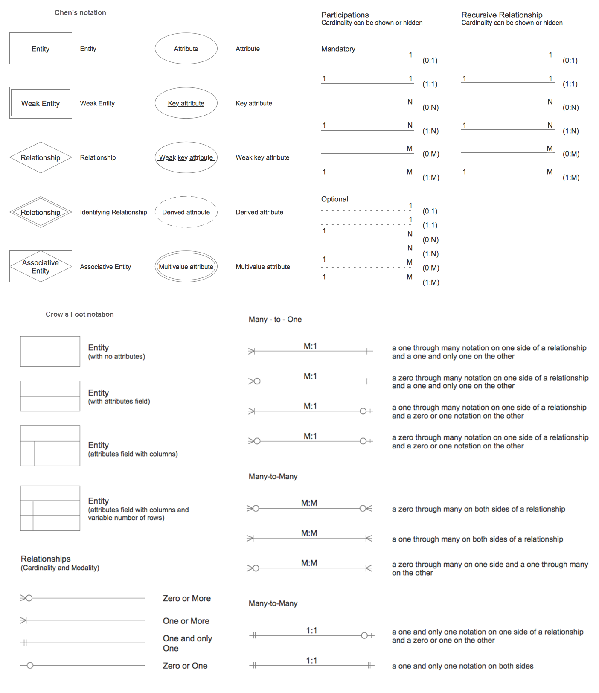
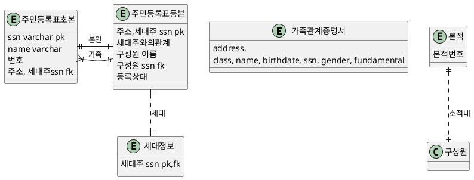
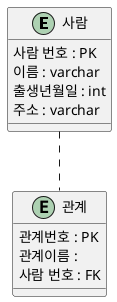

- 물리적 데이터베이스 설계 : 데이터베이스가 지원해 주어야 할 예상 작업 부하를 고려해 주어야 하고, 그 이우호를 차차 데이터베이스 설계를 정제하여 원하는 성능 기준에 맞도록 해 주어야 함
  - 고정길이 레코드, 예상되는 글의 양 등등 타입지정
  - 주로 쓰이는 검색조건

```

```
## ER 모델
### 개체 관계 데이터 모델
- 데이터를 개체, 속성 관계로 나타낸 데이터모델
- 실 세계를 개체라 불리는 기본 객체들과 그 객체들 사이의 관계로 인식
- 데이터베이스의 전체 노리적 구조를 나타내는 조직의 스키마를 명시함으로써 데이터베이스를 쉽게 설계하도록 개발
- 실세계의 조직의 의미와 상호작용을 개념적 스키마로 나타내는데 매우 유용
  
```
설계를 하다가, 개발자들 간에 이야기를 할때,
글이나 말로 대화하는데 한계가 있는 경우 ERD를 사용

만티프리 노테이션
크로프 노테이션

개체 : 사각형

속성 : 타원

관계 : 마름모
```

### 개체, 속성, 개체 집합


- 개체
  - 실세계와 다른 객체와 구별되는 유, 무형의 사물
  - 회사, 부서, 부서장, 주소 등이 실세계의 개체
  - 개체집합 : EntrySet
    - 비슷한 개체들을 하나로 묶음
- 속성
  - 한 개체를 기술하기 위한 속성
  - 사번, 이름 , 주차 구역 번호 등
  - 개체 집합에 속한 모든 개체들은 동일한 속성을 가짐
  - 가능한 값의 집합인 Domain을 지정하며, 개체를 식별하기 위한 Key 지정
  - 단순 속성과 복합속성
  - 단일값 속성, 다중값 속성
  - 유도된 속성
- 개체 집합
  - 개체들의 집합
- 개체 집합하나는 하나의 릴레이션으로 바로 매핑
```sql
CREATE TABLE 직원 (
사번 int,
이름 varchar(10)m
주차구역번호 int,
CONSTRAINT pk_employee PRIMARY KEY(사번)
)
```

### 관계 집합
- 관계  : 둘 이상의 개체간의 관련성
- 관계 집합 : 같은 유형의 관계뜰의 집합. n>=2개의 개체집합(중복 허용) 수학적 관계

- 만약 E1,E2...En이 개체 집합들일 때 관계 집합 R은
$$ {(e1, e2,… en)| e1 ∈ E1 ... en ∈ En}$$
    
    의 부분집합 여기서 e1,e2,...는 관계

- 개체 집합 사이의 연관을 관계집합에의 참가라고 함
- 관계에서 개체가 행하는 기능을 개체의 역할이라고함
- 관계는 설명형 속성이라는 속성을 가짐


```
한 직원이 한 부서에서 근무한다는 개체 관계
- 관계 집합
    - 개체와 마찬가지로 비슷한 항목끼리 하나의
    집합으로 묵을수  있음
관계 집합은 n-투플의 집합
Ei : 개체집합
n-투플 : e1~en까지 n개의 개체가 관련된 관계 하나

```
$${(e1, e2,… en)| e1 ∈ E1 ... en ∈ En}$$


- 직원 한명당 하나의 부서에서 근무한다라는 관계를 묶은 개체집합 근무
- 관계엔 설명형 속성이 들어갈 수 있음
- 관계의 정보를 기록, 개체정보 기록 X
  - 근무 시작일은 직원개체, 부서개체에 기록될 수 없음
  - 이때 관계에 설명형 속성 추가
- 각 직원이 어디서 근무하는가에 대한 정보를 넣으면 3진 관계


 
- 관계에 참여하는 개체가 동일한 개체 집합일 경우
- 역할, 역할 지시자를 통해 역할을 표시


## Chens Notation



## ER 모델의 기타 기능

### 대응 수
- 참여 제약 조건 관계를 이루는 관계 비율
  - One-To-One
    - A의 한 개체는 B의 한 개체와 연관을 가져, 가지고 있는 B의 개체는 A의 한 개체에 연관을 가짐
  - One-To-Many
  - A의 한개체는 임의의 수( 0 또는 그 이상)의 B개체와 연관성을 가짐. 그러나 b의 개체는 a의 한개체만 연관 
  - Many-to-One
  - A의 한 개체는 B의 한 개체와 연관을 가짐. 그러나 B의 개체는 A의 임의이 수의 개체와 연관을 갖는다
  - Many-to-Many : A의 한 개체는 임의의 수의 B개체와 연관을 갖고 B의 한개체도 임의의 수의 A개체와 연관을 갖는다.
### 키 제약조건
- 릴레이션 에서 키 제약 조건에 따라 대응수가 정해짐
- 개체 집합 E가 관계 집합 R에 대해 키 제약조건을 가진다면 E인스턴스에 속한 각 객체는 R인스턴스에 속한 관계 중 하나만 나타냄


### 참여 제약 조건
### 약 개체 집합
- 키가 존재하지 않는 개체 집합
  - 자신의 일부 속성과 다른 개체늬 PrimaryKEy를 조합해 유일하게 식별
  - 다른 개체를 식별 소유자
- 다음 조건이 충족해야 사용
  - 식별 소유자와 약 개체 집합사이엔 One-To-Many 관계 집합이 성립
  - 약 개체집항은 식별 관계집합에 전체적으로 참여해야함
  - 소유자 개체에 대해 약 개체를 하나를 유일하게 식별해주는 속성 집합을 약 개체 집합에 대한 구별자 또는 부분 키
```
승객과 항공편  : 일대다 ? 다대다
개체나 관계나 : 식별(pk)가능하면 개체, 불가능하면 관계

사람 - 가족
가족은 가족을 저장
가족 식별?ㅂ

직원 - 부하직원
1. 부하직원 상급자직원 테이블을 만든다
2. 직원, 상급자, 하급자 관계를 만든다.(롤링형태) 

```



- 사람은 고유의 ID, PWD, NICKNAME을 가진다.
- 사람은 유저와 관리자로 구분된다.
- 게시물은 작성자, 제목, 내용, 생성일을 가진다.

### 전문화와 일반화
## 개념적 설계 고려사항

