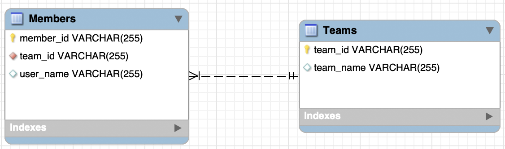
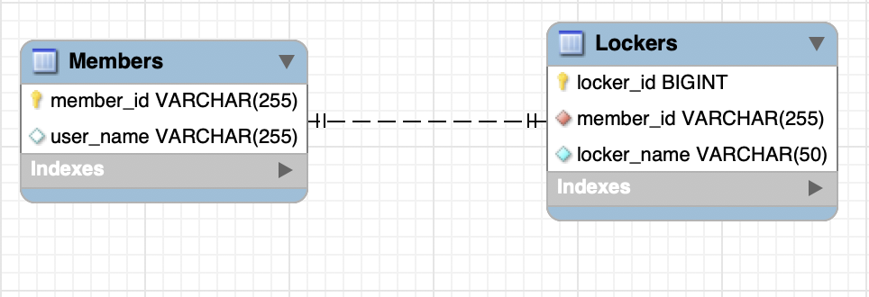
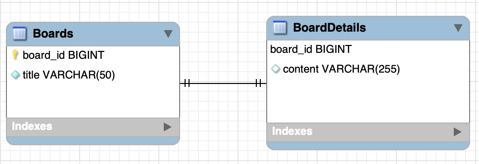
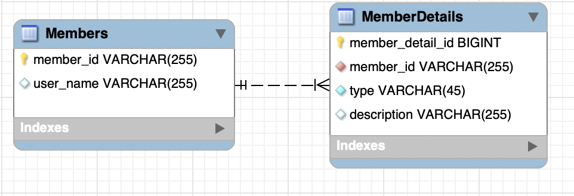

# 관계형 데이터베이스와 ORM

## 데이터베이스 (Database)
### 데이터베이스의 정의
- 데이터를 효율적으로 관리하기 위한 일종의 창고
- 특정 조직의 여러 사용자가 데이터를 공유하여 사용할 수 있도록 통합 저장된 데이터의 집합
- 행과 열로 구성된 시트에서 사용자가 정의한 형식으로 데이터를 관리하는 엑셀파일과 유사
## 관계형 데이터베이스 (Relational Database)
### 관계형 데이터베이스
- 1970년에 E. F. Codd 가 제안한 데이터 관계형 모델에 기초하는 디지털 데이터베이스
### 관계형 모델 (Relational Model)
- 데이터를 컬럼(column)과 로우(row)를 이루는 하나 이상의 테이블(또는 관계)로 정리
- 고유 키(Primary key)가 각 로우(row)를 식별
로우(row)는 레코드(record)나 튜플(tuple)로 부른다
- 관계(Relationship)는 서로 다른 테이블들 사이의 상호작용에 기반을 두고 형성된 논리적 연결이다.
- 관계(Relationship)는 테이블 간에 둘 다 존재한다.
  - 이 관계들은 일대일, 일대다, 다대다, 이렇게 세 가지 형태로 이루어진다.
  - 모두 다 관계형 데이터베이스
> column, row, primary key, foreign key, relationship, transaction, SQL, MySQL, Oracle


## 하지만 내가 아는 프로그래밍 언어는
### Java
- 객체지향(Object-oriented) 프로그래밍 언어
- 패러다임의 불일치 발생
  - 관계형 데이터베이스 ≠ 객체 지향 프로그래밍 언어
  
## 데모
- IntelliJ에서 VCS에서 가져와 프로젝트 생성
- URL: https://github.com/dongmyo/academy-spring-jpa
- 복제(Clone)
- 실행 구성: Tomcat 서버, 로컬, 데모
- 전체 소스 코드 살펴보기:
  - `pom.xml`: 메이븐 프로젝트
  - 패키징: war
  - Spring MVC + Spring JDBC
  - JdbcTemplate
  - H2 데이터베이스
  - 자바 기반
  - 오픈소스
  - 관계형 데이터베이스

- H2 데이터베이스 다운로드 및 실행:
  - Download > All Platforms: https://www.h2database.com/html/main.html
  - 압축 파일 해제
  - jar 파일 실행: `java -jar h2/bin/h2-2.1.214.jar`

- 연습:
  - 이전 Demo 프로그램에서 `User` 클래스에 `age` 필드 추가하기
  - 하지만...
    - SQL 직접 수정
    - 텍스트 편집으로 오타가 있어도 런타임에서 확인 가능
    - 객체와의 맵핑은 별개의 작업
    - 쿼리 수행 결과와 객체와의 맵핑은 별도 수작업 필요
    - Repository의 CRUD 메서드와 SQL을 함께 변경
  - 추가적으로:
    - 상속 구조의 표현
    - 연관관계 참조
    - 객체 그래프 탐색 등

## ORM
- ORM (Object-Relational Mapping)
- ORM 프레임워크가 중간에서 객체와 관계형 데이터베이스를 맵핑
- ORM을 사용하면 DBMS 벤더마다 다른 SQL에 대한 종속성을 줄이고 호환성을 향상시킬 수 있음
```
데이터베이스 벤더들 마다 다른 쿼리를 작성해주라는 뜻

```
## JPA
- JPA (Java Persistence API)
  - 자바 ORM 기술 표준
  - 표준 명세:
    - JSR 338 - Java Persistence 2.2
- JPA (Jakarta Persistence API)
  - Jakarta Persistence 3.1
- JPA 구현: <p>JPA는 스펙이다. <a href="#footnote1" id="ref1" style="text-decoration:none;">[1]</a></p>


  - Hibernate, EclipseLink, DataNucleus
  - Hibernate가 사실상 표준 (de facto) JPA 구현체임.
JPA를 사용해야 하는 이유


```
ORM을 자바에서 쓰려면 JPA를 써야함.
서블릿과 톰켓의 차이?
서블릿은 스펙이고 톰캣은 구현
JPA는 스펙이다.

```
1. SQL 중심적인 개발 -> 객체 중심으로 개발
   - JPA를 사용하면 객체를 중심으로 개발하고, 지루하고 반복적인 CRUD용 SQL을 개발자가 직접 작성하지 않아도 된다.

2. 패러다임 불일치 해결
   - JPA는 객체와 관계형 데이터베이스 사이의 패러다임의 불일치로 인해 발생하는 문제(상속, 연관관계, 객체 그래프 탐색 등)를 해결한다.

3. 생산성
   - Spring Data JPA를 사용하면 interface 선언만으로도 쿼리 구현이 가능하기 때문에, 지루하고 반복적인 CRUD 쿼리를 손쉽게 대처할 수 있다.

4. 유지보수성
   - JPA를 사용하면 컬럼 추가/삭제 시 관련된 CRUD 쿼리를 모두 수정하는 대신, JPA가 관리하는 모델(Entity)을 수정하면 된다.

5. 데이터 접근 추상화와 벤더 독립성
   - 데이터베이스 벤더마다 미묘하게 다른 데이터 타입이나 SQL을 JPA를 이용하면 손쉽게 해결이 가능하다.

Spring Framework과 JPA

- Spring Data: 다양한 데이터 저장소에 대한 접근을 추상화하기 위한 Spring 프로젝트 (JPA, JDBC, Redis, MongoDB, Elasticsearch 등을 지원한다)
- Spring Data JPA: repository 추상화를 통해 interface 선언만으로도 구현 가능하며, 메서드 이름으로 쿼리를 생성할 수 있다. 또한 Web Support(페이징, 정렬, 도메인 클래스 컨버터 기능)을 제공한다.

Demo

- 앞선 Demo 프로그램에서는 트랜잭션 적용, Spring + JPA 셋팅을 살펴보았다.

- Spring Framework의 트랜잭션 추상화
  - PlatformTransactionManager: Spring Framework 트랜잭션 추상화의 핵심 interface
    ```
    public interface PlatformTransactionManager extends TransactionManager {
        TransactionStatus getTransaction(TransactionDefinition definition) /*..*/;
        void commit(TransactionStatus status) throws TransactionException;
        void rollback(TransactionStatus status) throws TransactionException;
    }
    ```
  - 선언적 트랜잭션: @Transactional

- Demo: Spring + JPA 셋팅을 살펴본다.
  - 설정:
    - pom.xml: dependencyManagement에 spring-data-bom 추가
죄송합니다. 아래에 한번에 복사할 수 있게 코드를 올려드리겠습니다.

```xml
<dependencyManagement>
    <dependencies>
        <dependency>
            <groupId>org.springframework.data</groupId>
            <artifactId>spring-data-bom</artifactId>
            <version>2021.2.0</version>
            <scope>import</scope>
            <type>pom</type>
        </dependency>
    </dependencies>
</dependencyManagement>

<dependency>
    <groupId>org.springframework.data</groupId>
    <artifactId>spring-data-jpa</artifactId>
</dependency>
```

```java
@Bean
public LocalContainerEntityManagerFactoryBean entityManagerFactory(DataSource dataSource) {
    LocalContainerEntityManagerFactoryBean emf = new LocalContainerEntityManagerFactoryBean();
    emf.setDataSource(dataSource);
    emf.setPackagesToScan("com.nhnacademy.springjpa.entity");
    emf.setJpaVendorAdapter(jpaVendorAdapters());
    emf.setJpaProperties(jpaProperties());

    return emf;
}

private JpaVendorAdapter jpaVendorAdapters() {
    HibernateJpaVendorAdapter hibernateJpaVendorAdapter = new HibernateJpaVendorAdapter();
    hibernateJpaVendorAdapter.setDatabase(Database.H2);

    return hibernateJpaVendorAdapter;
}

private Properties jpaProperties() {
    Properties jpaProperties = new Properties();
    jpaProperties.setProperty("hibernate.show_sql", "true");
    jpaProperties.setProperty("hibernate.format_sql", "true");
    jpaProperties.setProperty("hibernate.use_sql_comments", "true");
    jpaProperties.setProperty("hibernate.globally_quoted_identifiers", "true");
    jpaProperties.setProperty("hibernate.temp.use_jdbc_metadata_defaults", "false");

    return jpaProperties;
}
```
해당 내용을 마크다운 문법으로 수정하겠습니다.

위 코드는 Spring Data JPA 설정 예시입니다. 위 코드에서는 `dependencyManagement` 태그 내에서 `spring-data-bom`을 추가하여 Spring Data JPA에 필요한 라이브러리들의 버전을 일괄적으로 관리할 수 있습니다. `dependency` 태그 내에서 `spring-data-jpa` 라이브러리를 추가하여 Spring Data JPA를 사용할 수 있습니다.

`LocalContainerEntityManagerFactoryBean`을 사용하여 `EntityManagerFactory`를 설정합니다. `DataSource`를 주입받아 `emf.setDataSource(dataSource)` 메서드를 호출하여 `DataSource`를 설정합니다. `emf.setPackagesToScan("com.nhnacademy.springjpa.entity")` 메서드를 호출하여 Entity 클래스들이 위치한 패키지를 설정합니다. `jpaVendorAdapters()` 메서드를 호출하여 Hibernate JPA 구현체를 설정합니다. `jpaProperties()` 메서드를 호출하여 Hibernate JPA 설정을 추가로 설정합니다. 위 예제에서는 SQL 출력, SQL 포맷팅, SQL 코멘트, Globally quoted identifiers 설정, JDBC metadata 설정 등을 추가로 설정하였습니다.

### Bean Configuration

#### Transaction Manager
Spring Framework은 트랜잭션을 추상화하여 다양한 방식으로 트랜잭션을 다룰 수 있게 해주는데, 그 중에서 `DataSourceTransactionManager`와 `JpaTransactionManager`를 살펴보겠습니다.

`DataSourceTransactionManager`는 JDBC의 `Connection`을 사용하여 트랜잭션을 다룹니다. 따라서 JDBC 기반의 프로그램에서 사용하기 적합합니다.

반면에 `JpaTransactionManager`는 JPA의 `EntityManager`를 사용하여 트랜잭션을 다룹니다. JPA 기반의 프로그램에서 사용하기 적합합니다.

또한 `@Transactional` 어노테이션을 사용하여 선언적 트랜잭션을 사용할 수 있습니다. 이를 사용하면 메서드 단위로 트랜잭션을 관리할 수 있습니다.
## Bean Configuration

### Transaction Manager
```java
@Bean
public PlatformTransactionManager transactionManager(EntityManagerFactory entityManagerFactory) {
    JpaTransactionManager transactionManager = new JpaTransactionManager();
    transactionManager.setEntityManagerFactory(entityManagerFactory);

    return transactionManager;
}
```

### EntityManager
엔터티의 저장, 수정, 삭제, 조회 등 엔터티와 관련된 모든 일을 처리하는 관리자

```java
public interface EntityManager {
    public <T> T find(Class<T> entityClass, Object primaryKey);
    public <T> T find(Class<T> entityClass, Object primaryKey, Map<String, Object> properties); 
    public <T> T find(Class<T> entityClass, Object primaryKey, LockModeType lockMode);
    public <T> T find(Class<T> entityClass, Object primaryKey, LockModeType lockMode, Map<String, Object> properties);

    public void persist(Object entity);

    public <T> T merge(T entity);

    public void remove(Object entity);

    // ...
}
```

### EntityManagerFactory
EntityManager를 생성하는 팩토리

```java
public interface EntityManagerFactory {
  public EntityManager createEntityManager();
  public EntityManager createEntityManager(Map map);
  public EntityManager createEntityManager(SynchronizationType synchronizationType);
  public EntityManager createEntityManager(SynchronizationType synchronizationType, Map map);

  // ...
}
```
# cf.) JPA/Hibernate Logging

## SQL
- JPA properties
  - hibernate.show-sql=true
  - hibernate.format_sql=true
- logback logger
```
<logger name="org.hibernate.SQL" level="debug" additivity="false">
    <appender-ref ref="console" />
</logger>
```
- binding parameters
```
<logger name="org.hibernate.type.descriptor.sql.BasicBinder" level="trace" additivity="false">
    <appender-ref ref="console" />
</logger>
```
- 맵핑된 sql 파라미터도 보여주는 로거, 둘중 하나만 쓰면 됨
- cf.) org.hibernate.type.descriptor.sql.BasicExtractor

## Demo
- cf.) Spring 없이 JPA 사용하기
  - [예시](https://blog.jetbrains.com/idea/2021/02/creating-a-simple-jpa-application/)
- IntelliJ에서 Jakarta EE 프로젝트 시작
  - Project template: Library
  - Java EE 8 > Hibernate 선택
  - h2 DB 사용
  - View > Tool Windows > Persistence
  - persistence.xml 생성
  - User Entity 생성
    - 주의! @Table(name = "Users")
  - Main class 생성
  - EntityManagerFactort / EntityManager 를 이용해서 Entity 를 저장
  - h2 web console 에서 데이터 확인

# Entity 맵핑

## Entity / Entity 맵핑
- Entity란?
  - JPA를 이용해서 데이터베이스 테이블과 맵핑할 클래스
- Entity 맵핑
  - Entity 클래스에 데이터베이스 테이블과 컬럼, 기본 키, 외래 키 등을 설정하는 것
```
컬럼들은 클래스의 필드들과 매핑
```
- 어노테이션
  - @Entity : JPA가 관리할 객체임을 명시
  - @Table : 맵핑할 DB 테이블 명 지정
  - @Id : 기본 키(PK) 맵핑
  - @Column : 필드와 컬럼 맵핑 (생략 가능)
- 예제
```java
@Entity
//맴버스란 테이블이 자바의 맴버 클래스와 맵핑
@Table(name = "Members")
public class Member {
    @Id
    @GeneratedValue(strategy = GenerationType.IDENTITY)
    private Long id;

    private String name;

    @Column(name = "created_dt")
    private LocalDateTime createdDate;
}
``````java
@Entity
@Table(name = "Members")
public class Member {
    @Id
    @GeneratedValue(strategy = GenerationType.IDENTITY)
    private Long id;

    private String name;//컬럼어노테이션은 생략 가능

    @Column(name = "created_dt")//dbtable의 컬럼을 명시, 이름이 달라서
    private LocalDateTime createdDate;
}
```

필드와 컬럼 맵핑
`@Column` : 객체 필드를 컬럼에 맵핑, 생략 가능

`@Temporal` : 날짜 타입 맵핑
```java
public enum TemporalType {
    DATE, 
    TIME, 
    TIMESTAMP
}
```
cf.) Java 8의 `date/time` (`LocalTime`, `LocalDate`, `ZonedDateTime`) 타입은 `@Temporal`을 붙이지 않는다.

```
명확한 타입이기에 굳이 Temporal을 붙 일 필요가 없다는 거같음
```

`@Transient` : 특정 필드를 컬럼에 맵핑하지 않을 경우에 지정

```
임시 값 같은애들은 따로 빼줌
```

도메인


실습: Items 테이블에 대한 Entity 맵핑

Items 테이블에 대한 Entity 맵핑을 위해 Entity 클래스를 생성하고 컬럼 맵핑을 해보세요.
```git checkout entity```

기본 키(Primary Key) 맵핑 전략
자동 생성
- TABLE 전략 : 채번 테이블을 사용
- SEQUENCE 전략 : 데이터베이스 시퀀스를 사용해서 기본 키를 할당 (예: Oracle)
- IDENTITY 전략 : 기본 키 생성을 데이터베이스에 위임 (예: MySQL)
- AUTO 전략 : 선택한 데이터베이스 방언(dialect)에 따라 기본 키 맵핑 전략을 자동으로 선택

직접 할당
- 애플리케이션에서 직접 식별자 값을 할당

예제
```java
public class Item {
    @Id
    @GeneratedValue(strategy = GenerationType.IDENTITY)
    @Column(name = "item_id")
    private Long itemId;

    // ...
}

public @interface GeneratedValue {
  GenerationType strategy() default AUTO;
  String generator() default "";
}

public enum GenerationType {
    TABLE, 
    SEQUENCE, 
    IDENTITY, 
    AUTO
}
```
실습

Orders 테이블에 대한 Entity 맵핑

Orders 테이블에 대한 Entity 맵핑을 위해 Entity 클래스를 생성하고 컬럼 맵핑을 해봅시다.
```java
@Entity
@Table(name = "Orders")
public class Order {
    @Id
    @GeneratedValue(strategy = GenerationType.IDENTITY)
    @Column(name = "order_id")
    private Long orderId;

    @Column(name = "order_date")
    private LocalDateTime orderDate;

    @Column(name = "status")
    private String status;

    @ManyToOne
    @JoinColumn(name = "user_id")
    private User user;

    // ...
}
```

복합 Key (Composite key)

복합 키란 둘 이상의 필드를 조합하여 기본 키(PK)를 생성하는 방식입니다. 복합 키를 사용하려면 `@IdClass` 어노테이션 또는 `@EmbeddedId`와 `@Embeddable` 어노테이션을 사용해야 합니다.

@IdClass
복합 키를 사용할 때는 `@IdClass` 어노테이션을 이용해 Entity class 레벨에서 지정해줍니다. `@Id` 어노테이션을 필드에 지정하며, 복합 키를 구성하는 모든 필드에 `@Id` 어노테이션을 붙여줍니다.

```java
@Entity
@Table(name = "OrderItems")
@IdClass(OrderItem.Pk.class)
public class OrderItem {
    @Id
    @Column(name = "order_id")
    private Long orderId;

    @Id
    @Column(name = "line_number")
    private Integer lineNumber;

    // ...

    @NoArgsConstructor
    @AllArgsConstructor
    @EqualsAndHashCode
    public static class Pk implements Serializable {
        private Long orderId;
        private Integer lineNumber;
    }
}
```

@EmbeddedId / @Embeddable
복합 키를 사용할 때는 `@EmbeddedId`와 `@Embeddable` 어노테이션을 이용해 복합 키 식별자 클래스를 만들어줍니다. 복합 키 식별자 클래스에는 `@Embeddable` 어노테이션을 붙여주고, Entity 클래스의 필드에는 `@EmbeddedId` 어노테이션을 붙여줍니다.

```java
@Entity
@Table(name = "OrderItems")
public class OrderItem {
    @EmbeddedId
    private Pk pk;

    // ...

    @Embeddable
    @NoArgsConstructor
    @AllArgsConstructor
    @EqualsAndHashCode
    public static class Pk implements Serializable {
        private Long orderId;
        private Integer lineNumber;
    }
}
```
```
복합키를 하나의 필드에서 사용할수 있다는 장점이 있다. 구조적으로 접근할수 있는 장점
```
```java
@NoArgsConstructor
@AllArgsConstructor
@EqualsAndHashCode
@Embeddable
public static class Pk implements Serializable {
    @Column(name = "order_id")
    private Long orderId;

    @Column(name = "line_number")
    private Integer lineNumber;

}
```

#### 복합 Key Class 제약조건

- PK 제약조건을 그대로 따름
- PK 제약 조건
  - The primary key class must be public and must have a public no-arg constructor.
  - The primary key class must be serializable.
  - The primary key class must define equals and hashCode methods.
```
인스턴스같은지 확인해야해서 public이어야해고 기본 생성자가 반드시 존재해야한다. 그래야 key값을 jpa가 만들 수 있다.

저장되고 읽어야 하니까 e앤티티 매니저가 유일하게 구별해야해서 시리얼라이저블해야한다

서로 다른 인스턴스가 같은값인지 ( 동등한지 확인하기위해 내가 만든 유저인스턴스와 , 디비에서 가져온거를 확인)확인하기위해 equals랑 hashcode 메소드가 구현되어야한다.

```
#### 실습

OrderItems 테이블에 대한 Entity 맵핑을 위해 Entity 클래스를 생성하고 컬럼 맵핑을 해봅시다. 복합 Key 맵핑을 위한 두 가지 방법을 모두 실습해봅시다.

- @IdClass
- @EmbeddedId / @Embeddable

#### EntityManager / EntityManagerFactory

- EntityManagerFactory: EntityManager를 생성하는 팩토리
  - 데이터베이스를 하나만 사용하는 애플리케이션은 일반적으로 EntityManagerFactory를 하나만 사용
  - EntityManagerFactory를 만드는 비용이 매우 크기 때문에 하나만 만들어서 전체에서 공유 (thread-safe)
- EntityManager: Entity의 저장, 수정, 삭제, 조회 등 Entity와 관련된 모든 일을 처리하는 관리자
  - EntityManagerFactory가 생성 → 생성 비용이 크지 않다
  - EntityManager는 thread-safe하지 않음
  - 여러 thread 간에 절대 공유하면 안 됨
  - 각각의 요청마다 별도의 EntityManager를 생성해서 사용

```
데이터 베이스 클래스에서 나오는 인스턴스를 관리해주는게 @Entity

@Entity와 관련된 데이터와 관련된 쿼리를 자동으로 설정해준다.
엔터티매니저
반드시 싱글톤으로 써야할거같지만
트랜잭션 세이프하지 않다.
하나의 트랜잭션당 하나의 엔터티 매니저

여러개의 엔터티매니저가 돌아가기때문에 트랜잭션 매니저에서
jpa 엔터티 매니저를 써야 하는것이기 때문이다.

entity 매니저 팩토리는 어플리케이션 전체에 하나만 있으면 되기때문에  싱글톤으로 되있다

커넥션이 달라지면 공장이 하나 더있어야하고
커넥션이 같으면 공장 하나만 있으면 된다.
```

#### 영속성 컨텍스트
- Entity를 영구 저장하는 환경
  - @PersistenceContext
- EntityManager가 관리하는 영역
- 영속성 컨텍스트에서 Entity의 생명주기
  - 비영속 (new/transient): 영속성 컨텍스트와 전혀 관계가 없는 상태
  - 영속 (managed): 영속성 컨텍스트에 저장된 상태
  - 준영속 (detached): 영속성 컨텍스트에 저장되었다가 분리된 상태
  - 삭제 (removed): 삭제하기 위해 표시한 상태


```
detach는 데이터베이스에 저장하지 않는다
remove 만으론 디비반영 x
flush를 하면 디비반영 o
```

```
- 영속성 컨텍스트에서 Entity의 생명주기
- 비영속 (new/transient): 영속성 컨텍스트와 전혀 관계가 없는 상태
- 영속 (managed): 영속성 컨텍스트에 저장된 상태
- 준영속 (detached): 영속성 컨텍스트에 저장되었다가 분리된 상태
- 삭제 (removed): 삭제하기 위해 표시한 상태
```

#### 영속성 컨텍스트가 Entity를 관리하면 얻을 수 있는 이점
- 1차 캐시
- 동일성 보장
- 트랜잭션을 지원하는 쓰기 지연
- 변경 감지
- 지연 로딩

```
1. 엔티티 매니저랑 상관없이 new 로 생성된 객체는 비영속상태
2. persist() 메소드를 통하면 엔티티매니저가 관리하는 상태로 변환(db 에 들어간 상태는 아님) -> flush 후 db에 저장
3. 추상화된 리포지토리를 보면 entitymanager를 볼일이 없다??? 스프링 레포지토리에는 save save delete find
엔터티매니저 => 스프링 레포지토리
persist,merge => save => saveAndFlush()
remove => delete
find = > find
```

#### @PersistenceContext

- EntityManager를 주입받기 위한 어노테이션
- 주입받은 EntityManager는 트랜잭션 내에서 사용되며, 트랜잭션이 종료되면 자동으로 플러시되어 DB에 반영됨
게시판 데이터베이스 테이블에 대해 Entity 맵핑해보겠습니다.

게시판 테이블 정보:
- 테이블 이름: board
- 컬럼 정보:
    - id (PK, 자동 생성)
    - title (VARCHAR)
    - content (TEXT)
    - writer (VARCHAR)
    - created_at (DATETIME)
    - updated_at (DATETIME)

Entity 클래스는 다음과 같이 작성할 수 있습니다.

```java
@Entity
@Table(name = "board")
public class Board {
    @Id
    @GeneratedValue(strategy = GenerationType.IDENTITY)
    private Long id;

    private String title;

    @Lob
    private String content;

    private String writer;

    @Column(name = "created_at")
    private LocalDateTime createdAt;

    @Column(name = "updated_at")
    private LocalDateTime updatedAt;

    // getters and setters
}
```

위의 코드에서 `@Lob` 어노테이션은 컨텐츠가 긴 경우 TEXT 데이터 타입을 사용하기 위한 것입니다.

``` 동묘 질문 리스트
1. stereotype이 뭔가요
2. @Bean은 뭔가요
3. 
dataSource.setInitialSize(10); // 초기 커넥션풀 갯수
dataSource.setMaxTotal(10); // 최대 커낵션 풀 갯수
dataSource.setMinIdle(10);// 놀고있는 커넥션의 최소 갯수
dataSource.setMaxIdle(10); 놀고잇는 커넥션풀의 최대 갯수
//베스트는 모두 갯수를 일치시키는게 베스트(보통 200으로 셋팅)
dataSource.setMaxWaitMillis(1000); // 커넥션풀이 바쁠때 대기시간
4. 커넥션 풀은 커넥션에 드는 비용이 많아서 사용
5.
dataSource.setTestOnBorrow(true); // 커넥션풀에서 커넥션을 가져올때 살아있는지 확인
dataSource.setTestOnReturn(true); // 못쓰는건지 확인? 하고 반환
dataSource.setTestWhileIdle(true); // 주기적으로 살아있는지 확인
//약간의 성능저하가 있을 수도 있다.
// 그래도 커넥션 비용보다 낫다
6. dataSource.setUrl("jdbc:h2:~/spring-jpa;DATABASE_TO_UPPER=false;"
                + "INIT=RUNSCRIPT FROM 'classpath:/script/schema.sql'");
6. 유닛테스트는 관심있는 부분만 테스트 
7. 통합테스트는 외부시스템을 다 통합하고 테스트
```

# 2일차

## 1일차 복습

### 1일차 학습한 내용

#### ORM (Object-Relational Mapping)
- 관계형 데이터베이스와 객체 지향 프로그래밍 언어의 패러다임 불일치를 해결하기 위해 ORM 프레임워크가 중간에서 객체와 관계형 데이터베이스를 맵핑

#### JPA (Java Persistence API, Jakarta Persistence API)
- 자바 ORM 기술 표준

| 소주제        | 명사형                     | 특징                                                          |
|-------------|--------------------------|---------------------------------------------------------------|
| ORM         | Object-Relational Mapping | 패러다임 불일치 해결, 객체-데이터베이스 매핑, 코드 간결화           |
| JPA         | Java Persistence API     | 자바 ORM 표준, 인터페이스 기반, 다양한 구현체, 객체 지향적 데이터 처리 |
| 패러다임 불일치 | Paradigm Mismatch        | 객체 지향 프로그래밍과 관계형 데이터베이스 간 차이, ORM을 통한 해결  |
| 구현체       | Implementation           | JPA 인터페이스 구현, 예: Hibernate, EclipseLink, OpenJPA       |
#### Entity / Entity 맵핑
- **Entity**: JPA를 이용해서 데이터베이스 테이블과 맵핑할 클래스
- **Entity 맵핑**: Entity 클래스에 데이터베이스 테이블과 컬럼, 기본 키, 외래 키 등을 설정하는 것

#### EntityManager 와 영속성 컨텍스트
- **EntityManager**: Entity의 저장, 수정, 삭제, 조회 등 Entity와 관련된 모든 일을 처리하는 관리자
- **영속성 컨텍스트**: Entity를 영구 저장하는 환경, 1차 캐시 역할

| 소주제                  | 명사형                 | 특징                                                                                     |
|-----------------------|----------------------|------------------------------------------------------------------------------------------|
| Entity                | Entity 클래스         | 데이터베이스 테이블 매핑, 테이블-컬럼-키 설정 가능                                           |
| Entity 맵핑            | Entity Mapping       | 클래스와 데이터베이스 사이의 매핑 설정, 관계 설정                                          |
| EntityManager         | EntityManager 클래스 | Entity 저장, 수정, 삭제, 조회 등 처리, Entity 관리자                                      |
| 영속성 컨텍스트         | Persistence Context  | Entity 영구 저장 환경, 1차 캐시 역할, EntityManager를 통해 접근 및 관리 가능                |
##### EntityManager 실습
```sql
CREATE TABLE member (
  id BIGINT PRIMARY KEY AUTO_INCREMENT,
  name VARCHAR(100) NOT NULL,
  age INT NOT NULL
);
```
```java
 import javax.persistence.*;

@Entity
@Table(name = "member")
public class Member {

  @Id
  @GeneratedValue(strategy = GenerationType.IDENTITY)
  private Long id;

  @Column(name = "name", nullable = false)
  private String name;

  @Column(name = "age", nullable = false)
  private int age;

  // 기본 생성자, Getter, Setter, toString() 메서드 등
}

```
```java
import javax.persistence.*;

public class MemberService {
  private EntityManagerFactory emf;

  public MemberService() {
    //기본적으로 EntityManagerFactory는 프로젝트에서 한개만 존재한다.
    emf = Persistence.createEntityManagerFactory("myPersistenceUnit");
  }

  public Member save(Member member) {
    // EntityManger는 트랜잭션 하나당 하나 씩 존재하며
    // 트랜잭션 내부에는 다양한 SQL문이 들어갈수 있다
    EntityManager em = emf.createEntityManager();
    EntityTransaction tx = em.getTransaction();

    try {
      tx.begin();
      em.persist(member);
      tx.commit();
      return member;
    } catch (Exception e) {
      tx.rollback();
      throw e;
    } finally {
      em.close();
    }
  }

  public Member findById(Long id) {
    EntityManager em = emf.createEntityManager();

    try {
      return em.find(Member.class, id);
    } finally {
      em.close();
    }
  }

  // 다른 CRUD 메서드들
}

```
### 실습
- EntityManager와 영속성 컨텍스트: TODO 넘버를 따라 질문에 답변하기 (`git checkout entity-manager`)
- Day1 training: 아래 ERD를 참고하여 TODO 넘버를 따라 요구사항 구현하기 (`git checkout day1-training`)

### 연관관계 맵핑
- 데이터베이스 테이블 간의 관계(relationship)
- 데이터베이스 정규화: 정규화는 중복 데이터로 인해 발생하는 데이터 불일치 현상을 해소하는 과정, 정규화를 통해 각각의 데이터베이스 테이블들은 중복되지 않은 데이터를 가지게 됨
  - 필요한 데이터를 가져오기 위해서는 여러 테이블들 간의 관계(relationship)를 맺어 JOIN을 이용해서 관계 테이블을 참조
- 연관 관계(association): 데이터베이스 테이블 간의 관계(relationship)를 Entity 클래스의 속성(attribute)으로 모델링
  - 데이터베이스 테이블은 외래 키(FK)로 JOIN을 이용해서 관계 테이블을 참조
  - 객체는 참조를 사용해서 연관된 객체를 참조
  - No object is an island.
 - Kent Beck, Ward Cunningham

| 소주제            | 명사형           | 특징                                       |
|-----------------|----------------|------------------------------------------|
| 연관관계 맵핑      | Association Mapping | Entity 클래스의 속성으로 관계 모델링         |
| 데이터베이스 정규화 | Database Normalization | 중복 데이터 줄임, 데이터 불일치 해소          |
| 관계(relationship) | Relationship       | 테이블 간 관계, JOIN 사용, 외래 키(FK) 참조  |
| 객체 참조          | Object Reference   | 객체 간 연관 관계, 참조 사용                |
### 연관 관계(association)

#### 외래 Key(FK) 맵핑
- `@JoinColumn`: 외래 키 맵핑
- `@JoinColumns`: 복합 외래 키 맵핑

| 소주제             | 명사형         | 특징                                     |
|------------------|--------------|----------------------------------------|
| 연관 관계(association) | Association  | Entity 클래스의 속성으로 관계 모델링       |
| 외래 키(FK) 맵핑   | @JoinColumn   | 단일 외래 키 맵핑, 테이블 간 관계 표현      |
| 복합 외래 키 맵핑   | @JoinColumns  | 복합 외래 키 맵핑, 여러 개의 외래 키를 사용 |

#### 예제
- ERD: `teams_members_erd.png`



#### 예제: Member Entity
```java
@Entity
@Table(name="Members")
public class Member {
    @Id
    @Column(name = "member_id")
    private String id;

    @Column(name = "user_name")
    private String userName;

    @ManyToOne(fetch = FetchType.EAGER, cascade = CascadeType.ALL)
    @JoinColumn(name = "team_id")
    private Team team;
}
```

### 다중성 (Multiplicity)
- `@OneToOne`
- `@OneToMany`
- `@ManyToOne`
- `(@ManyToMany)`

### Fetch 전략 (fetch)
- JPA가 하나의 Entity를 가져올 때 연관관계에 있는 Entity들을 어떻게 가져올 것인지에 대한 설정
- Fetch 전략:
  - `FetchType.EAGER` (즉시 로딩)
  - `FetchType.LAZY` (지연 로딩)

#### 다중성과 기본 Fetch 전략
- *-ToOne (`@OneToOne`, `@ManyToOne`): `FetchType.EAGER`
- *-ToMany (`@OneToMany`, `@ManyToMany`): `FetchType.LAZY`


| 소주제            | 명사형                   | 특징                                          |
|-----------------|------------------------|---------------------------------------------|
| 다중성           | Multiplicity           | - Entity 간 관계 표현<br> - `@OneToOne`: 1:1 관계<br> - `@OneToMany`: 1:N 관계<br> - `@ManyToOne`: N:1 관계<br> - `@ManyToMany`: M:N 관계 |
| FetchType       | FetchType               | - `EAGER`: 즉시 로딩<br> - `LAZY`: 지연 로딩 |
| Fetch 전략       | Fetch Strategy         | - 연관 Entity 로딩 설정<br> - FetchType 설정에 따른 로딩 전략 사용 |
| 기본 Fetch 전략   | Default Fetch Strategy | - *-ToOne (`@OneToOne`, `@ManyToOne`): `FetchType.EAGER`로 기본 설정<br> - *-ToMany (`@OneToMany`, `@ManyToMany`): `FetchType.LAZY`로 기본 설정 |
### 영속성 전이 (cascade)
- 영속성 전이: Entity의 영속성 상태 변화를 연관된 Entity에도 함께 적용
- 연관관계의 다중성 (Multiplicity) 지정 시 `cascade` 속성으로 설정
  - `@OneToOne(cascade = CascadeType.PERSIST)`
  - `@OneToMany(cascade = CascadeType.ALL)`
  - `@ManyToOne(cascade = { CascadeType.PERSIST, CascadeType.REMOVE })`

#### cascade 종류
```java
public enum CascadeType {
    ALL,        /* PERSIST, MERGE, REMOVE, REFRESH, DETACH */
    PERSIST,    // cf.) EntityManager.persist()
    MERGE,      // cf.) EntityManager.merge()
    REMOVE,     // cf.) EntityManager.remove()
    REFRESH,    // cf.) EntityManager.refresh()
    DETACH      // cf.) EntityManager.detach()
}
```

| 소주제          | 명사형             | 특징                                                                                            |
|---------------|------------------|-----------------------------------------------------------------------------------------------|
| 영속성 전이     | Cascade          | - Entity의 영속성 상태 변화를 연관된 Entity에도 함께 적용<br> - 연관관계의 다중성 지정 시 cascade 속성으로 설정       |
| cascade 종류   | CascadeType      | - `ALL`: 모든 영속성 상태 변화 전이<br> - `PERSIST`: 생성 시 영속성 전이<br> - `MERGE`: 업데이트 시 영속성 전이<br> - `REMOVE`: 삭제 시 영속성 전이<br> - `REFRESH`: 새로고침 시 영속성 전이<br> - `DETACH`: 분리 시 영속성 전이 |

##### 설명:

1. `CascadeType.ALL`: 모든 영속성 상태 변화를 전이합니다. 즉, `PERSIST`, `MERGE`, `REMOVE`, `REFRESH`, `DETACH` 모두 적용됩니다.

2. `CascadeType.PERSIST`: `EntityManager.persist()`와 같이, 연관된 Entity를 생성할 때 영속성 상태 변화를 전이합니다.

3. `CascadeType.MERGE`: `EntityManager.merge()`와 같이, 연관된 Entity를 업데이트할 때 영속성 상태 변화를 전이합니다.

4. `CascadeType.REMOVE`: `EntityManager.remove()`와 같이, 연관된 Entity를 삭제할 때 영속성 상태 변화를 전이합니다.

5. `CascadeType.REFRESH`: `EntityManager.refresh()`와 같이, 연관된 Entity를 새로고침할 때 영속성 상태 변화를 전이합니다.

6. `CascadeType.DETACH`: `EntityManager.detach()`와 같이, 연관된 Entity를 영속성 컨텍스트에서 분리할 때 영속성 상태 변화를 전이합니다.
### 연관관계의 방향성
- 단방향(unidirectional)
- 양방향(bidirectional)

#### 양방향 연관 관계
- 관계의 주인(owner): 연관 관계의 주인은 외래 키(FK)가 있는 곳
- 연관 관계의 주인이 아닌 경우, `mappedBy` 속성으로 연관 관계의 주인을 지정

#### 예제
- 양방향(bidirectional) 연관 관계
  - 관계의 주인(owner): 외래 키(FK)가 있는 곳 - `Member`
  - 관계의 주인이 아닌 경우: `mappedBy` 속성으로 연관 관계의 주인을 지정 - `Team`

##### Member Entity
```java
@Entity
@Table(name="Members")
public class Member {
    @Id
    @Column(name = "member_id")
    private String id;

    @Column(name = "user_name")
    private String userName;

    @ManyToOne(fetch = FetchType.EAGER, cascade = CascadeType.ALL)
    @JoinColumn(name = "team_id")
    private Team team;
}
```

@startuml

class Member {
  -id: String
  -userName: String
  -team: Team
}

class Team {
  -id: String
  -name: String
  -members: List<Member>
}

Member "1" -- "N" Team: mappedBy team

@enduml


##### Team Entity
```java
@Entity
@Table(name = "Teams")
public class Team {
    @Id
    @Column(name = "team_id")
    private String id;

    @Column(name = "team_name")
    private String name;

    @OneToMany(mappedBy = "team", fetch = FetchType.EAGER)
    private List<Member> members;
}
```
### 단방향 vs 양방향
- 단방향 맵핑만으로 연관관계 맵핑은 이미 완료
- JPA 연관관계도 내부적으로 FK 참조를 기반으로 구현하므로 본질적으로 참조의 방향은 단방향
- 단방향에 비해 양방향은 복잡하고 양방향 연관관계를 맵핑하려면 객체에서 양쪽 방향을 모두 관리해야 함
- 물리적으로 존재하지 않는 연관관계를 처리하기 위해 `mappedBy` 속성을 통해 관계의 주인을 정해야 함
- 단방향을 양방향으로 만들면 반대 방향으로의 객체 그래프 탐색 가능
- 우선적으로는 단방향 맵핑을 사용하고 반대 방향으로의 객체 그래프 탐색 기능이 필요할 때 양방향을 사용


| 소주제              | 명사형             | 특징                                                                                            |
|-------------------|------------------|-----------------------------------------------------------------------------------------------|
| 단방향 연관 관계     | Unidirectional   | 한 쪽 Entity만 다른 쪽 Entity 참조, 연관 관계 설정 간단                              |
| 양방향 연관 관계     | Bidirectional    | 양쪽 Entity 서로 참조, 관계 주인 설정 필요, `mappedBy` 속성 사용, 복잡, 반대 방향 객체 그래프 탐색 가능 |
### 실습
- Item, Order, OrderItem Entity 사이의 연관관계를 설정해보자
  - `item-order-orderitem.png`


#### 단방향 일대일(1:1) 관계
- 주 테이블에 외래 키(FK)가 있는 경우
  - ERD: `members_lockers_erd.png`

  - 예제: `git checkout unidirectional-one-to-one`


```java
@Entity
@Table(name = "Items")
public class Item {
    @Id
    @GeneratedValue(strategy = GenerationType.IDENTITY)
    private Long id;

    private String name;
    private int price;

    // ...
}

@Entity
@Table(name = "Orders")
public class Order {
    @Id
    @GeneratedValue(strategy = GenerationType.IDENTITY)
    private Long id;

    @ManyToOne(fetch = FetchType.LAZY)
    @JoinColumn(name = "user_id")
    private User user;

    @OneToMany(mappedBy = "order", cascade = CascadeType.ALL)
    private List<OrderItem> orderItems = new ArrayList<>();

    // ...
}

@Entity
@Table(name = "OrderItems")
public class OrderItem {
    @Id
    @GeneratedValue(strategy = GenerationType.IDENTITY)
    private Long id;

    @ManyToOne(fetch = FetchType.LAZY)
    @JoinColumn(name = "item_id")
    private Item item;

    @ManyToOne(fetch = FetchType.LAZY)
    @JoinColumn(name = "order_id")
    private Order order;

    private int quantity;

    // ...
}

```

@startuml

!define Table(name,desc) class name as "desc" << (T,#FFAAAA) >>
!define primary_key(x) <u>x</u>
!define foreign_key(x) <color:red>x</color>
hide methods
hide stereotypes

Table(order, "Order") {
    primary_key(id)
    user_id
}

Table(order_item, "OrderItem") {
    primary_key(id)
    foreign_key(item_id)
    foreign_key(order_id)
    quantity
}

Table(item, "Item") {
    primary_key(id)
    name
    price
}

order -- order_item : "OneToMany"
item -- order_item : "ManyToOne"

@enduml


- 단방향 일대일(1:1) 관계: 대상 테이블에 외래 키(FK)가 있는 경우
  - ERD: `members_lockers_erd2.png`
  - 
  - JPA에서 지원하지 않는다
  - 단방향 관계를 Locker에서 Member로 수정하거나 양방향 관계로 만들어야 함
  - 단방향 관계를 Locker에서 Member로 수정: `git checkout unidirectional-one-to-one2`

#### 양방향 일대일(1:1) 관계
- 대상 테이블에 외래 키(FK)가 있는 경우
  - `git checkout bidirectional-one-to-one`
- 양방향 일대일(1:1) 관계: 주 테이블에 외래 키(FK)가 있는 경우
  - 앞선 단방향 일대일(1:1) 관계 예제에서: `git checkout unidirectional-one-to-one`
  - 실습: 양방향 관계로 바꿔봅시다

#### 일대일(1:1) 식별 관계
- ERD: `boards_borddetails_erd.png`
- 예제: `git checkout identifying-one-to-one`



#### 단방향 다대일(N:1) 관계
- ERD: `members_memberdetails_erd.png`
- 
- 예제: `git checkout unidirectional-many-to-one`
- 영속성 전이(cascade) 적용: `git checkout unidirectional-many-to-one2`

#### 단방향 일대다(1:N) 관계
- 예제: `git checkout unidirectional-one-to-many`
- 단점: 다른 테이블에 외래 키가 있으면 연관관계 처리를 위해 추가적인 UPDATE 쿼리 실행
- 해결: 단방향 일대다(1:N) 관계보다는 양방향 맵핑을 사용하자

#### 양방향 일대다(1:N) 관계
- 예제: `git checkout bidirectional-one-to-many`
- 영속성 전이(cascade) 적용: `git checkout bidirectional-one-to-many2`


1. 단방향 일대일(1:1) 관계

@startuml
!define Table(name,desc) class name as "desc" << (T,#FFAAAA) >>
!define primary_key(x) <u>x</u>
!define foreign_key(x) <color:red>x</color>
hide methods
hide stereotypes

Table(member, "Member") {
    primary_key(id)
}

Table(locker, "Locker") {
    primary_key(id)
    foreign_key(member_id)
}

member -- locker : "OneToOne"
@enduml

2. 양방향 일대일(1:1) 관계

@startuml
!define Table(name,desc) class name as "desc" << (T,#FFAAAA) >>
!define primary_key(x) <u>x</u>
!define foreign_key(x) <color:red>x</color>
hide methods
hide stereotypes

Table(member, "Member") {
    primary_key(id)
}

Table(locker, "Locker") {
    primary_key(id)
    foreign_key(member_id)
}

member -- locker : "OneToOne"
locker -- member : "OneToOne"
@enduml

3. 일대일(1:1) 식별 관계

@startuml
!define Table(name,desc) class name as "desc" << (T,#FFAAAA) >>
!define primary_key(x) <u>x</u>
!define foreign_key(x) <color:red>x</color>
hide methods
hide stereotypes

Table(board, "Board") {
    primary_key(id)
}

Table(board_detail, "BoardDetail") {
    primary_key(id)
    foreign_key(board_id)
}

board -- board_detail : "OneToOne"
@enduml

4. 단방향 다대일(N:1) 관계

@startuml
!define Table(name,desc) class name as "desc" << (T,#FFAAAA) >>
!define primary_key(x) <u>x</u>
!define foreign_key(x) <color:red>x</color>
hide methods
hide stereotypes

Table(member, "Member") {
    primary_key(id)
}

Table(member_detail, "MemberDetail") {
    primary_key(id)
    foreign_key(member_id)
}

member_detail -- member : "ManyToOne"
@enduml

5. 단방향 일대다(1:N) 관계

@startuml
!define Table(name,desc) class name as "desc" << (T,#FFAAAA) >>
!define primary_key(x) <u>x</u>
!define foreign_key(x) <color:red>x</color>
hide methods
hide stereotypes

Table(member, "Member") {
    primary_key(id)
}

Table(order, "Order") {
    primary_key(id)
    foreign_key(member_id)
}

member -- order : "OneToMany"
@enduml

6. 양방향 일대다(1:N) 관계

@startuml
!define Table(name,desc) class name as "desc" << (T,#FFAAAA) >>
!define primary_key(x) <u>x</u>
!define foreign_key(x) <color:red>x</color>
hide methods
hide stereotypes

Table(member, "Member") {
    primary_key(id)
}

Table(order, "Order") {
    primary_key(id)
    foreign_key(member_id)
}

member -- order : "OneToMany"
order -- member : "ManyToOne"
@enduml

#### 실습
- Item, Order, OrderItem Entity 사이의 연관관계를 다시 설정해봅시다
  - `item-order-orderitem.png`
  - Item - OrderItem: `git checkout association`
  - Order - OrderItem: `git checkout association2`


#### Repository
- Repository의 정의: 도메인 객체에 접근하는 컬렉션과 비슷한 인터페이스를 사용해 도메인과 데이터 맵핑 계층 사이를 중재(mediate)
  - 마틴 파울러, P of EAA: a mechanism for encapsulating storage, retrieval, and search behavior which emulates a collection of objects
  - 에릭 에반스, DDD
- 주의할 점: Repository는 JPA의 개념이 아니고, Spring Framework가 제공해주는 것임.

#### Spring Data Repository
- data access layer 구현을 위해 반복해서 작성했던, 유사한 코드를 줄일 수 있는 추상화 제공
  - The goal of Spring Data repository abstraction is to significantly reduce the amount of boilerplate code required to implement data access layers for various persistence stores.

| 요구사항                   | 설명                                                                                                                                                                                                                                                                                                                                                                                                                                                                                                                                                     |
|------------------------|--------------------------------------------------------------------------------------------------------------------------------------------------------------------------------------------------------------------------------------------------------------------------------------------------------------------------------------------------------------------------------------------------------------------------------------------------------------------------------------------------------------------------------------------------------|
| Repository의 정의         | 도메인 객체에 접근하는 컬렉션과 비슷한 인터페이스를 사용해 도메인과 데이터 맵핑 계층 사이를 중재합니다. 마틴 파울러는 "저장, 검색, 검색 동작을 캡슐화하는 메커니즘"으로 정의하였고, 에릭 에반스는 DDD(Domain-Driven Design)에서 Repository 개념을 사용하였습니다. Repository는 JPA의 개념이 아니며, Spring Framework에서 제공해주는 것입니다.                                                                                                                                                                                               |
| Spring Data Repository | Spring Data Repository는 데이터 액세스 계층을 구현하는 데 필요한 반복적인 코드를 줄이기 위한 추상화를 제공합니다. 다양한 영속성 저장소에 대한 데이터 액세스 계층 구현에 필요한 보일러플레이트 코드를 크게 줄여줍니다.                                                                                                                                                                                                                                                                                                                                                         |
  
```java
// EntityManager를 통해 entity를 저장, 수정, 삭제, 조회
// create, update, delete, and look up entities through EntityManager
Item entity1 = new ItemEntity();
entity1.setItemName("peach");
entity1.setPrice(135L);
entityManager.persist(entity1);

Item entity2 = entityManager.find(ItemEntity.class, entity1.getItemId());
entity2.setPrice(235L);
entityManager.merge(entity2);
```

복잡한 쿼리는 JPQL 또는 Criteria API를 사용하여 실행할 수 있습니다.

```java
// JPQL, Criteria API를 이용해서 복잡한 쿼리 수행
// complex query can be executed by using JPQL, Criteria API
String jpql = "select item from Item item where item.itemName like '%peach%'";
List<ItemEntity> entites = entityManager.createQuery(jpql, ItemEntity.class)
                                        .getResultList();
```

### Repository 설정
예시: ItemRepository 인터페이스
JpaRepository 인터페이스를 상속합니다.

```java
public interface ItemRepository extends JpaRepository<Item, Long> {
}
```

### Repository 인터페이스 계층 구조

#### JpaRepository
대부분의 CRUD, Paging, Sorting 메서드를 제공합니다.

```java
@NoRepositoryBean
public interface JpaRepository<T, ID extends Serializable>
		extends PagingAndSortingRepository<T, ID>, QueryByExampleExecutor<T> {
    List<T> findAll();
    List<T> findAll(Sort sort);
    List<T> findAllById(Iterable<ID> ids);

    <S extends T> List<S> save(Iterable<S> entities);
    <S extends T> S saveAndFlush(S entity);

    void deleteInBatch(Iterable<T> entities);
    void deleteAllInBatch();

    // ...
}
```

#### PagingAndSortingRepository
```java
@NoRepositoryBean
public interface PagingAndSortingRepository<T, ID extends Serializable> extends CrudRepository<T, ID> {
    Iterable<T> findAll(Sort sort);
    Page<T> findAll(Pageable pageable);
}
```

#### CrudRepository
```java
@NoRepositoryBean
public interface CrudRepository<T, ID extends Serializable> extends Repository<T, ID> {
    <S extends T> S save(S entity);
    <S extends T> Iterable<S> saveAll(Iterable<S> entities);

    Optional<T> findById(ID id);

    boolean existsById(ID id);

    long count();

    void deleteById(ID id);
    void delete(T entity);
    void deleteAll(Iterable<? extends T> entities);

    // ...
}
```
JpaRepository가 제공하는 메서드들이 실제 수행하는 쿼리:

```java
// insert / update
<S extends T> S save(S entity);

// select * from Items where item_id = {id}
Optional<T> findById(ID id);

// select count(*) from Items;
long count();

// delete from Items where item_id = {id}
void deleteById(ID id);

// ...
```

### 실습

ItemRepository를 참조하여 다음 Spring Data JPA Repository 인터페이스를 생성하십시오.

- OrderRepository
- OrderItemRepository

```sh
git checkout repository
```

### 참고) @Repository와 Spring Data Repository의 차이점

**@Repository**

- org.springframework.stereotype.Repository
- Spring Stereotype annotation (예: @Controller, @Service, @Repository, @Component)
- @ComponentScan 설정에 따라 classpath scanning을 통해 빈 자동 감지 및 등록
- 다양한 데이터 액세스 기술마다 다른 예외 추상화 제공 (DataAccessException, PersistenceExceptionTranslator)

**Spring Data Repository**

- org.springframework.data.repository
- @EnableJpaRepositories 설정에 따라 Repository 인터페이스 자동 감지 및 동적으로 구현 생성해서 Bean으로 등록

### 참고) @NoRepositoryBean

- Spring Data Repository bean으로 등록하고 싶지 않은 중간 단계 인터페이스에 적용

### 메서드 이름으로 쿼리 생성

- Spring Data JPA에서 제공하는 기능으로 이름 규칙에 맞춰 인터페이스에 선언하면 쿼리 생성

### 참고) 메서드 이름으로 쿼리 생성의 키워드

- [Spring Data JPA Documentation](https://docs.spring.io/spring-data/jpa/docs/current/reference/html/#repository-query-keywords)
예제

```java
public interface ItemRepository {
    // select * from Items where item_name like '{itemName}'
    List<Item> findByItemNameLike(String itemName);

    // select item_id from Items
    // where item_name = '{itemName}'
    // and price = {price} limit 1
    boolean existsByItemNameAndPrice(String itemName, Long price);

    // select count(*) from Items where item_name like '{itemName}'
    int countByItemNameLike(String itemName);

    // delete from Items where price between {price1} and {price2}
    void deleteByPriceBetween(long price1, long price2);
}
```

### 실습

TODO 넘버를 따라 요구사항 구현하기

```sh
git checkout method
```

### 복잡한 쿼리 작성

JPA에서 제공하는 객체 지향 쿼리:

- JPQL: 엔티티 객체를 조회하는 객체 지향 쿼리
- Criteria API: JPQL을 생성하는 빌더 클래스

Third-party 라이브러리를 이용하는 방법:

- Querydsl
- jOOQ
- ...

### JPQL vs Criteria API

**JPQL**

- SQL을 추상화해서 특정 DBMS에 의존적이지 않은 객체지향 쿼리
- 문제: 결국은 SQL이라는 점
- 문자 기반 쿼리이다보니 컴파일 타임에 오류를 발견할 수 없다

```sql
SELECT DISTINCT post
FROM Post post
  JOIN post.postUsers postUser 
  JOIN postUser.projectMember projectMember
  JOIN projectMember.member member
WHERE member.name = 'dongmyo'
```
### JPQL vs Criteria API

**Criteria API**

- 프로그래밍 코드로 JPQL을 작성할 수 있고 동적 쿼리 작성이 쉽다
- 컴파일 타임에 오류를 발견할 수 있고 IDE의 도움을 받을 수 있다
- 문제: 너무 복잡

```java
EntityManager em = ...;
CriteriaBuilder cb = em.getCriteriaBuilder();
CriteriaQuery<PostEntity> cq = cb.createQuery(PostEntity.class);
Root<PostEntity> post = cq.from(Post.class);
cq.select(post);
TypedQuery<PostEntity> q = em.createQuery(cq);
List<PostEntity> posts = q.getResultList();
```

cf.) 위 코드를 JPQL로 표현하면?

```sql
SELECT post FROM PostEntity post
```

### 과제

데이터베이스를 이용한 애플리케이션 개발1 과제(평가)

[https://nhnacademy.dooray.com/project/posts/3529956144655367872](https://nhnacademy.dooray.com/project/posts/3529956144655367872)

..를 기반으로

게시판 데이터베이스 테이블에 대해

어제 만든 Entity 맵핑에 추가로 ...

1. 연관관계 맵핑하기
2. Repository interface 작성하기
    - JpaRepository 상속
    - 메서드 이름으로 쿼리 생성


## 3일차

### 1, 2일차 복습

#### 1일차 학습한 내용
- ORM (Object-Relational Mapping)
    - 관계형 데이터베이스와 객체 지향 프로그래밍 언어의 패러다임 불일치를 해결하기 위해
    - ORM 프레임워크가 중간에서 객체와 관계형 데이터베이스를 맵핑
- JPA (Java Persistence API, Jakarta Persistence API)
    - 자바 ORM 기술 표준
- Entity / Entity 맵핑
    - Entity: JPA를 이용해서 데이터베이스 테이블과 맵핑할 클래스
    - Entity 맵핑: Entity 클래스에 데이터베이스 테이블과 컬럼, 기본 키, 외래 키 등을 설정하는 것
- EntityManager 와 영속성 컨텍스트
    - EntityManager: Entity의 저장, 수정, 삭제, 조회 등 Entity와 관련된 모든 일을 처리하는 관리자
    - 영속성 컨텍스트: Entity를 영구 저장하는 환경, 1차 캐시 역할

#### 2일차 학습한 내용
- 연관관계 맵핑
    - 외래 키 맵핑: @JoinColumn
    - 다중성: @OneToOne, @OneToMany, @ManyToOne
    - fetch 전략: EAGER, LAZY
    - cascade: Entity의 영속성 상태 변화를 연관된 Entity에도 함께 적용
    - 방향성: 단방향, 양방향
- Repository
    - Spring Data Repository: data access layer 구현을 위해 반복해서 작성했던, 유사한 코드를 줄일 수 있는 추상화 제공
    - interface 선언, JpaRepository 상속
- JpaRepository
    - 웬만한 CRUD, Paging, Sorting 메서드 제공
    - 메서드 이름으로 쿼리 생성
        - findBy, existsBy, countBy, deleteBy
        - and, or
        - like, in, between, ...
## Repository 고급

### JPQL
- JPQL 이란?
    - SQL을 추상화해서 특정 DBMS에 의존적이지 않은 객체지향 쿼리
    ```
    SELECT DISTINCT post
    FROM Post post
      JOIN post.postUsers postUser 
      JOIN postUser.projectMember projectMember
      JOIN projectMember.member member
    WHERE member.name = 'dongmyo'
    ```
- JPQL을 Repository에서 쓰려면?
    - @Query

### @Query
- JPQL 쿼리나 Native 쿼리를 직접 수행
    ```
    @Query("select i from Item i where i.price > ?1")
    List<Item> getItemsHavingPriceAtLeast(long price);

    @Query(value = "select * from Items where price > ?1", nativeQuery = true)
    List<Item> getItemsHavingPriceAtLeast2(long price);
    ```
### @Modifying
- @Query 를 통해 insert, update, delete 쿼리를 수행할 경우 붙여줘야 함
    ```
    @Modifying
    @Query("update Item i set i.itemName = :itemName where i.itemId = :itemId")
    int updateItemName(@Param("itemId") Long itemId, @Param("itemName")String itemName);
    ```

### Demo
- `git checkout query`

### 실습
- `git checkout query2`

### 메서드 이름 규칙에서 연관관계 Entity를 이용한 JOIN 쿼리 실행
- Demo
    - `git checkout method-association`
## DTO Projection

### DTO Projection 이란
- Repository 메서드가 Entity를 반환하는 것이 아니라 원하는 필드만 뽑아서 DTO(Data Transfer Object)로 반환하는 것

### Dto Projection 방법
- Interface 기반 Projection
- Class 기반 (DTO) Projection
- Dynamic Projection

### 예제
- `git checkout projection`

### 실습
- `git checkout projection2`

## Web Support

### Spring Data 에서 제공하는 Web 확장 기능
```java
@EnableSpringDataWebSupport
@Configuration
@EnableWebMvc
@EnableSpringDataWebSupport
public class WebConfig {
    // ...
}
```

### Basic Web Support
- DomainClassConverter //  얘는 쓰지마라
    - MVC request parameter나 path variable로부터 Spring Data Repository가 관리하는 도메인 클래스로의 conversion을 제공
- HandlerMethodArgumentResolver
    - MVC request parameter를 Pageable, Sort 인스턴스로 resolver할 수 있도록 해 준다

### DomainClassConverter
- Demo
    - `git checkout websupport`

### HandlerMethodArgumentResolver
- Spring Data가 page, size 파라미터 값을 Controller의 Pageable 파라미터로 변환해서 전달해준다

#### Controller에 Pageable 적용
```java
@RestController
@RequestMapping("/items")
public class ItemController {
  @Autowired
  private ItemService itemService;

  @GetMapping
  public List<ItemDto> getItems(Pageable pageable) {   // GET /items?page=0&size=30
    return itemService.getItems(pageable);
  }
}
```
### Pageable interface의 대표적인 구현
- PageRequest class
    - `// ?page=0&size=30`
    - `PageRequest.of(0, 30);`

### Pageable을 이용한 Pagination 구현
- JpaRepository.findAll(Pageable pageable) 메서드로 Controller에서 전달받은 Pageable 객체를 그대로 전달
```java
@Service
public class ItemServiceImpl implement ItemService {
  public List<ItemDto> getItems(Pageable pageable) {
      Page<Item> itemPage = itemRepository.findAll(pageable);
      // ...
  }
}
```

## Page interface

### Page interface
```java
public interface Page<T> extends Slice<T> {
    int getTotalPages();
    long getTotalElements();

    // ...
}
```

### Slice interface
```java
public interface Slice<T> extends Streamable<T> {
    int getNumber();
    int getSize();
    int getNumberOfElements();
    List<T> getContent();
    boolean hasContent();
    Sort getSort();

    boolean isFirst();
    boolean isLast();
    boolean hasNext();
    boolean hasPrevious();

    // ...
}
```
```
슬라이스와 Page 차이점
select * from items;

//select * from imems offset 0 limit 30

Page<item> getAllBy(페이지어블 페이지어블)
슬라이스<아이템> readAllBy(페이지어블 페이지어블)

 슬라이스는 전체 카운트는 알수없음
 page는 전체 카운트를 알수있음
```
## Page interface의 대표적인 구현
- PageImpl class

### Pageable을 이용한 Pagination 구현
- 실습
    - `git checkout pageable`

### 실습에서 ...
- 만약 MemberNameOnly 대신 MemberDto 타입으로 응답한다면?
    - `failed to lazily initialize a collection of role: com.nhnacademy.springjpa.entity.Member.memberDetails, could not initialize proxy - no Session`
    - cf.) Open EntityManager In View
        - 영속성 컨텍스트를 벗어나서 Lazy Loading 시도 시 LazyInitializationException이 발생
        - OSIV (Open Session In View, Open EntityManager In View) 적용해서 해결 가능
- Spring OSIV
    - `org.springframework.orm.jpa.support.OpenEntityManagerInViewInterceptor`
    - `org.springframework.orm.jpa.support.OpenEntityManagerInViewFilter`

## Querydsl

### Querydsl
- 정적 타입을 이용해서 JPQL을 코드로 작성할 수 있도록 해 주는 프레임워크
- Criteria API에 비해 매우 편리하고 실용적
- 무엇보다 Type Safe!

### Querydsl 쿼리 생성 style
```java
from(entity)
  .where(/* conditions */)
  .list();
```

### Ex.) Querydsl
```java
QPost post = QPost.post;
QPostUser postUser = QPostUser.postUser;
QProjectMember projectMember = QProjectMember.projectMember;
QMember member = QMember.member;
```
```java
List<Post> posts = from(post)
        .innerJoin(post.postUsers, postUser)
        .innerJoin(postUser.projectMember, projectMember)
        .innerJoin(projectMember.member, member)
        .where(member.name.eq("dongmyo"))
        .distinct()
        .select(post)
        .fetch();
List<Post> posts = from(post).fetch();
```

### Querydsl 설정
- Demo
    - `git checkout querydsl`

## Spring Data JPA + Querydsl

### QuerydslPredicateExecutor
- QuerydslRepositorySupport

### QuerydslPredicateExecutor
```java
public interface QuerydslPredicateExecutor<T> {
   Optional<T> findOne(Predicate predicate);
   Iterable<T> findAll(Predicate predicate);
   long count(Predicate predicate);
   boolean exists(Predicate predicate);
   // ...
}
```

### QuerydslPredicateExecutor 적용
- Interface
    - 도메인 repository interface가 QuerydslPredicateExecutor interface를 상속
```java
public interface ItemRepository extends QuerydslPredicateExecutor<Item>, JpaRepository<Item, Long> {
  // ...
}
```
### Querydsl 사용
```java
QItem item = QItem.item;

Predicate itemQuery = item.itemName.contains("l")
                                    .and(item.price.gt(200L))
                                    .and(item.itemId.lt(5L));

Optional<Item> result = itemRepository.findOne(itemQuery);
```

## QuerydslRepositorySupport
- JPQLQuery를 통해 Querydsl의 모든 기능 사용 가능
- Ex.) JOIN

### QuerydslRepositorySupport 추상 클래스
- QuerydslRepositorySupport를 상속받는 Custom Repository 구현 필요
```java
@Repository
public abstract class QuerydslRepositorySupport {
  protected JPQLQuery from(EntityPath<?>... paths) { /* ... */ }
  protected DeleteClause<JPADeleteClause> delete(EntityPath<?> path) { /* ... */ }
  protected UpdateClause<JPAUpdateClause> update(EntityPath<?> path) { /* ... */ }
  // ...
}
```

### public interface JPQLQuery<T>
```java
public interface JPQLQuery<T> {
    JPQLQuery<T> from(EntityPath<?>... sources);
    <P> JPQLQuery<T> from(CollectionExpression<?,P> target, Path<P> alias);

    <P> JPQLQuery<T> innerJoin(EntityPath<P> target);
    <P> JPQLQuery<T> innerJoin(EntityPath<P> target, Path<P> alias);

    <P> JPQLQuery<T> join(EntityPath<P> target);

    <P> JPQLQuery<T> leftJoin(EntityPath<P> target);

    <P> JPQLQuery<T> rightJoin(EntityPath<P> target);

    // ...
}
```
### QuerydslRepositorySupport를 이용해 Custom Repository 구현하기

#### Custom Repository를 위한 interface 생성
```java
@NoRepositoryBean
public interface ItemRepositoryCustom {
    // querydsl로 복잡한 쿼리를 수행할 메서드.
    List<Item> complexQuery();
}
```

#### Custom Repository 기능 구현
- QuerydslRepositorySupport 상속
- ItemRepositoryCustom 구현
- constructor 구현 필요
- 구현 메서드에서 Querydsl 사용
```java
public class ItemRepositoryImpl extends QuerydslRepositorySupport implements ItemRepositoryCustom {
    public ItemRepositoryImpl() {
        super(Item.class);
    }

    @Override
    public List<Item> complexQuery() {
        QItem item = QItem.item;

        JPQLQuery query = from(item).where(/* ... */);
        // ...
    }
}
```

#### 기본 Repository interface 변경
- 기본 Repository interface가 Custom Repository interface를 상속받도록 변경
```java
public interface ItemRepository extends ItemRepositoryCustom, JpaRepository<Item, Long> {
}
```

#### Custom Repository 사용
- 기본 Repository interface를 통해 custom 메서드를 호출


```java
@Autowired ItemRepository itemRepository;

List<Item> items = itemRepository.complexQuery();
@Autowired ItemRepository itemRepository;

List<Item> items = itemRepository.complexQuery();
```
### QuerydslRepositorySupport를 이용한 Custom Repository 구현

#### Demo
```
git checkout querydsl2
```

#### 실습
```
git checkout querydsl3
```

### N + 1 문제

#### 단일 Entity 조회 시

Java Code
```java
itemRepository.findById(1L);
```

실제 수행되는 쿼리
```sql
select
    item0_."item_id" as item_id1_4_0_,
    item0_."item_name" as item_nam2_4_0_,
    item0_."price" as price3_4_0_ 
from
    "Items" item0_ 
where
    item0_."item_id"=1
```

#### 여러 개의 Entity 조회 시

Java Code
```java
itemRepository.findAll();
```
실제 수행되는 쿼리
```sql
select
    item0_."item_id" as item_id1_4_,
    item0_."item_name" as item_nam2_4_,
    item0_."price" as price3_4_ 
from
    "Items" item0_
```

#### 여러 개의 Entity 조회 + 객체 그래프 탐색

Java Code
```java
itemRepository.findAll()
    .stream()
    .map(Item::getOrderItems)
    .flatMap(Collection::stream)
    .collect(Collectors.summarizingInt(OrderItem::getQuantity));
```

실제 수행되는 쿼리
```sql
select
    item0_."item_id" as item_id1_4_,
    item0_."item_name" as item_nam2_4_,
    item0_."price" as price3_4_ 
from
    "Items" item0_
select
    orderitems0_."item_id" as item_id4_8_0_,
    orderitems0_."line_number" as line_num1_8_0_,
    orderitems0_."order_id" as order_id2_8_0_,
    orderitems0_."line_number" as line_num1_8_1_,
    orderitems0_."order_id" as order_id2_8_1_,
    orderitems0_."item_id" as item_id4_8_1_,
    orderitems0_."quantity" as quantity3_8_1_,
    order1_."order_id" as order_id1_9_2_,
    order1_."order_date" as order_da2_9_2_ 
from
    "OrderItems" orderitems0_ 
inner join
    "Orders" order1_ 
        on orderitems0_."order_id"=order1_."order_id" 
where
    orderitems0_."item_id"=1
select
    orderitems0_."item_id" as item_id4_8_0_,
    orderitems0_."line_number" as line_num1_8_0_,
    orderitems0_."order_id" as order_id2_8_0_,
    orderitems0_."line_number" as line_num1_8_1_,
    orderitems0_."order_id" as order_id2_8_1_,
    orderitems0_."item_id" as item_id4_8_1_,
    orderitems0_."quantity" as quantity3_8_1_,
    order1_."order_id" as order_id1_9_2_,
    order1_."order_date" as order_da2_9_2_ 
from
    "OrderItems" orderitems0_ 
inner join
    "Orders" order1_ 
        on orderitems0_."order_id"=order1_."order_id" 
where
    orderitems0_."item_id"=2
...
```
### N + 1 문제
- 쿼리 한 번으로 N 건의 레코드를 가져왔을 때, 연관관계 Entity를 가져오기 위해 쿼리를 N번 추가 수행하는 문제

### 해결 방법
- Fetch Join
    - JPQL join fetch
    - Querydsl .fetchJoin()
- Entity Graph

### JPQL join fetch
- 예제: git checkout n-plus-1-jpql
- 실습: git checkout n-plus-1-jpql2

### Querydsl .fetchJoin()
- Demo: git checkout n-plus-1-querydsl

### Fetch Join 주의할 점
- Pagination + Fetch Join
- 둘 이상의 컬렉션을 Fetch Join 시 MultipleBagFetchException 발생

### 해결 방법
- List를 Set으로 변경

### Entity Graph
- Entity를 조회하는 시점에 연관 Entity들을 함께 조회할 수 있도록 해주는 기능

### 종류
- 정적 선언 - @NamedEntityGraph
- 동적 선언 - EntityManager.createEntityGraph()

### @NamedEntityGraph 예제
```java
@NamedEntityGraphs({
    @NamedEntityGraph(name = "itemWithOrderItems", attributeNodes = {
        @NamedAttributeNode("orderItems")
    }),
    @NamedEntityGraph(name = "itemWithOrderItemsAndOrder", attributeNodes = {
        @NamedAttributeNode(value = "orderItems", subgraph = "orderItems")
    }, subgraphs = @NamedSubgraph(name = "orderItems", attributeNodes = {
        @NamedAttributeNode("order")
    }))
})
@Entity
public class Item {
    // ...
}
```
### Repository method 에서 @EntityGraph를 이용해서 적용할 entity graph 지정
```java
@EntityGraph("itemWithOrderItems")
List<Item> readAllBy();
```

### Entity Graph 실습
- Demo: git checkout n-plus-1-entity-graph
- 실습: git checkout n-plus-1-entity-graph2

### 과제
데이터베이스를 이용한 애플리케이션 개발1 과제(평가)
[과제 링크](https://nhnacademy.dooray.com/project/posts/3529956144655367872)

..를 기반으로 게시판 데이터베이스 테이블에 대해 다음을 구현하세요:

1. 현재
    - Entity 맵핑
    - 연관관계 맵핑
    - Repository interface 작성

2. JpaRepository 상속
    - 메서드 이름으로 쿼리 생성

3. Repository 기능 강화
    - @Query을 이용해서 JPQL 쿼리 실행
    - Querydsl을 통해서 복잡한 쿼리 실행

4. Web Support 적용
    - Web View로 개발

5. Dto Projection 을 이용해서 Entity 가 아니라 Dto를 반환

6. Pageable 을 이용한 pagination 적용
<p><a name="footnote1" id="footnote1"></a><sup>1</sup>: JPA는 Java에서 ORM을 사용하기 위한 API 스펙입니다. JPA는 인터페이스와 애노테이션을 정의하며, 여러 구현체가 있습니다. 대표적인 구현체로는 Hibernate, EclipseLink, OpenJPA 등이 있습니다. <a href="#ref1" style="text-decoration:none;">(돌아가기)</a></p>

