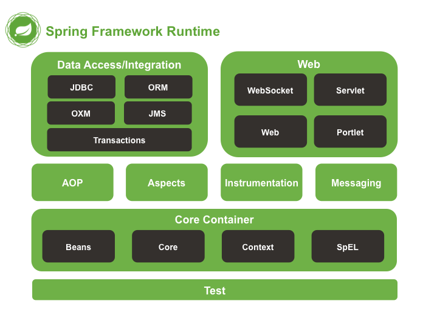
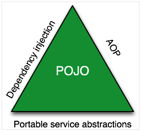
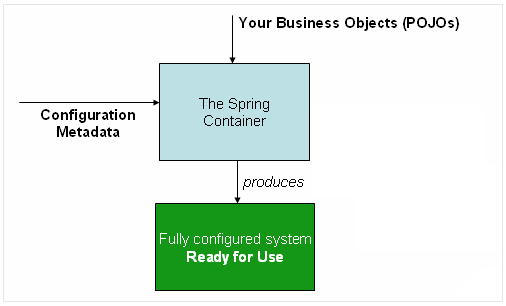
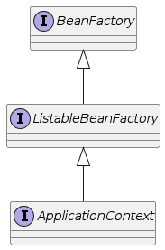
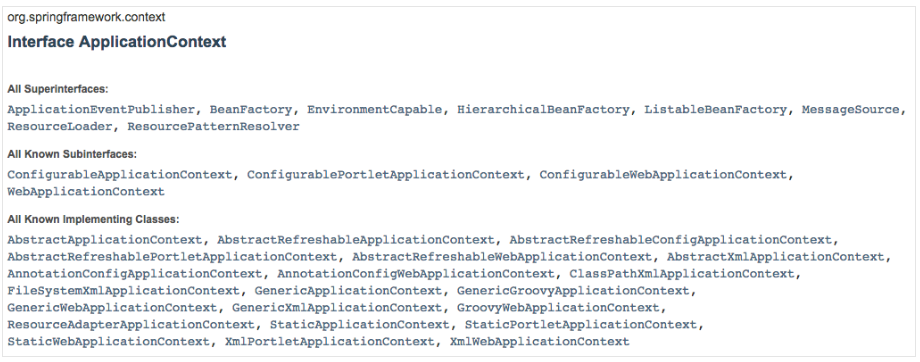
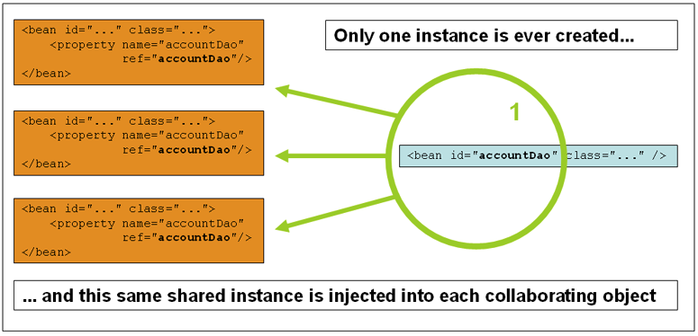
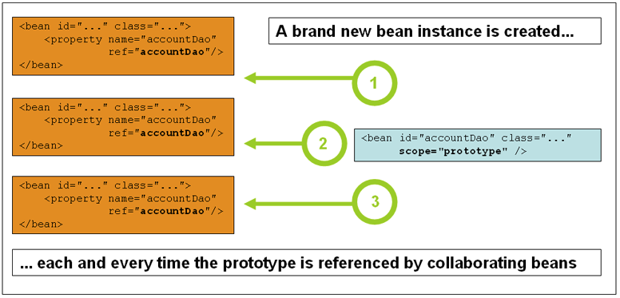
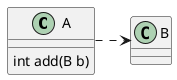

# Spring
[스프링 공식 문서](https://docs.spring.io/spring-framework/docs/3.0.0.M4/reference/html/index.html)
[스프링 공식 문서](https://docs.spring.io/spring-framework/docs/current/reference/html/core.html#spring-core)
## 라이브러리와 프레임워크 차이
- 공통점
  - 특정 문제를 일반적인 방법(모델 뷰  컨트롤러)으로 해결하기 위한 코드를 제공한다.
  - 재활용할 수 있다.
- 차이점
  - Framework 는 원하는 기능을 구현하기 위하여 일정한 형태 (골격)를 제공한다. 
  e.g. WebApplication, 레디스 영속 프레임워크 등등
  - 기능(함수)의 집합. e.g. 레디스 클라이언트 라이브러리
  - 주도권
  - 레디스 영속 프레임워크 vs 레디스 클라이언트 라이브러리

| 구분        | Framework                                                                                                                                                                                                                                                                                                      | 라이브러리                                                                                                                                                                                                                             |
| ----------- | ------------------------------------------------------------------------------------------------------------------------------------------------------------------------------------------------------------------------------------------------------------------------------------------------------------- | -------------------------------------------------------------------------------------------------------------------------------------------------------------------------------------------------------------------------------------- |
| 기능        | 애플리케이션을 개발하기 위해 필요한 기본적인 구조와 규칙을 제공                                                                                                                                                                                                                                           | 특정 기능을 구현하는 데 필요한 함수, 클래스 등의 코드 집합을 제공                                                                                                                                                                 |
| 주도권      |개발자가 그 위에 자신만의 코드를 작성해 나가는 방식이며, 프레임워크가 제어권한을 가지고 있음                                                                                                                                                                                      | ***개발자가 직접 호출하여 사용하며, 주도권은 개발자에게 있음***                                                                                                                                                                         |
| 사용 예시   | 대규모 애플리케이션에서 사용됨                                                                                                                                                                                                                                                                              | 여러 프로젝트에서 반복적으로 사용되는 기능을 라이브러리로 구현하여 재사용함                                                                                                                                                          |
| 구현 방식   | 프레임워크는 애플리케이션의 기본적인 구조와 규칙을 제공하며, 개발자는 그 위에 자신만의 코드를 작성함                                                                                                                                                                                                       | 라이브러리는 개발자가 필요에 따라 직접 호출하여 사용함                                                                                                                                                                           |
| 예시 프레임워크 | Ruby on Rails, Django, Flask, Spring                                                                                                                                                                                                                                                                         |                                                                                                                                                                                                                                        |
| 예시 라이브러리 | requests (HTTP 요청), numpy (과학 계산), pandas (데이터 분석), scikit-learn (머신러닝), matplotlib (시각화), BeautifulSoup (웹 스크래핑)                                                                                                                                                                   |                                                                                                                                                                                                                                        |
| 예시 프레임워크와 라이브러리 함께 사용하는 경우 | Flask 프레임워크와 SQLAlchemy 라이브러리를 함께 사용하여 웹 애플리케이션에서 데이터베이스를 다루는 기능 구현                                                                                                                                                                                               |                                                                                                                                                                                                                                     |
---   
## 프레임워크 사용해아하는 이유
- 기능적 요구 사항과 비 기능적 요구사항(비기능 요구사항 : 프레임워크 쓰면 구현되있음)
- 반복되는 기능
- 비즈니스에 집중
- 빠른 개발

| 이유                             | 설명                                                                                                                                                                          |
| -------------------------------- | ----------------------------------------------------------------------------------------------------------------------------------------------------------------------------- |
| 기능적 요구사항과 비 기능적 요구사항 | 프레임워크가 애플리케이션에서 필요한 기능을 이미 구현하고 있어, 개발자는 이를 사용하여 빠르게 개발할 수 있고, 대부분의 비 기능적 요구사항도 고려하고 있어 추가 고민이 줄어듭니다. |
| 반복되는 기능                    | 프레임워크가 반복되는 기능들을 미리 구현해놓았기 때문에, 개발자는 이를 다시 구현할 필요가 없어 시간과 노력을 절약할 수 있습니다.                                          |
| 비즈니스에 집중                  | 프레임워크를 사용하면 개발자는 비즈니스 로직에 집중할 수 있습니다. 프레임워크가 제공하는 기능들은 이미 검증되었으므로, 개발자는 비즈니스 로직을 구현하는 데 집중할 수 있습니다.      |
| 빠른 개발                        | 프레임워크를 사용하면 개발자는 미리 구현된 기능들을 사용하여 빠르게 개발할 수 있습니다. 이를 통해 개발자는 빠르게 애플리케이션을 출시할 수 있으며, 경쟁 우위를 유지할 수 있습니다.  |
---
## 스프링 프레임워크


- 자바 엔터프라이즈 개발을 편하게 해주는 오픈소스 경량급 애프리케이션 프레임워크
- 스프링(Spring) 프레임워크는 가볍고 엔터프라이즈 애플리케이션을 구축하는 하나의 대안(Potential one-stop-shop)입니다. 
- 스프링은 모듈화되어 있어 필요한 부분만 사용할 수 있으며, 나머지는 가져올 필요가 없습니다.
- 스프링은 비침투적(Non-intrusive)으로 설계되어 있어 도메인 로직 코드는 일반적으로 프레임워크에 대한 의존성이 없습니다. 
- 스프링 프레임워크는 Java 애플리케이션 개발에 대한 종합 인프라 지원을 제공합니다. 
- 스프링은 인프라를 처리하므로 애플리케이션에 집중할 수 있게 해줍니다. 
- 스프링은 "Plain Old Java Objects" (POJOs)에서 애플리케이션을 구축하고 엔터프라이즈 서비스를 POJO에 비침투적으로 적용할 수 있도록 해 줍니다.

```
경량 컨테이너 : 특정 인터페이서를 구현, 상속 받을 필요가 없어, 이미 존재하는 라이브러리 등을 지원하기에 용이하고 객체가 가볍다는 의미

POJO : Plain Old Java Object, 간단히 POJO는 말 그대로 해석을 하면 오래된 방식의 간단한 자바 오브젝트라는 말로서 Java EE 등의 중량 프레임워크들을 사용하게 되면서 해당 프레임워크에 종속된 "무거운" 객체를 만들게 된 것에 반발해서 사용되게 된 용어이다. 2000년 9월에 마틴 파울러, 레베카 파슨, 조쉬 맥킨지 등이 사용하기 시작한 용어로서 마틴 파울러는 다음과 같이 그 기원을 밝히고 있다.
```
```
GPT

스프링(Spring) 프레임워크는 자바 엔터프라이즈 개발을 편하게 해주는 오픈소스 경량급 애프리케이션 프레임워크입니다. 스프링은 IoC(Inversion of Control)와 DI(Dependency Injection)를 지원하여 객체 간의 결합도를 낮추고 유지보수성을 높일 수 있습니다. 또한 스프링은 AOP (Aspect Oriented Programming)를 지원해서, 핵심 로직과 부가적인 기능을 분리시켜서 개발할 수 있게 해줍니다. 따라서 스프링 프레임워크를 사용하면 비즈니스 로직에 집중하여 빠른 속도로 애플리케이션을 구현할 수 있습니다.
```
## 주요 모듈
- 제어 역전 컨테이너
- 관점 지향 프로그래밍 프레임워크
- 데이터 엑세스 프레임워크
- 트랜잭션 관리 프레임워크
- 모델 - 뷰- 컨트롤러 패턴
- 배치 프레임워크
- 스프링 부트

## 경량 컨테이너로서, Spring Bean 을 직접 관리한다.
- Spring Bean 객체의 **라이프 사이클**을 관리한다.
  - Spring Bean : **Spring Container** 가 관리하는 중요 객체
- Container - Spring Bean **객체의 생성, 보관, 제거**(라이브 사이클)에 관한 모든일을 처리한다.
  <!-- todo 스프링 컨테이너를 통해 빈을 조합 생성 제거에 대해 알것 -->
## POJO(Plain Old Java Object) 기반의 프레임워크.
- 일반적인 J2EE 프레임워크와 비교하여, 특정한 인터페이스를 구현하거나 상속을 받을 필요가 없다.
- 기존에 존재하는 라이브러리를 사용하기 편리하다.
## 제어 역전(IoC : Inversion of Control)
- 컨트롤의 제어권이 <text style="color:yellow">사용자(개발자)가 아니라 프레임워크</text>따라 Spring에서 사용자의 코드를 호출한다.
- 의존성 주입(DI : Dependency Injection)
- DDD, TDD와 같은 프로그래밍 개발론에도 적합한 프레임워크이다.
## 관점 지향 프로그래밍(AOP : Aspect-Oriented Programming)을 지원.
- 성능측정 어플리케이션 관점 : 스레드 시작, 종료 등 처리시간이 궁금, 
- 보안의 관점 : rest api 등을 시작하기전에 인증인가가 되어있어야함.
- 복잡한 비지니스 영역의 문제와 공통된 지원 영역의 문제를 분리할 수 있음.
- 문제 해결을 위한 집중.
- e.g. Transaction, Logging, Security and etc.
## 영속성과 관련된 다양한 서비스 지원.
- e.g. MyBatis, Hibernate, JdbcTemplate 등등
- 영속성 : 영원히 저장하고, 유지시킨다.
  - 기능 : DB 읽기, 쓰기, 저장, 수정,삭제
  - 메모리는 휘발성, DB는 비휘발성

## 높은 확장성 및 범용성 그리고 Eco System

## 한국의 Spring Framework
- 전자정부 표준 프레임워크
  - Spring Framework 기반
  - https://www.egovframe.go.kr/
  - 대기업 SI 3사 ( Samsung SDS, SK C&C, LG CNS) 참여
  - 정부 시스템 프레임워크 표준화
- 대부분의 Java 기반 Back End 서비스에서 사용

## Spring Framework State
- https://tanzu.vmware.com/content/ebooks/the-state-of-spring-2021

## Spring Framework Modules


## Core Container
|모듈	|설명|
|--------|-----|
|spring-core|	Spring의 핵심 유틸리티가 포함된 모듈|
|spring-context|	Spring의 ApplicationContext 클래스들, 스케줄링 클래스들, AOP 관련 클래스들, Cache 관련 클래스들을 제공한다|
|spring-context-support|	Third-part 라이브러리를 통합하여, Spring ApplicationContext| 에서 사용하기 위한 클래스들을 제공한다. Quartz, Guava, Ehcache 등과 관련된 클래스들|
|spring-beans|	Spring Bean 과 관련된 클래스와 어노테이션들을 제공한다.|
|spring-expression|	Spring Expression Language (SpEL) 관련 기능을 제공한다.|

## AOP
|모듈	|설명|
|--------|-----|
|spring-aop|	Proxy-based AOP support|
|spring-aspects|	AspectJ based aspects|

## Data Access/Integration, Web, Test
|모듈|	설명|
|--------|-----|
|spring-jdbc|DataSource 설정 및 JDBC 접근을 포함한 JDBC 지원 패키지|
|spring-jms|JMS 메시지 전송 및 수신을 위한 헬퍼 클래스를 포함한 JMS 지원 패키지|
|spring-messaging|메시징 아키텍처와 프로토콜 지원 패키지|
|spring-orm|ORM(Object/Relational Mapping)으로, JPA와 Hibernate 지원을 포함한다.|
|spring-oxm|Object/XML 매핑을 위한 패키지|
|spring-tx|DAO 지원과 JCA(Java EE Connector Architecture) 통합을 포함한 트랜잭션 인프라스트럭처 패키지|
|spring-web|클라이언트 및 웹 리모팅을 포함한 웹 지원 패키지|
|spring-webmvc|Web 애플리케이션용 REST 웹 서비스 및 MVC 구현을 위한 패키지|
|spring-webmvc-portlet|포틀릿(Portlet) 환경에서 사용되는 MVC 구현을 위한 패키지|
|spring-websocket|WebSocket 및 SockJS 구현을 포함하며, STOMP를 지원하는 패키지|

## Spring Projects
|Spring Projects|설명|
|--------------|----|
|Spring Boot|스프링 어플리케이션을 쉽게 만들고 실행할 수 있도록 자동구성을 지원해주는 프로젝트|
|Spring Framework|스프링의 핵심 기능인 DI, AOP 등을 제공하는 프레임워크|
|Spring Cloud DataFlow|메시징 교환을 위한 SEDA(Staged, Event-Driven Architecture) 구축을 지원하는 프레임워크|
|Spring Cloud|클라우드 네이티브 애플리케이션 개발에 필요한 인프라스트럭처를 제공하는 프로젝트|
|Spring Data|JPA, MongoDB, Redis, Elasticsearch 등 다양한 데이터베이스와 연동하여 데이터 액세스를 위한 라이브러리를 제공하는 프로젝트|
|Spring Integration|Enterprise Integration Pattern을 구현하기 위한 라이브러리를 제공하는 프로젝트|
|Spring Batch|대용량 데이터 처리를 위한 일괄처리(Batch)를 구현하기 위한 라이브러리를 제공하는 프로젝트|
|Spring Security|인증과 권한 부여를 위한 라이브러리를 제공하는 프로젝트|
|Spring HATEOAS|Hypermedia As The Engine Of Application State를 구현하기 위한 라이브러리를 제공하는 프로젝트|
|Spring AMQP|메시지 큐(Message Queue)를 구현하기 위한 라이브러리를 제공하는 프로젝트|
- https://spring.io/projects

## Spring Boot vs Spring Core?
- 대세는 Spring Boot Project // 미리 준비해져 개발을 시작만하면 됨
  - 대용량 서비스
  - Cloud
  - MSA
  - Pivotal
- 하지만 기본은 Spring Core

### 스프링코어 
- 일일이 하나하나 올려야함
### 스프링 부트 
- 이미 만들어진 걸 가이드에 맞추면 동작하는 애플리케이션
### 스프링 관련 
- 스프링 코어를 기본으로 함
## 실습1
```markdown
1. IntelliJ 에서 maven 프로젝트를 생성합니다.
- NEW PROJECT , 아키텍트 사용 x

2. maven 속성을 지정합니다.
- Name: springframework-core-message-sender
- GroupId: com.nhnacademy.edu.springframework
- ArtifactId: springframework-core-message-sender
- Version: 1.0-SNAPSHOT
3. pom.xml 파일에 spring-context 라이브러리 의존성을 추가 합니다.
<dependencies>
    <dependency>
        <groupId>org.springframework</groupId>
        <artifactId>spring-context</artifactId>
        <version>5.3.17</version>
    </dependency>
</dependencies>
```

## Spring Framework Dependencies - 2
- Bill of Materials
  - 자재 목록 : 제품을 구성하는 부품들에 대한 목록
  - Spring Framework을 구성할때 많은 모듈로 구성
  - Version 관리
  - artifactId : spring-framework-bom
```xml
dependencyManagement는 spring-framework-bom의 스프링 코어 버전을
자동으로 적용해주는 기능
<dependencyManagement>
    <dependencies>
        <dependency>
            <groupId>org.springframework</groupId>
            <artifactId>spring-framework-bom</artifactId>
            <version>5.3.17</version>
            <type>pom</type>
            <scope>import</scope>
        </dependency>
    </dependencies>
</dependencyManagement>

<dependencies>
    <dependency>
        <groupId>org.springframework</groupId>
        <artifactId>spring-context</artifactId>
    </dependency>
</dependencies>
```

## The Spring Triangle
- DI (Dependency Injection)
- AOP (Aspect-Oriented Programming)
- PSA (Portable Service Abstraction



## java의 다형성(polymorphism)
- Java의 객체는 부모클래스 타입의 참조변수나 구현한 인터페이스 변수에 담을 수 있습니다.
- 참조 변수의 메소드를 호출하면 실제 구현 객체의 메소드가 실행됩니다.
- 즉, 동일한 메시지를 전송하지만 실제로 어떤 메서드가 실행될 것인지는 메시지를 수신하는 객체의 클래스가 무엇인가에 따라 결정되는 것입니다.
- 한국어, 영어 인사를 수행하는 시스템을 다형성을 이용해서 개발한다고 가정하면 다음과 같이 설계 할 수 있다.


## 자바에서 클래스를 인식하는 원리, static void main
```
자바에서 클래스를 인식하는 원리는 해당 클래스를 포함한 패키지명을 포함하여 전체 클래스 경로를 사용하여 찾습니다. 즉, 클래스파일이 위치한 디렉토리 구조와 패키지 이름을 포함하여 클래스를 검색합니다.

`static void main`은 자바에서 프로그램을 시작할 때 가장 먼저 실행되는 메소드입니다. 이 메소드는 프로그램의 진입점으로 사용되며 JVM(Java Virtual Machine)이 이 메소드를 호출하여 프로그램을 시작합니다. `static` 키워드가 사용된 이유는 객체 생성 없이도 메소드를 호출하기 위함입니다. `main` 메소드의 반환형은 `void`(값을 반환하지 않음) 입니다.
```
## 스프링에서 클래스를 인식하는 원리, static void main

```
스프링 프레임워크에서도 클래스를 인식하는 방법은 자바와 유사합니다. 스프링은 `classpath`라는 시스템 환경 변수에 지정된 경로 중에서 클래스를 검색합니다.

그런 다음 스프링은 해당 클래스의 `@Bean` 어노테이션이 지정된 메소드를 찾아서 빈(Bean) 객체를 생성하고, 이를 애플리케이션 컨텍스트(Application Context)에 등록합니다.

또한 스프링에서도 `static void main`이 프로그램의 진입점으로 사용됩니다. 보통 스프링 부트(Spring Boot) 애플리케이션에서는 `SpringApplication.run(Application.class, args)` 코드를 `main` 메소드 안에서 호출하여 애플리케이션을 실행합니다. 이때 `Application.class`는 애플리케이션의 주 진입 클래스(Class with main method)`를 의미합니다.
```
## Spring Inversion of Control
- 사용자가 코드를 작성하면. 그것에 대한 제어를 SpringInversionOfControl이 함.
- 더이상 인스턴스 생성시 new Class() 형태로 작성하지 않아야한다.
- 스프링프레임워크가 제어하기때문
- 순환참조의 문제가 있을 경우 EXCEPTION 
- 순환참조?
- 탬플릿패턴이란 프레임워크 만들기에 적합한 패턴이다.
## IoC (제어역전)
- 제어권을 프레임워크가 갖는것 == 개발자는 제어권이 없다 == 제어(Control)가 역전(Inversion) 되었다.
- IoC : Inversion of Control
- 제어
    - 프로그램의 흐름
    - 객체의 생성
- IoC 관점에서 각자의 역할
  - 개발자는 코드의 흐름이나 객체생성에 관련된 코드를 직접 적성하지 않는다.
  - 개발자는 프레임워크가 제공하는 설정방법을 사용하여 코드를 설정만 한다.
  - 프레임워크는 이 설정을 보고 객체를 생성하고 코드가 동작하는 순서를 결정하여 실행한다.
## 헐리우드 원칙
- 객체지향 프레임워크와 클래스 라이브러리의 큰 차이점은 프레임워크가 애플리케이션 코드를 호출한다는 것입니다. 일반적으로는 애플리케이션 코드가 클래스 라이브러리를 호출합니다. 이러한 제어의 역전(inversion of control)은 때때로 헐리우드 원칙이라고도 합니다.
```
우리에게 전화(call)하지 마세요. 우리가 당신을 부를(call) 것입니다.
```

## IOC의 예 - 흐름의 제어역전 (template method 패턴)
- template (형판, 틀) + 메서드 + 패턴
- 추상 클래스에 탬플릿에 해당하는 메소드에서 실행의 흐름이 이미 결정되어 있음.
- 단, 각 메소드가 구체적으로 어떤일을 할 것인지는 개발자의 구현에 따라 결정됨.
- preProcess() -> mainProcess() -> postProcess()
- javax.servlet.Filter interface
```java
public interface Filter {

    public default void init(FilterConfig filterConfig) throws ServletException {}
    
    public void doFilter(ServletRequest request, ServletResponse response,
            FilterChain chain) throws IOException, ServletException;

    public default void destroy() {}
}
```
## template method
- feature/ioc_01
- 가정 : 프레임워크는 다음 AbstractProcessor 클래스를 제공한다.

```java
package com.nhnacademy.edu.springframework.greeting.template_method.processor;

public abstract class AbstractProcessor {

    public final void process() {
        preProcess();
        mainProcess();
        postProcess();
    }

    protected abstract void preProcess();
    protected abstract void mainProcess();
    protected abstract void postProcess();
}

```
- public final void process가 final인 이유는 추상클래스인데 미리 구현 해야 할 코드이니 건들지 말고 쓰기만 하라는 뜻. 
- 서블릿 필터도 탬플릿 메소드 패턴을 따라했기에 비슷한 구조임을 볼수있다.
## IoC의 예 - 흐름의 제어역전 (template method 패턴)
- ConsoleLogProcessor 클래스는 AbstractProcessor 클래스의 구현체
- AbstractProcessor 의 메서드를 구현함.
- ConsoleLogProcessor 클래스는 실행에 대한 기능은 없다. AbstractProcessor 의 메서드의 기능만 구현함.
- 실행의 흐름에 대한 어떤 책임은 없다.
- 실행 흐름에 대한 책임은 AbstractProcessor만 가진다.

```java
package com.nhnacademy.edu.springframework.greeting.template_method.processor;

public class ConsoleLogProcessor extends AbstractProcessor {

    @Override
    protected void preProcess() {
        System.out.println("preProcess");
    }

    @Override
    protected void mainProcess() {
        System.out.println("mainProcess");
    }

    @Override
    protected void postProcess() {
        System.out.println("postProcess");
    }
}
```
- **실행의 흐름은 AbstractProcessor 에 의해서 제어가 됨**

## IoC의 예 - 흐름의 제어역전 (template method 패턴)
- 실행을 위한 Main 클래스

```java
package com.nhnacademy.edu.springframework.greeting.template_method;

import com.nhnacademy.edu.springframework.greeting.template_method.processor.AbstractProcessor;
import com.nhnacademy.edu.springframework.greeting.template_method.processor.ConsoleLogProcessor;

public class TemplateMethodMain {

    public static void main(String[] args) {
        AbstractProcessor processor = new ConsoleLogProcessor();
        processor.process();
    }
}
```
- **프레임워크의 IoC 개념을 다시 생각해보자.**
## [시연]IoC의 예 - 객체 생성의 제어역전
- feature/ioc_02
- 개발자는 ComplexGreetingService 클래스를 작성하여, KoreanGreeter 객체를 생성하는 제어를 스스로 구현하였음
  
```java
package com.nhnacademy.edu.springframework.greeting;

public class NonIocMain {

    public static void main(String[] args) {
        new ComplexGreetingService().greet();
    }
}
```
```java
package com.nhnacademy.edu.springframework.greeting;

import com.nhnacademy.edu.springframework.greeting.service.KoreanGreeter;

public class ComplexGreetingService {

    // ComplexGreetingService 내부에서 생성한 객체를 사용한다.
    public boolean greet() {
        return new KoreanGreeter().sayHello();
    }
}
```
- **ComplexGreetingService 관점에서 누가 KoreanGreeter 객체를 생성했는가?**

## [시연] IoC의 예 - 객체 생성의 제어역전
- 객체 생성의 제어역전을 위해 KoreanGreeter 클래스의 객체를 Main 클래스에서 생성하여 제공한다.

```java
public class IoCMain {
    public static void main(String[] args) {
        new GreetingService(new KoreanGreeter()).greet();
    }
}
```
- GreetingService는 외부에서 생성된 객체를 사용한다. 객체 생성의 책임이 없다.
- 대신 외부에서 정의된 내용만 일치한다면 모든 객체를 담을수 있다.
```java
public class GreetingService {
    private final Greeter greeter;

    public GreetingService(Greeter greeter) {
        this.greeter = greeter;
    }

    public void doGreet() {
        greeter.sayHello();
    }
}
```
## 클래스의 역할

- IoCMain
  - Greeter 구현체를 선택할 수 있다.
  - KoreanGreeter 객체를 생성한다.
- GreetingService
  - IoCMain에서 생성한 KoreanGreeter 객체를 실행만 한다.
- ComplexGreetingService 관점에서 누가 KoreanGreeter 객체를 생성했는가?
- GreetingService 관점에서 누가 Greeter 객체를 생성했는가?

- 만약 IoCMain 클래스가 프레임워크라면, 개발자가 작성한 GreetingService 및 Greeter 객체 생성에 대한 제어를 프레임워크에 위임한 형태이다.
- 만약 개발자가 Greeter 구현체를 교체하고 싶다면 IocMain 클래스만 수정하면 된다.
- 만약 IoCMain 클래스가 사용자가 설정한 내용을 읽고 객체를 생성하는 클래스라면?

## ApplicationContext
### Spring IoC Container
- `org.springframework.context.ApplicationContext` 인터페이스는 Spring IoC 컨테이너를 나타내며
- 빈(Bean)을 인스턴스화하고 구성하며 조립하기 위해 
- 설정 메타데이터(configuration metadata)를 읽는 작업을 수행합니다.

## Spring Bean
```
an object that is instantiated, assembled, and otherwise managed by a Spring IoC 
container

```
- Spring Bean 은 name, type, object 로 구성되어있다.
- Spring Framework 에서 중요하게 관리하는 객체로 이해
## cf.) JavaBeans
<span style="color:red">
- public default (no argument) constructor<br/>
- getter/setter<br/>
- implement java.io.Serializable<br/>
 </span>

## Spring Beans ≠ JavaBeans

## Bean Factory vs ApplicationContext
- Spring IoC container = { Bean Factory | ApplicationContext }



## Bean Factory
- The BeanFactory API provides the underlying basis for Spring’s IoC functionality

## ApplicationContext
- Bean Factory functionality + α

| Feature                                            | BeanFactory | ApplicationContext |
|----------------------------------------------------|-------------|---------------------|
| Bean instantiation/wiring                          | Yes         | Yes                 |
| Integrated lifecycle management                    | No          | Yes                 |
| Automatic BeanPostProcessor registration           | No          | Yes                 |
| Automatic BeanFactoryPostProcessor registration    | No          | Yes                 |
| Convenient MessageSource access (for Internationalization)  | No | Yes |
| Built-in ApplicationEvent publication mechanism    | No          | Yes                 |
----

| 특징                                                     | BeanFactory | ApplicationContext |
|--------------------------------------------------------|-------------|---------------------|
| 빈의 생성 및 의존성 주입                             | Yes         | Yes                 |
| 통합 라이프사이클 관리                                | No          | Yes                 |
| 자동 BeanPostProcessor 등록                          | No          | Yes                 |
| 자동 BeanFactoryPostProcessor 등록                  | No          | Yes                 |
| 편리한 MessageSource 액세스 (국제화 지원을 위한)  | No          | Yes                 |
| 내장된 ApplicationEvent 발행 메커니즘        | No          | Yes                 |
---
- life cicle manager 객체 생성 소멸에 책임
## ApplicationContext
- 정의
  - central interface within a Spring application for providing configuration information to the application
- 기능
  - Bean factory methods for accessing application components.
  - The ability to load file resources in a generic fashion.
  - The ability to publish events to registered listeners.
  - The ability to resolve messages to support internationalization.
  - Inheritance from a parent context.

## ApplicationContext 종류

- ~Xml~ApplicationContext
- ~AnnotationConfig~ApplicationContext
- ~Groovy~ApplicationContext
- ~Web~ApplicationContext
- 이름의 양식이 지정되어 있다.
## ApplicationContext 역할
- Spring Bean 생성
- Spring Bean 파기
- Spring Bean 주입

## [시연] SpringFramework에서 객체생성 시연(XML)
- beans.xml 추가
- beans.xml 파일은 src/main/resources 에 둔다.
- Spring Framework의 BeanFactory에게 EnglishGreeter, KoreanGreeter 를 각각 englishGreeter, koreanGreeter 이란 ID 로 등록을 요청하는 내용이다.

```xml
xmlconfigulationApplication을 이용한다. 

<?xml version="1.0" encoding="UTF-8"?>
<beans xmlns="http://www.springframework.org/schema/beans"
       xmlns:xsi="http://www.w3.org/2001/XMLSchema-instance"
       xsi:schemaLocation="
        http://www.springframework.org/schema/beans http://www.springframework.org/schema/beans/spring-beans.xsd">


    <bean id="englishGreeter" class="com.nhnacademy.edu.springframework.greeting.service.EnglishGreeter" >
    </bean>

    <bean id="koreanGreeter" class="com.nhnacademy.edu.springframework.greeting.service.KoreanGreeter" >
    </bean>

</beans>
```
- id : 이름
- class : type
- bean에게 어떤 클래스를 만들어야하는지 명시해줌

## [시연] SpringFramework에서 객체생성
- feature/ioc_03
- Main 클래스
  - Spring Framework의 **ClassPathXmlApplicationContext** 을 사용하여 **beans.xml 을 로딩**하고 **Spring Bean 객체를 받아온다**.
```java
package com.nhnacademy.edu.springframework.greeting.xml;

import com.nhnacademy.edu.springframework.greeting.service.Greeter;
import org.springframework.context.support.ClassPathXmlApplicationContext;

public class XmlMain {
    public static void main(String[] args) {
        try (ClassPathXmlApplicationContext context = new ClassPathXmlApplicationContext("beans.xml")) {
          // 이름은 koreanGreeter, type은 Greeter.class
            Greeter koreanGreeter = context.getBean("koreanGreeter", Greeter.class);
            Greeter englishGreeter = context.getBean("englishGreeter", Greeter.class);
            // 가져온 Bean에 저장된 메소드를 호출
            koreanGreeter.sayHello();
            englishGreeter.sayHello();
        }
    }
}
```

## Spring Bean 객체의 생명주기 설정
- Java 객체의 생명 주기는?
- Bean은 ApplicationContext내에선 Singleton 객체
- Spring Bean 객체도 Java 객체이다.
  - java에서 JVM에 의해 소멸되는 때, 실행이 완료되고, 콜스택에서 빠질때 사라진다.
  ```java
  //Bean의 탄생 ClassPathXmlApplicationContext context = new ClassPathXmlApplicationContext
     try (ClassPathXmlApplicationContext context = new ClassPathXmlApplicationContext("beans.xml")) {
          // 이름은 koreanGreeter, type은 Greeter.class
            Greeter koreanGreeter = context.getBean("koreanGreeter", Greeter.class);
            Greeter englishGreeter = context.getBean("englishGreeter", Greeter.class);
            // 가져온 Bean에 저장된 메소드를 호출
            koreanGreeter.sayHello();
            englishGreeter.sayHello();
        }
  //Bean의 소멸
  ```
  ```java
        Greeter koreanGreeter1 = context.getBean("koreanGreeter", Greeter.class);
        Greeter koreanGreeter2 = context.getBean("koreanGreeter", Greeter.class);
        // 객체의 이름은 다르지만 하나의 싱글톤 객체이다.
  ```
  ## 싱글톤 생성방법
  - 자바 키워드
  - DCL 방법
  - 클래스 로더방법
---
## GPT 설명
싱글톤 패턴은 애플리케이션에서 인스턴스를 하나만 생성하고, 이후에는 생성된 인스턴스를 계속해서 재사용하는 디자인 패턴입니다. 싱글톤 패턴을 사용하면 인스턴스를 여러 개 생성하지 않아 메모리 낭비를 줄일 수 있으며, 상태값 등의 공유가 필요한 경우 유용합니다.

싱글톤 인스턴스를 생성하는 방법으로는 자바 키워드, DCL(Double Checked Locking) 방법, 클래스 로더 방법이 대표적입니다.

- 자바 키워드 : private 생성자와 static 변수를 활용하여 인스턴스를 유일하게 관리합니다. 해당 클래스 내부에서만 인스턴스 생성이 가능하므로 외부에서는 인스턴스 생성을 못하도록 제어할 수 있습니다.
```java
public class Singleton {
    private static Singleton instance = new Singleton();
    private Singleton() { }
    public static Singleton getInstance() {
        return instance;
    }
}
```

- DCL 방법 : 멀티 스레드 환경에서 발생할 수 있는 문제점을 해결하기 위해 동기화(synchronized)를 적용한 방법입니다. 첫 번째 if 문으로 인스턴스가 null인지 검사하고, 두 번째 if 문에서 synchronized 블럭을 실행하여 인스턴스를 생성합니다. 해당 방법은 getInstance() 메서드 호출 시 동기화 처리가 발생하여 성능이 저하될 수 있습니다.
```java
public class Singleton {
    private static volatile Singleton instance;
    private Singleton() { }
    public static Singleton getInstance() {
        if (instance == null) {
            synchronized (Singleton.class) {
                if (instance == null) {
                    instance = new Singleton();
                }
            }
        }
        return instance;
    }
}
```

- 클래스 로더 방법 : JVM의 클래스 로딩 메커니즘을 이용한 방법입니다. 클래스 로딩 시점에서 인스턴스를 생성하는데, JVM에서 보장되는 클래스 로더의 특성으로 인해 멀티 스레드 환경에서도 안전하게 인스턴스를 생성할 수 있습니다. 다만 해당 방법은 클래스 로딩 시점에 인스턴스를 생성하므로 메모리 낭비 문제가 발생할 수 있습니다.
```java
public class Singleton {
    private static class SingletonHolder {
        private static final Singleton INSTANCE = new Singleton();
    }
    private Singleton() { }
    public static Singleton getInstance() {
        return SingletonHolder.INSTANCE;
    }
}
```

- 위와 같은 방식으로 싱글톤 패턴을 구현할 수 있지만, 이에 대한 단점으로는 테스트 코드 작성 등에 어려움이 따르며, 유연성과 확장성이 떨어지는 한계점이 존재합니다. 따라서 싱글톤 패턴 구현 전, 해당 패턴을 사용하기에 적합한지를 검토해보는 것이 좋습니다.
---
## Bean Scope
- singleton - default
- prototype
- Only valid in the context of a web-aware Spring ApplicationContext
  - request - lifecycle of a single HTTP request
  - session - lifecycle of an HTTP Session
  - application - lifecycle of a ServletContext
  - websocket - lifecycle of a WebSocket
  - global session - portlet (dropped in spring 5)

## Singleton vs Prototype
- singleton

- prototype


## Bean Scope 시연 - Singleton, Prototype
- feature/bean_scope
- englishGretter는 Singleton으로 설정
- koreanGretter는 Prototype으로 설정
```xml
<?xml version="1.0" encoding="UTF-8"?>
<beans xmlns="http://www.springframework.org/schema/beans"
       xmlns:xsi="http://www.w3.org/2001/XMLSchema-instance"
       xsi:schemaLocation="
        http://www.springframework.org/schema/beans http://www.springframework.org/schema/beans/spring-beans.xsd">


    <bean id="englishGreeter" class="com.nhn.edu.springframework.ioc.helloworld.EnglishGreeter"  scope="singleton">
    </bean>

    <bean id="koreanGreeter" class="com.nhn.edu.springframework.ioc.helloworld.KoreanGreeter" scope="prototype">
    </bean>

</beans>
```
## Bean Scope 시연 -Singletone,Prototype
- 각각의 빈 생성자에게 로그출력을 추가한다.
- KoreanGreeter 구현
```java
package com.nhn.edu.springframework.ioc.helloworld;

public class KoreanGreeter implements Greeter {

    public KoreanGreeter() {
        System.out.println("KoreanGreeter initiated!!");
    }

    @Override
    public void sayHello() {
        System.out.println("안녕 세상!");
    }
}

```
- EnglishGreeter 구현
```java
package com.nhn.edu.springframework.ioc.helloworld;

public class EnglishGreeter implements Greeter {

    public EnglishGreeter() {
        System.out.println("EnglishGreeter initiated!!");
    }

    @Override
    public void sayHello() {
        System.out.println("Hello World!");
    }
}
```
## Bean Scope 시연 - Singleton, Prototype
- Main 클래스에서 koreanGreeter, englishGreeter 를 각각 2회 호출한다.
```java
package com.nhnacademy.edu.springframework.greeting;

import com.nhnacademy.edu.springframework.greeting.service.Greeter;
import org.springframework.context.support.ClassPathXmlApplicationContext;

public class ScopeMain {
    public static void main(String[] args) {
        try (ClassPathXmlApplicationContext context = new ClassPathXmlApplicationContext("beans.xml")) {

            System.out.println("---------");
            new GreetingService(context.getBean("koreanGreeter", Greeter.class)).greet();
            System.out.println("---------");
            new GreetingService(context.getBean("koreanGreeter", Greeter.class)).greet();
            System.out.println("---------");
            new GreetingService(context.getBean("englishGreeter", Greeter.class)).greet();
            System.out.println("---------");
            new GreetingService(context.getBean("englishGreeter", Greeter.class)).greet();
            System.out.println("---------");
        }
    }
}
```
- Prototype 으로 구성한 koreanGreeter 는 두번 생성자를 호출한다.
```prompt
// 싱글톤 빈인 EnglishGreeter는 ApplicationContext에 의해 빈이 생성될 때 생성되고
EnglishGreeter initiated!!
---------
// 프로토타입 반은 생성할때마다 생성이 된다.
KoreanGreeter initiated!!
안녕 세상! 
---------
KoreanGreeter initiated!!
안녕 세상! 
---------
Hello World!
---------
Hello World!
---------
```
- 싱글톤 소멸 : 컨텍스트가 종료될때,
- 프로토타입 소멸 : 레퍼런스가 끊길때

## 객체의 생명주기 callbacks - 초기화
- org.springframework.beans.factory.InitializingBean 인터페이스를 구현한 빈은 생성시에 초기화 작업을 수행할 수 있다.
- InitializingBean 은 afterPropertiesSet() 이라는 단일 메서드를 가진다.
```java
    void afterPropertiesSet() throws Exception;
```
```java
package com.nhn.edu.springframework.ioc.helloworld;

import org.springframework.beans.factory.InitializingBean;

public class EnglishGreeter implements Greeter, InitializingBean {

    public EnglishGreeter() {
        System.out.println("EnglishGreeter initiated!!");
    }
    
    public void afterPropertiesSet() {
        // do some initialization work
    }
    
    @Override
    public void sayHello() {
        System.out.println("Hello World!");
    }
}
```
- 이 방식은 컴포넌트에 스프링프레임워크의 의존성이 발생함으로 권장하지 않는다.

## 객체의 생명주기 callbacks - 초기화
- XML 빈 설정에서 init-method 에 초기화 메서드 이름을 지정하여 초기화 작업을 등록할 수 있다.
- 다시 생각해보자 IoC (흐름 제어의 역전!)
```xml
  <bean id="koreanGreeter" class="com.nhn.edu.springframework.ioc.helloworld.EnglishGreeter" init-method="init">
```
```java
package com.nhn.edu.springframework.ioc.helloworld;

public class EnglishGreeter implements Greeter {

    public EnglishGreeter() {
        System.out.println("EnglishGreeter initiated!!");
    }
    
    public void init() {
        System.out.println("EnglishGreeter init called!!");
    }
    
    @Override
    public void sayHello() {
        System.out.println("Hello World!");
    }
}

```
## 객체의 생명주기 callbacks - 소멸
- org.springframework.beans.factory.DisposableBean 인터페이스를 구현한 빈은 소멸시에 호출된다.
- DisposableBean 은 destroy() 이라는 단일 메서드를 가진다.

```java
void destroy() throws Exception;
```
```java
package com.nhn.edu.springframework.ioc.helloworld;

import org.springframework.beans.factory.DisposableBean;

public class EnglishGreeter implements Greeter, DisposableBean {

    public EnglishGreeter() {
        System.out.println("EnglishGreeter initiated!!");
    }
    
    public void destroy() {
        // do some destruction work (like releasing pooled connections)
    }
    
    @Override
    public void sayHello() {
        System.out.println("Hello World!");
    }
}

```
- 이 방식은 컴포넌트에 스프링프레임워크의 의존성이 발생함으로 권장하지 않는다.

## 객체의 생명주기 callbacks - 소멸
- XML 빈 설정에서 init-method 에 초기화 메서드 이름을 지정하여 초기화 작업을 등록할 수 있다.
```xml 
<bean id="koreanGreeter" class="com.nhn.edu.springframework.ioc.helloworld.EnglishGreeter" destroy-method="cleanup">
```

```java
package com.nhn.edu.springframework.ioc.helloworld;

public class EnglishGreeter implements Greeter {

    public EnglishGreeter() {
        System.out.println("EnglishGreeter initiated!!");
    }
    
    public void cleanup() {
        System.out.println("EnglishGreeter cleanup called!!");
    }
    
    @Override
    public void sayHello() {
        System.out.println("Hello World!");
    }
}
```
- 클린업 후 어플리케이션 
- 프로토타입은 언제 호출되는지 명확하지 않음.
## 객체의 생명주기 - 초기와 소멸 기본 callbacks
- XML beans 설정에서 default-init-method 에 초기화 메서드 이름을 지정하여 기본 초기화 작업을 등록할 수 있다.
- XML beans 설정에서 default-destroy-method 에 소멸 callback 메서드 이름을 지정하여 기본 소멸 처리 작업을 등록할 수 있다.
```xml
<beans default-init-method="init" default-destory-method="cleaup" >
    <bean id="koreanGreeter" class="com.nhn.edu.springframework.ioc.helloworld.EnglishGreeter">
</beans>    
```

## 객체의 생명주기 - BeanPostProcessor
- 인터페이스
- Spring IoC 의 생명주기 처리를 변경할 수 있는 확장 포인트
- BeanPostProcesor 가 설정되면 Bean **생명주기 이벤트를 가로채서** 처리할 수 있다.
## 구현 메소드
- postPostBeforeInitialization : init-method 에 지정된 메서드가 호출되기 전에 호출된다.
  - public void postPostBeforeInitialization(Object bean, String beanName)    
  - 초기화 전에 호출된다.
  - 모든 스프링 빈은 반드시 거친다.
- postPostAfterInitialization : init-method 에 지정된 메서드가 호출된 후에 호출된다.
  - public void postPostAfterInitialization(Object bean, String beanName)
  - 초기화 후에 호출된다.
- init-method 가 지정되어 있지 않더라도 자동으로 호출된다.


## CAUSE
```
try-catch문은 종료가 안됨 try-with-resource문은 자동으로 종료가 됨.
```


## CHAT GPT
```
스레드풀(Thread Pool)은 미리 스레드를 생성해 두고, 작업이 들어오면 스레드를 할당하여 처리하는 방식입니다. 이를 통해 스레드를 반복적으로 생성하고 삭제하는 비용이 절감되며, 요청 처리 시간도 빨라집니다.


스레드풀을 구현하는 방법은 다양하지만, 가장 간단한 방법은 ThreadPoolExecutor 클래스를 이용하는 것입니다. ThreadPoolExecutor 클래스를 사용하면 일정한 개수의 스레드를 유지하며, 작업이 들어오면 스레드를 할당하여 처리합니다.

스프링은 대규모의 요청을 처리할 수 있는 웹 어플리케이션을 개발할 때 자주 사용되는 프레임워크인데, 이러한 어플리케이션에서 많은 요청을 처리하기 위해서는 많은 수의 스레드가 필요합니다.


이때 스레드풀을 적절히 이용하면, 스레드 생성 및 삭제로 인한 비용이 절약되어 어플리케이션의 응답 속도가 빨라집니다. 또한, 스레드풀을 이용하면 일정한 개수의 스레드를 유지하여 메모리 사용량을 줄일 수 있습니다.


개발자들은 스레드풀을 이용함으로써 보다 안정적인 웹 어플리케이션을 구현할 수 있으며, 관리자들은 스레드풀을 통해 서버의 효율성을 높일 수 있습니다. 또한 스레드풀을 적절히 설정함으로써 서버에서 발생할 수 있는 다양한 이슈들을 최소화할 수 있습니다.


```
---
# 의존성
## 의존성 정의
- 코드에서 두 모듈간의 연결을 의존성이라고 합니다.
- 객체지향언어에서 두 클래스간의 관게를 말하기도 합니다.

## 의존성의 종류 - Dependency(의존 관계)
- A 클래스가 B클래스를 일시적으로 참조하는 형태입니다.
  - 인자로 받은 객체의 메서드 참조


<!-- 의존당하는 빈, 의존 하는 빈 -->
<!-- 자바 컨피그로 바꾸는 법 -->