## 4장 데이터베이스 구조의 원리

### 4.1 데이터 파일

#### 4.1.1 페이지와 익스텐트

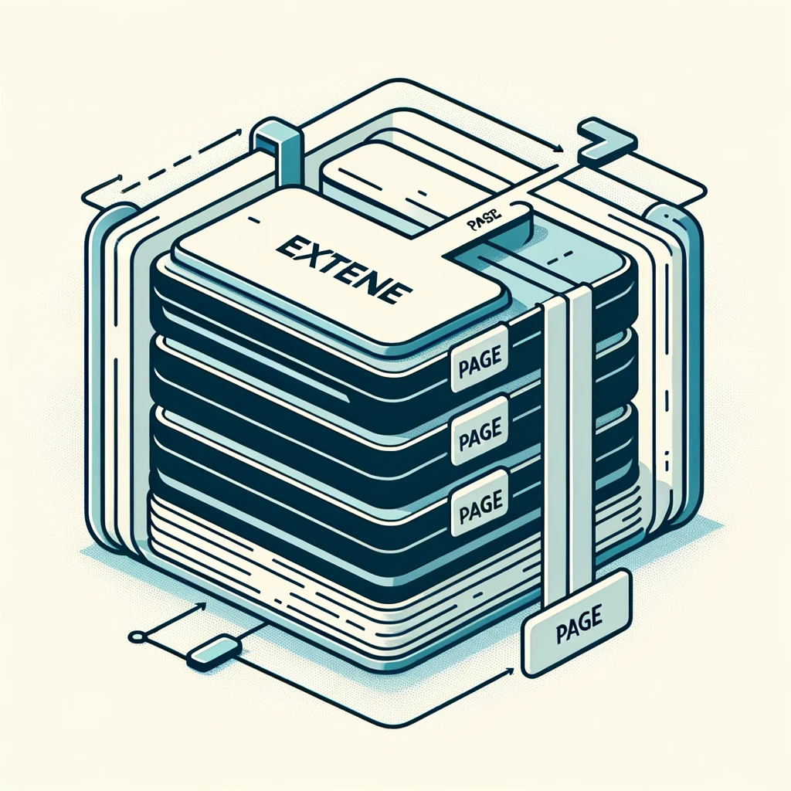
데이터 베이스를 구성하는 데이터 파일은 내부적으로 **페이지**라고 하는 8kb의 논리단위로 구분되어 사용된다.

페이지는 테이블 등의 오브젝트에 저장된 데이터으 참조와 변경 시 최소 논리 I/O 단위로 사용된다.

- 페이지
  - 8kb의 논리단위
  - 최소 논리 I/O단위로 사용(데이터 참조 / 변경)

오브젝트에 새로운 영역을 할당해야 하는 경우에는 페이지가 아닌 **익스텐트**라는 단위가 사용된다.

익스텐트는 8kb의 페이지가 8개로 구성된 단위이다.

테이블에 할당된 모든 페이지에 빈 용량이 없어지면 테이블에는 새로운 익스텐트가 할당된다.

- 익스텐트
  - 8개의 페이지로 구성
  - 오브젝트에 새로운 영역을 할당할 때

#### 4.1.2 단일 익스텐트와 혼합 익스텐트

익스텐트에는 하나의 오브젝트에 8페이지 모두를 점유하는 **단일 익스텐트**와 복수의 오브젝트에서 공유하는 **혼합 익스텐트** 2종류가 있다.

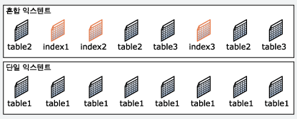

- 혼합 익스텐트
  - 혼합 익스텐트 유무 검색
  - 빈 페이지 유무 확인 후 할당
  - 작업량이 많아 할당이 빈번하면 처리 시간이 지연되는 경우가 있다.
- 단일 익스텐트
  - 모든 페이지가 하나의 오브젝트에 링크
  - 단순히 그 안의 페이지를 할당하면 됨.
  - 오브젝트의 사이즈가 1페이지보다 커지지 않는다면 7페이지가 낭비 됨.

SQL 서버 2014까지는 혼합 익스텐트가 디폴트였으나 SQL 서버 2016 부터는 단일 익스텐트가 디폴트가 되었다.

```SQL
-- ALTER DATABASE 스테이트먼트에서, MIXED_PAGE_ALLOCATION 옵션으로 디폴트 동작을 변경 할 수 있다.

-- 혼합 익스텐트 할당을 무효화(디폴트 설정)
ALTER DATABASE AdventureWorks2012
SET ALLOW_SNAPSHOT_ISOLATION OFF;
GO;

-- 혼합 익스텐트 할당을 유효화
ALTER DATABASE AdventureWorks2012
SET ALLOW_SNAPSHOT_ISOLATION ON;
GO;
```

#### 4.1.3 페이지의 종류

데이터 파일 내의 페이지는 다음 중 어느 쪽인가를 저장하는 용도로 사용된다.( 관리 정보 저장용 페이지는 제외)

- IN_ROW_DATA : 데이터 또는 인덱스를 저장
- LOB_DATA : 라지 오브젝트(text, ntext, image, xml, varchar(max), nvarchar(max), varbinary(max))를 저장
- ROW_OVERFLOW_DATA : 페이지 상한인 8KB를 넘는 가변 길이 칼럼의 데이터를 저장

#### 4.1.4 페이지의 배치

데이터 파일의 대부분의 페이지는 데이터와 인덱스 키를 저장하는데 사용 되지만, 극히 소수의 관리 정보만을 저장한 페이지가 있다.

관리 정보만 저장한 페이지는 데이터베이스를 효율적으로 관리하기 위해 데이터베이싀 할당 정보를 보관하고 있다.

- 관리 정보 페이지
  - 관리 정보만 저장
  - 데이터베이스 효율적인 관리

**GAM**</br>
8kb의 페이지 내 각 비트가 익스텐트의 상황을 나타낸다. 만약 비트의 값이 1을 나타내는 경우는 대응하는 데이터베이스 내의 익스텐트가 할당되어 있지 않았음을 나타낸다. 단일 익스텐트에 할당되면 비트의 값은 0으로 설정된다.

1개의 GAM 페이지에서 64000익스텐트분(4GB)의 상태를 관리할 수 있다. SQL 서버가 오브젝트에 익스텐트를 새로 할당하는 경우에는 이 페이지를 참조해서 효율적으로 미사용 페이지의 익스텐트를 찾아낼 수 있다.

- 익스텐트가 할당 됨 : 0
- 익스텐트가 할당 됨X : 1

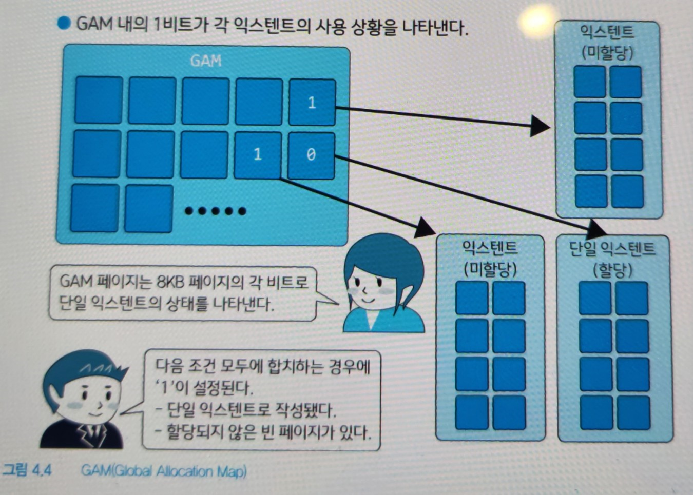

**SGAM**</br>
이것은 혼합 익스텐트의 상황을 나타내느 페이지.
GAM과 마찬가지로 8KB분의 각 비트가 대응하는 익스텐트의 상황을 나타낸다. 1이 설정되어 있는 경우는 혼합 익스텐트로 할당되어 빈 페이지가 존재하는 것을 나타낸다.

0인 경우엔 빈 페이지가 존재하지 않지만, 혼합 익스텐트로 할당되어 있지 않음을 나타낸다.

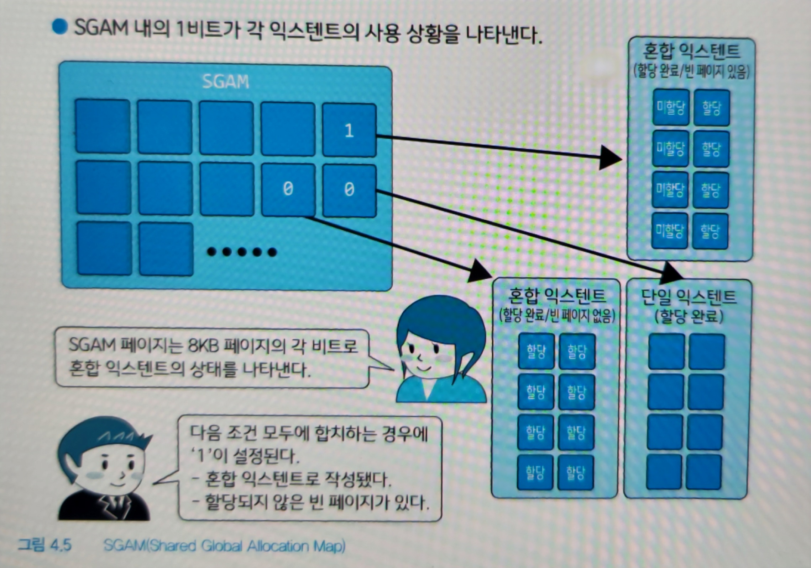

**PFS(Page Free Space**</br>
8kb페이지에 각 바이트가 대응하는 페이지의 상황을 나타내고 8000 페이지 분의 정보를 저장한다.

페이지 사용, 미사용 같은 정보를 추가하면 페이지 사용률도 확인이 가능하다.

PFS의 정보를 사용해 새로운 데이터를 저장하기 위한 페이지를 찾는다.

다만 인덱스 페이지는 인덱스 키 값에 따라 저장해야할 장소가 정해진다.

따라서 PFS는 힙이나 Text/Iamge 데이터의 저장 장소 검색을 위해서만 사용된다.

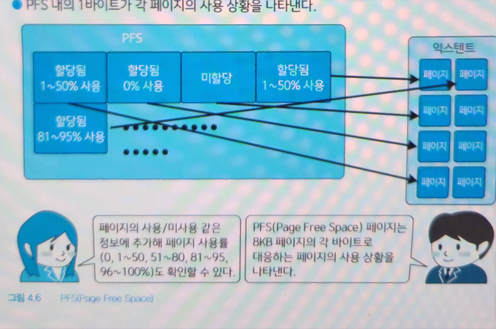

**IAM(Index Allocation Map)**</br>

클러스터화 인덱스, 비클러스터화 인덱스 및 히프와 각각의 오브젝트에 사용되는 익스텐트를 링크하기 위해 사용되는 8kb의 페이지이다. 1개의 IAM(Index Allocation Map)으로 64000익스텐트분(4GB) 정보를 관리 할 수 있다.

인덱스 등 사이즈가 4GB를 넘는 경우는 2개째 IAM이 할당 된다. 쌍방의 IAM은 상호의 링크 정보를 갖고 있다.


#### CHAT GPT

여기서 언급된 "GAM", "SGAM", "PFS", "IAM"은 SQL 서버의 데이터 저장 및 관리에 사용되는 시스템 페이지에 관한 것입니다. 이들은 데이터베이스에서 데이터의 저장 및 관리를 최적화하기 위해 사용되는 메커니즘을 나타냅니다.

1. **GAM (Global Allocation Map)**:

   - SQL 서버에서 8KB 크기의 페이지를 사용하여 각 비트가 데이터베이스 내의 익스텐트(데이터 저장 단위)의 상태를 나타냅니다.
   - 비트 값이 1이면 해당 익스텐트가 할당되지 않았음을, 0이면 할당되었음을 나타냅니다.
   - 하나의 GAM 페이지는 64,000 익스텐트(약 4GB)의 상태를 관리할 수 있습니다.
   - 새로운 익스텐트를 할당할 때 SQL 서버는 이 페이지를 참조하여 효율적으로 사용 가능한 익스텐트를 찾습니다.

2. **SGAM (Shared Global Allocation Map)**:

   - SGAM은 혼합 익스텐트의 상태를 나타내는 페이지입니다.
   - GAM과 마찬가지로 8KB 크기의 페이지에서 각 비트가 익스텐트의 상태를 나타냅니다.
   - 비트 값이 1이면 혼합 익스텐트로 할당되어 빈 페이지가 있음을, 0이면 혼합 익스텐트로 할당되지 않았음을 나타냅니다.

3. **PFS (Page Free Space)**:

   - 8KB 페이지에서 각 바이트가 대응하는 페이지의 상태를 나타내며, 8,000 페이지 분의 정보를 저장합니다.
   - 페이지의 사용 여부 및 사용률을 나타내어 새로운 데이터 저장을 위한 페이지를 찾는 데 사용됩니다.
   - PFS는 주로 힙이나 Text/Image 데이터의 저장 장소 검색에 사용됩니다.

4. **IAM (Index Allocation Map)**:
   - 클러스터화된 인덱스, 비클러스터화된 인덱스 및 힙과 각각의 오브젝트에 사용되는 익스텐트를 매핑하기 위한 8KB 페이지입니다.
   - 하나의 IAM 페이지는 최대 64,000 익스텐트(약 4GB)의 정보를 관리할 수 있습니다.
   - 인덱스 크기가 4GB를 초과하는 경우 추가 IAM 페이지가 할당되며, 각 IAM 페이지는 서로 연결되어 있습니다.

이러한 페이지들은 데이터베이스의 효율적인 공간 관리 및 데이터 접근을 위해 중요한 역할을 합니다.

### 4.2 트랜잭션 로그 파일

**트랜잭션 로그**는 SQL서버가 관리하는 오브젝트로는 예외적으로 8KB라는 페이지 단위가 사용되지 않는다. 트랜잭션 로그 레코드의 사이즈는 실행된 오퍼레이션에 따라 4~60KB의 범위에서 변화한다.

- 트랜잭션 로그
  - 8KB 페이지 단위 X
  - 4~60KB 범위의 트랜잭션 로그 레코드 사이즈를 갖는다.

#### 4.2.1 가상 로그 파일

SQL 서버는 트랜잭션 로그 파일을 다시 여러 개의 가상 로그 파일이라 불리는 단위로 분할해서 사용한다. 트랜잭션 로그 파일 내의 각 가상 로그 파일을 최소 단위로 해서 영역의 '사용 중', '미사용' 같은 상태값이 관리된다.

또한 로그 파일의 축소와 확장 등도 가상 로그 파일을 하나의 단위로 해서 실행된다.


가상 로그 파일의 사이즈는 SQL서버에 의해서 결정되기 떄문에 유저가 직접 변경하는 등의 관리는 불가능하다. 일반적으로 데이터베이스를 작성한 단계에서 트랜잭션 로그 파일에 작은 사이즈를 지정하면 작은 사이즈의 가상 로그파일이 할당된다. 반대로 큰 사이즈의 트랜잭션 로그파일은 큰 사이즈의 가상 로그 파일로 분할된다.

또한 트랜잭션 로그 파일의 확장 사이즈로서 작은 값이 지정된 경우 파일의 확장이 발상될 때마다 작은 사이즈의 가상 로그 파일이 추가된다. 작은 가상 로그파일로 분할된 로그 파일에 트랜잭션 로그가 축적 되고, 그 결과 확장이 반복 됐다고 하자. 결과적으로 로그 파일은 매우 많은 수의(작은 사이즈) 가상 로그 파일로 구성된다.


SQL 서버는 다수의 가상 로그 파일의 관리(스테이터스의 업데이트 등)가 필요하며, 그에 따른 오버헤드는 퍼포먼스에 악영향을 미치는 경우가 있다.

그러한 상황을 피하기 위해 데이터베이스를 정의하는 단계에서 필요 최대한으로 생각되는 사이즈를 트랜잭션 로그 파일에 할당할 것을 권장한다.

- 트랜잭션 로그 파일(소) -> 부하 커짐

  - 새로운 로그 파일을 확장 할 때 마다 작은 로그 파일들이 생성되어 여러 상태 관리에 대한 부하가 커진다.

- 트랜잭션 로그 파일(대) -> 부하 작음
  - 큰 로그 파일들만 생성되며, 여러 상태 관리에 대한 부하가 작다.

### 4.3 데이터베이스 파일 내의 액세스 수법

데이터베이스 내의 각 오브젝트에 엑세스 하는 방법과 순서는 쿼리 옵티마이저라 불리는 컴포넌트가 결정한다. 옵티마이저에 따라서 가장 효율적으로 데이터에 엑세스하기 위한 수단(최적의 인덱스 선택과 테이블의 결합 방법/순서 등)을 결정하고, 그 결정에 기초한 순서대로 테이블 등에 저장된 데이터를 취득한다.

쿼리 옵티마이저의 동작 자체도 매우 흥미롭지만, 여기서는 우선 쿼리 옵티마이저가 데이터에 엑세스하는 수단을 결정한 후에 어떤 알고리즘으로 실제 데이터를 취득하는지를 소개한다.

인덱스가 사용되는 경우 각 인덱스 페이지는 동일 계층의 앞 페이지와 다음 페이지의 포인터를 각각 갖고 있다. 또한 인덱스의 각 계층도 링크 리스트로 링크 되어 있다. 때문에, 가령 목적하는 데이터를 취득하기 위해 인덱스를 스캔해야 하는 경우 매우 심플한 알고리즘으로 데이터를 취득 할 수 있다. 스캔 시작 페이지를 인덱스 페이지 계층의 상위에서 하위로 링크 리스트를 사용해서 특정한다. 다음으로 앞 페이지 또는 다음 페이지의 포인터를 사용해서 스캔 시작 페이지부터 스캔 종료 지점까지 이동하면서 데이터를 취득하면 된다.


- 인덱스 페이지는 상위, 하위 계층과 링크되어 있고, 앞 페이지와 다음 페이지가 링크되어있다.
- 심플한 알고리즘이 사용 가능하다

인덱스가 사용되지 않는 경우 히프 테이블의 각 데이터 페이지는 앞 페이지 및 다음 페이지의 포인터를 갖고 있지 않다. 때문에 개별 데이터 페이지 만으로는 상호의 관련성을 전혀 파악할 수 없다.

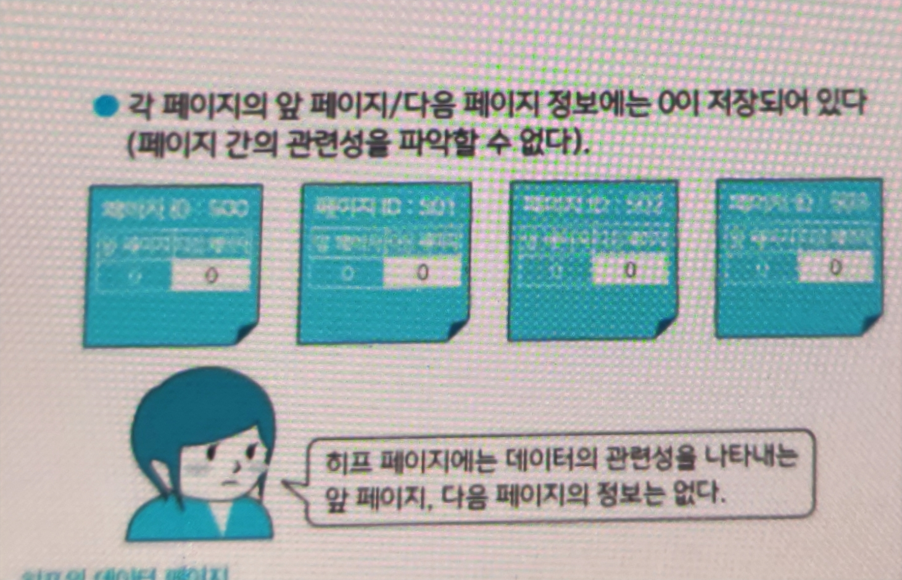

- 단순 페이지라면, 페이지 간에 상호 관계를 전혀 알 수 없다.

그러면 그런 상황에서 테이블 내의 전 건을 스캔할 필요가 있는 경우 어떤 순서를 생각 할 수 있을까?

히프를 구성하고 있는 각 데이터 페이지에는 정보가 없기 때문에 관리정보를 저장하고 있는 페이지를 의존하는 수 밖에 달리 방법이 없다. 이 경우는 앞서 말한 IAM이 가장 효과를 발휘한다. IAM의 각 비트를 확인하면 히프가 사용되고 있는 모든 익스텐트를 알 수 있다. 다음은 각 익스텐트에 저장되어 있는 데이터 페이지를 순차 참조 해서 익스텐트 내의 페이지를 스캔한다. 하나의 익스텐트 내 모든 페이지의 스캔이 종료하면 IAM의 정보에 기초해서 다음 익스텐트로 이동하고, 각 데이터 페이지에 엑세스하는 동작을 반복해서 히프 테이블을 스캔할 수 있다.


#### CHAT GPT

SQL 서버에서 히프(Heap) 구조를 가진 테이블의 모든 데이터를 스캔할 때의 과정을 이해하기 쉽게 설명드리겠습니다. 히프 구조는 인덱스가 없는 테이블로, 데이터가 순차적이거나 정렬된 방식으로 저장되어 있지 않습니다. 이런 상황에서 전체 데이터를 스캔하기 위해 IAM (Index Allocation Map) 페이지가 중요한 역할을 합니다.

1. **IAM 페이지 사용**:

   - IAM 페이지는 테이블에 할당된 모든 익스텐트(데이터 저장 단위)의 정보를 가지고 있습니다.
   - 데이터 스캔을 시작하기 전에, IAM 페이지를 참조하여 테이블에 할당된 모든 익스텐트의 위치를 파악합니다.

2. **익스텐트 순차 접근**:

   - IAM에서 파악한 정보에 따라 각 익스텐트에 순차적으로 접근합니다.
   - 각 익스텐트에는 여러 데이터 페이지가 포함될 수 있으며, 이 페이지들에 테이블의 실제 데이터가 저장되어 있습니다.

3. **데이터 페이지 스캔**:

   - 익스텐트 내의 각 데이터 페이지를 차례대로 스캔합니다.
   - 한 익스텐트의 모든 페이지를 스캔한 후에는 IAM의 정보를 기반으로 다음 익스텐트로 이동합니다.

4. **전체 테이블 스캔 완료**:
   - 이 과정을 반복하여 테이블에 할당된 모든 익스텐트의 모든 데이터 페이지를 스캔합니다.
   - 이렇게 하면 테이블의 모든 데이터를 순차적으로 읽을 수 있습니다.

히프 테이블에서 전체 데이터 스캔을 하는 과정은 인덱스가 없기 때문에 더 많은 시간과 자원이 소요될 수 있습니다. 이는 데이터를 저장하거나 검색하는 효율성이 중요한 경우에 고려해야 할 중요한 요소입니다.

### 데이터 베이스 파일의 관리

데이터베이스 파일에는 관리를 숩게 하기 위해 준비된 수만흔 프로퍼티를 설정 할 수 있다. 프로퍼티군 중에서 가장 일반적인 것 중 하나에 자동 확장이 있다. 데이터 파일과 로그 파일이 가득 찼을때 자동으로 파일 사이즈를 확장해주는 편리한 기능이지만, 설정 내용에 따라서는 생각지 않은 문제를 초래하기 때문에 소개한다.

#### 4.4.1 원인 불명의 데이터베이스 확장 실패

각 데이터 베이스 파일의 자동 확장 프로퍼티를 디폴트 상태로 설정해서 운용한 결과 디스크의 빈 용량은 충분한데도 다음과 같은 오류가 일어나서 대처하기 곤란한 경우가 있다,

```
에러 : 1105
중요도 레벨 : 17
메시지 :'Default' 파일 그룹이 가득 찼으므로 데이터베이스 'db1'에 오브젝트 'table1'의 영역을 할당하지 못했습니다.
```

사실 데이터베이스의 각 파일을 자동 확장하는 처리에는 내부적인 타임아웃 값이 설정되어 있다. 그 값은 30초이며 변경은 불가능하다. 또한 실제로 디스크의 빈 용량이 부족해 파일의 자동 확장이 실패한 경우도 빈 용량이 충분히 남아 있는데도 불구하고 타임아웃이 발생한 경우도 같은 오류가 발생한다.

또한 이 문제는 어느 시점 까지는 문제없이 운용되던 시스템에서 갑자기 문제가 일어나는 경향이 있다. 이것은 각 데이터베이스 파일 확장 사이즈의 설정에 원인이 있다. 디폴트 설정에서는 파일의 확장 사이즈는 '10%'로 되어있다. 100MB의 데이터 파일이 용량 부족에 의해서 확장될 때는 10MB가 추가 된다. 그런 작은 사이즈의 경우는 '10%'라는 값은 언뜻 무해한 것 처럼 보이지만, 가령 그것이 쌓여서 500GB에 도달한 파일은 어떨까?

500GB의 10%라고 하면 50GB이다. 디스크의 속도에 따라 다르기도 하지만 50GB의 파일 확장을 30초 이내에 완료하는 것은 대다수의 경우에는 실패한다. 따라서 드라이브에 100GB의 빈 용량이 있어도 확장 실패 메시지가 돌아오는 결과가 된다.

- 디스크 자동확장
  - 10%씩 증가한다.
  - 100MB면 10MB이지만 500GB면 50GB인데 대부분 30초 내에 하는 것은 불가능 하다.
  - 출력되는 메시지가 용량 부족과 타임아웃으로 인해 발생하는 경우와 같은 메시지가 출력된다.

#### 4.4.2 SQL서버 2005 이후 개선된 사항

데이터베이스 파일 확장에 관해 너무 많은 문의가 있어 SQL서버 2005부터 몇가지 개선이 있다.

**제로잉의 회피**</br>
SQL 서버 2000까지는 데이터베이스를 작성할 때나 데이터베이스 파일을 확장할 때 반드시 그 파일 내를 제로로 메우고 포맷했다. 이 동작은 **제로잉**이라고 한다. 당연히 제로잉은 파일의 사이즈가 커지면 커질 수록 긴 시간이 필요하다. SQL 서버 2005부터는 서비스 실행 어카운트에 볼륨의 보수 태스크(SE_MANAGE_VOLUMN_NAME) 특권을 부여함으로써, 데이터베이스 작성과 확장 시의 제로잉을 피할 수 있게 됐다. 이로써 파일 확장 처리의 퍼포먼스가 비약적으로 향상했다.


**디폴트 설정의 재검토**</br>
SQL 서버 2000까지는 10%로 설정되었던 파일의 작동 확장 프로퍼티가 10MB로 변경됐다. 이로써 자동 확장 프로퍼티에 주의하지 않은 사용자가 뜻하지 않게 용량 부족 오류에 직면하게 된다.

**이상적인 설정**</br>
데이터 파일 확장 실패에 대처하는 몇 가지 방법이 SQL 서버 2005에서 도입됐지만, 실제 운용 환경에서 일상적으로 데이터 파일의 자동 확장이 빈번하게 발생하는 것은 바람직 하지 않다. 자동확장이 반복되는 배경에는 데이터베이스에 추가되는 데이터 증가율을 제대로 파악하지 못했기 때문인데, 그것은 시스템의 안정 운용을 위협하는 요인이 된다. 따라서 항상 시스템이 필요한 파일 용량을 정확하게 파악하고 파일 확장이 필요한 경우에는 계획적으로 수동으로 실행하는 것이 이상적이다. 자동 확장은 어디까지나 긴급 상황에 대비하는 방법으로 사용할 것을 권한다.

- 제로잉
  - 확장된 파일을 0으로 메꿈으로 인해, 파일 사이즈가 클 때, 확장에 오랜 시간이 걸렸음
  - 볼륨의 보수 태스크 권한 부여로 해결
- 디폴트 설정의 재검토
  - 10% 확장을 10MB로 변경
  - 용량 부족에 시달리는 문제 발생
- 이상적인 설정
  - 시스템이 필요한 파일을 정확히 계산
  - 부득이하게 파일 확장이 필요한 경우 수동으로 실행
  - 자동 확장은 긴급상황 대비용으로 사용하는게 권장됨.

### 4.5 데이터의 효율적인 저장 방법

일반적으로 데이터베이스에 축적되는 데이터는 날로 늘어난다. 증가하는 데이터에 대한 근본적인 대처 방법으로 데이터의 운용 방침 확립과 오래된 데이터의 아카이브 등이 필수이다. 그러나 그런 대처의 필요성을 가능한 낮추는 효율적인 데이터 저장방법이 SQL 서버 2005 이후에 차츰 구현되고 있다.

#### 4.5.1 NTFS 파일 압축의 사용

SQL 서버 2005부터 데이터베이스 파일 안에서 읽어들이기 전용으로 설정된 파일그룹을 NTFS 파일에 압축 할 수 있게 됐다. NTFS 파일을 압축하려면 익스플로러나 COMPACT 커맨드를 사용한다. 다만 다음의 점에 주의해야 한다.

- 압축하는 파일 그룹에 읽기 전용(READ_ONLY)프로퍼티를 설정할 필요 가 있다.
- 프라이머리 파일 그룹(.mdf 파일이 포함되어 있다.)과 로그 파일은 압축할 수 없다.
- 다만 읽기 전용 데이터베이스에서는 프라이머리 파일 그룹도 압축할 수 있다.

#### 4.5.2 VARDECIMAL 형

VARDECIMAL형은 DECIMAL형의 저장 영역을 보다 효율적으로 사용하기 위해 SQL 서버 2005 SP2 이후에 구현된 기능이다. DECIMAL형 열은 모든 행에서 테이블의 정의 시에 설정된 영역을 확보한다. 그러나 저장되는 수치에는 크게 편차가 있는 경우도 많아 10자릿수 분을 준비한 경우라도 행 전체 중 80% 이상이 5자릿수 이하인 일도 적지 않다.

만약 테이블의 사이즈가 거대해진 경우 사용되지 않는 자릿수분의 영역을 확보하지 않으면 디스크 사용량을 크게 줄 일 수 있다.

그런 경우에 VARDECIMAL형은 매우 효과적이다. VARDECIMAL형을 사용하면 실제의 값을 추가해서 2바이트만 사용된다. 이로써 효율적인 실수 데이터의 저장이 가능하다

- Enterprice, Developer, Evaluation 각 에디션에서 사용 가능
- 데이터 형으로써 테이블 정의 시에 지정하는게 아니라 데이터베이스의 프로퍼티로 설정한다.
- CPU의 사용률이 증가할 가능성이 있다.
- 시스템 데이터베이스(master, msdb, model, tempdb)에는 vardecimal을 설정 할 수 없다.

#### 4.5.3 데이터 압축

SQL 서버 2008 이후에서는 테이블 별로 데이터를 압축하는 것이 가능하다. 테이블 내의 페이지 단위 또는 행 단위로 데이터를 압축할 수 있다. 이로써 필요한 스토리지의 사이즈를 절약할 수 있는 동시에 I/O수를 줄여 퍼포먼스 향상을 기대할 수 있다.

#### 4.5.4 백업 압축

SQL 서버 2008 이후에는 데이터베이스의 백업을 취득할 때 백업 파일을 압축하는 것이 가능하다. 이로써 백업 파일의 사이즈 축소 및 I/O 수의 삭감에 의한 백업/복원 시간이 단축 된다.

### 4.6 4장 정리

- 데이터 베이스 구조의 상세
- 관리상의 주의사항
- 데이터의 효율적인 저장 방법

데이터베이스를 구성하는 데이터 파일의 내부 구조는 8KB의 페이지 구성을 기본적으로 얼마나 심플하게 관리하느냐를 추구한 결과가 현재의 형태라고 할 수 있다. 한편으로 로그 파일에서는 8KB 페이지의 개념을 사용하지 않고 트랜잭션 로그 역할을 최대한 발휘하는 아키텍처가 도입되어 있는 점은 SQL 서버 디자인의 유연성을 나타내는 것이기도 하다.

## 5장 로우스토어형 테이블

'데이터베이스는 8KB의 페이지라는 논리 단위로 분할되어 관리되고 있다.'

지금까지 여러 번 반복해서 등장한 말이지만, 이장 역시 이 한문장으로 시작하고 싶다. 8KB의 페이지군을 효율적으로 조작해서 사용자의 요구에 얼마나 신속하게 대응하느냐가 SQL의 심플하면서도 가장 중요한 명제이다.

앞 장에서는 데이터베이스 레벨의 구조에 관해 소개했지만, 이 장에서는 한발 더 상세한 레벨로 들어간다. 구체적으로는 테이블, 인덱스 그리고 저장되어 있는 데이터 자체의 구조에 대해 확인한다. 또 이 장에서는 데이터를 테이블의 행별로 저장하는 로우 스토어형 테이블에 대해 살펴보고, 열별로 저장하는 칼럼스토어 방식에 관해서는 다음 장에서 자세히 설명한다.

### 5.1 테이블과 오브젝트 ID

사용자 입장에서 봤을때 테이블을 가장 심플하게표현하면 행과 열의 집합체라고 할 수 있지 않을까? sql 서버 뿐만 아니라 릴레이셔널 데이터베이스의 테이블을 작성할 때나 테이블에 대한 쿼리를 기술할 때는 행과 열을 의식해야한다. SQL 서버의 경우 8KB의 페이지를 구사해서 행과 열로 구성된 테이블에 액세스하는 기능이 구현되어 있다.

전혀 예비지식이 없는 상태에서는 8KB의 페이지를 조합해서 테이블을 표현하는 수단을 상상하는 것이 어려울 수도 있다. 먼저 구체적인 구현 방법을 확인하다.

8KB의 각 페이지에는 행과 열을 표현하기 위해 필요한 정보가 저장되어 있지만, 그 정보만으론 관리 정보를 저장하기 위한 영역으로 사용하고 있다. 각 페이지 헤어에, 페이지가 소속된 풀이 할당된 오브젝트 ID를 채운다. 이로써 일련의 페이지가 테이블이라는 한덩어리의 존재라는 것을 나타낸다.

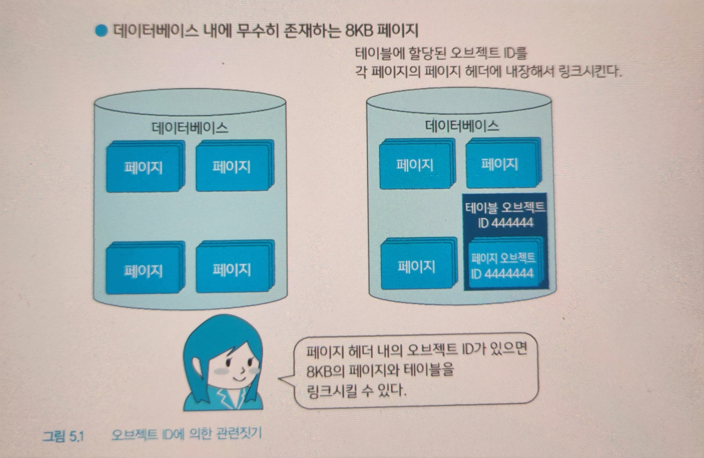

### 5.2 페이지의 분류

오브젝트 ID를 각 페이지에 부여함으로써 데이터베이스 내에 무질서하게 존재하던 8KB의 페이지를 테이블로서 관련지을 수 있다. 다만 한 덩어리의 그룹으로 다룬다고는 해도 용도에 따라서 각 페이지는 크게 다른 내용을 보존하고 있다는 점에 주의하기 바란다.

페이지의 용도는 크게 2종류로 나눈다.

1. 데이터의 내용을 저장한다
2. 인덱스의 키를 저장한다

저장하는 정보의 내용에서 1.은 데이터 페이지, 2.는 인덱스 페이지라고 한다.

용도를 더 세분화 하면 데이터베이스의 경우, 클러스터화 인덱스를 정의하고 있는 테이블과 정의하지 않은 테이블에 저장되어 있는 내용이 다르다.

인덱스 페이지의 경우도 클러스터화 인덱스와 비클러스터화 인덱스의 내용에 차이가 있다.

각각의 페이지가 어떤 용도로 사용되는지는 각 페이지의 페이지 헤더에 저장된 정보를 참조해서 확인할 수 있다.

페이지 헤더 내의 정보 일부에 인덱스ID가 저장되어 있다. 인덱스ID가 0이면 데이터 페이지임을 나타낸다. 1 이상 999 이하인 경우는 인덱스 페이지임을 나타낸다.

그러면 각 페이지에 포함되는 내용과 차이에 대해 확인해 보자.
| 페이지 (Page) | 세부 내용 |
|-----------------------------------|-----------------------------------------|
| 인덱스 (Index) | |
| | 클러스터화 인덱스 (Clustered Index) |
| | 비클러스터화 인덱스 (Non-Clustered Index) |
| 데이터 페이지 (Data Page) | |
| | 히프 (Heap) |
| | 클러스터화 인덱스의 리프 페이지 (Leaf Pages of Clustered Index) |

- 페이지 헤더 내 정보 일부에 인덱스 페이지가 존재한다.
  - 데이터페이지 : Index 아이디 : 0
  - 인덱스페이지 : Index 아이디 : 1 ~ 999

### 5.3 인덱스 페이지

인덱스 페이지를 자세히 설명하기 전에 간단하게 인덱스에 대해 다시 살펴본다. 다음의 심플한 질문에 대답할 수 있을까?

**Q** : 인덱스는 무엇때문에 존재하는 걸까?

**A** : 보다 적은 I/O 횟수에 대상으로 하는 데이터를 취득하기 위해서이다. 인덱스 페이지분의 데이터를 저장하기 위해 보다 많은 인덱스가 필요해졌다고 해도 또한 갱신 시 오버헤드가 있었다고 해도 I/O 횟수 삭감에 의한 참조 시의 이점이 더 크다고 판단 되면 인덱스를 활용해야 한다.

SQL 서버의 인덱스는 B-TREE(Balanced-Tree)라는 형식을 선택하고 있다. 인덱스 페이지를 사용해서 트리 구조를 구축하고 효울적인 I/O를 실현한다.

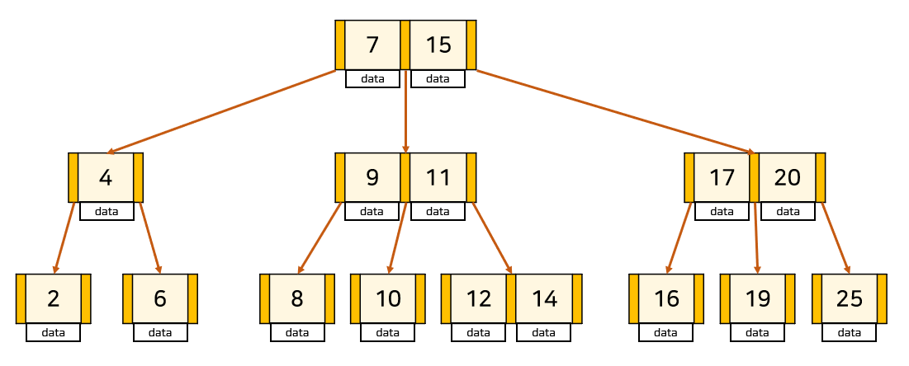

- B-tree구조의 상위에서 하위를 향해 목적으로 하는 데이터에 효율적으로 액세스 할 수 있다.

다만, 본래 필요한 데이터 저장용 영역에 추가해서 인덱스 영역의 디스크가 필요하다. 테이블의 값을 갱신할 때 본래의 데이터 이외에도 인덱스 페이지 내의 값을 갱신하는 오버헤드가 발생하는 일이 있다.

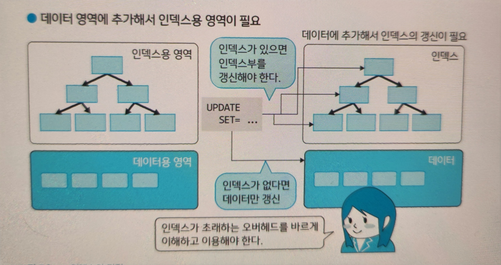

트리 구조의 최상위 루트노드(루트 페이지)라 불리며, 인덱스의 2분기 시작 지점이 된다. 최하층 리프노드(리프페이지)라 불리며, 모든 실 데이터에 대응한 인덱스 키 또는 실 데이터와 인덱스 키를 보관한다.

둘의 중간에 위치하는 인덱스 페이지는 중간 노드라 불린다. (인덱스가 루트 노드와 리프 노드만으로 구성되어 있는 소규모 경우를 제외하고) 루트 노드에서 리프노드까지 2분기를 반복해서 신속하게 도달하기 위해서는 양쪽을 연결하는 정보가 필요하다. 상위와 하위의 인덱스 페이지를 연결하기 위한 정보를 보관하고 있는 것이 중간 노드이다. 테이블이 보관하는 데이터 량에 따라서 중간 노드의 계층은 변화하고 데이터 량이 많으면 많을 수록 중간 노드의 계층은 깊어진다.


- 요약
  - B-TREE : SQL서버의 인덱스 구조
  - 데이터 저장영역에 인덱스가 저장된다.
  - 인덱스 값을 UPDATE 해야하는 오버헤드가 발생하는 일이 있다.
  - 루트노드 - 중간노드 - 리프노드
    - 중간노드는 상위와 하위노드를 연결한다.
    - 데이터가 많으면 중간 노드의 계층은 깊어진다.

#### 5.3.1 클러스터화 인덱스와 비클러스터화 인덱스의 차이

양자의 주요 차이는 리프노드에 있다. 비클러스터화 인덱스의 리프노드는 그외의 노드와 마찬가지로 키 값만을 보관한다. 그러나 클러스터화 인덱스는 키값에 추가해 실제의 데이터도 보관하고 있다. 키 값은 인덱스가 정의된 순서대로 나열되어 있고, 실 데이터도 마찬가지로 정렬된 상태로 저장되어 있다. 다시 말해 클러스터화 인덱스의 실 데이터는 물리적으로는 키 순서대로 정렬 되어 있다.

- 비클러스터화 인덱스의 리프노드에는 인덱스 키와 일치하는 데이터 행을 연결하기 위한 참조 정보가 보관되어 있다. 데이터를 저장하고 있는 데이터 구조가 클러스터화 인덱스인 경우는 클러스터화 인덱스 키 자체가 비클러스터화 인덱스의 리프페이지에 저장되어 있다. 히프인 경우는 파일 번호, 행 번호, 슬롯 번호 같은 관리 정보가 보관되어 있다.

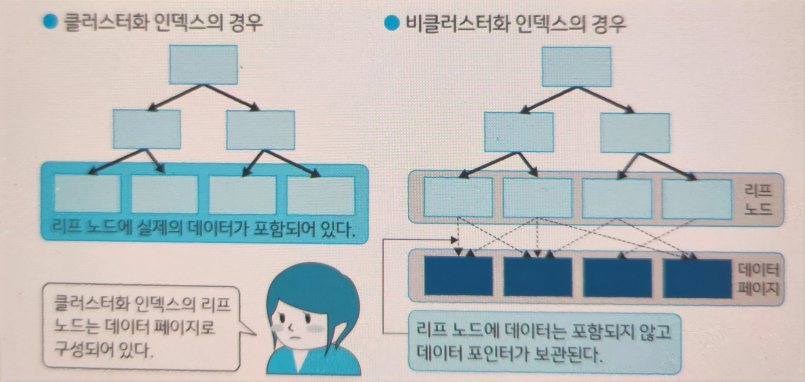

클러스터화 인덱스는 항상 인덱스 ID를 하나로 할당되며, 테이블에 대해 하나만 작성 가능하다. 클러스터화 인덱스에 정의한 정렬 순서대로 테이블의 데이터 행이 정렬되어 있으므로 당연히 하나밖에 보관할 수 없다. 이에 반해 비클러스터화 인덱스는 999개 까지 작성할 수 있다.

일반적으로 데이터가 물리적으로 키 순서대로 정렬되는 클러스터화 인덱스는 일정 범위를 키 순서대로 참조하는 검색에서 이점을 발휘한다고 여겼다. 한편 비클러스터화 인덱스는 부여된 키값을 토대로 한 소규모 데이터의 검색에 적합하다.

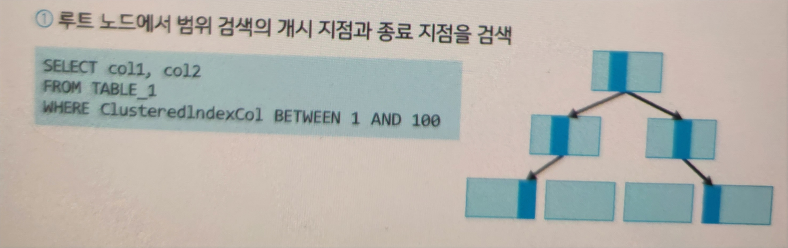
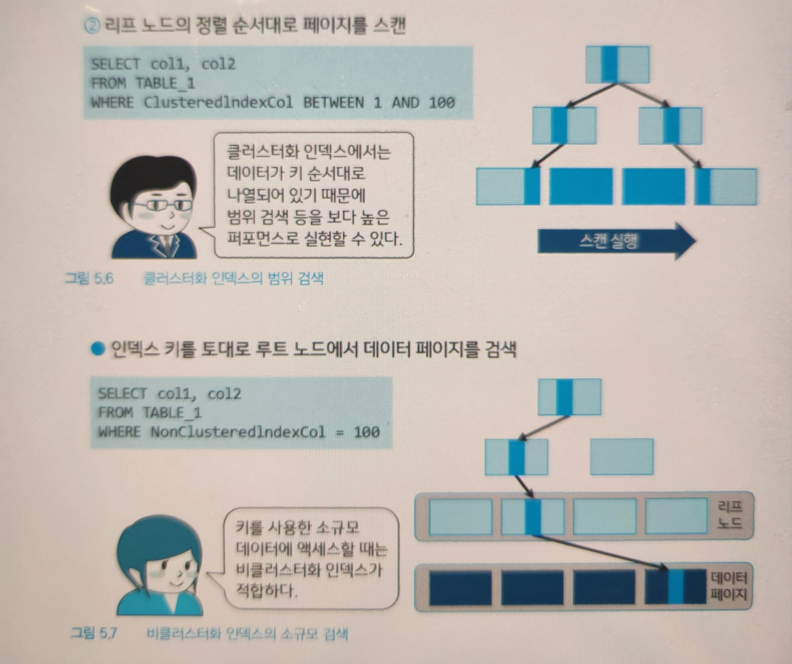

#### 5.3.2 인덱스 페이지의 내부 구조

다음으로 인덱스 페이지에 어떻게 데이터가 저장되어 있는지를 소개한다. 인덱스 페이지에는 인덱스 키로 정의된 열의 값과 관리 정보가 행별로 저장되어 있다. 관리정보에는 행의 구조등을 나타내는 메타 데이터와 인덱스 키 끼리의 관련성 등을 관련성 등의 정보가 저장되어 있다.

**헤더 정보**</br>
인덱스 페이지의 사이즈는 8KB이다. 페이지의 선두96바이트는 헤더정보로 사용된다. 헤더 정보에는 주로 다음 정보가 들어있다.

|            |                                                              |
| ---------- | ------------------------------------------------------------ |
| Page ID    | 데이터베이스 내의 파일 번호와 페이지 번호를 조합한 정보      |
| Next Page  | 페이지 링크 중에서 다음의 순서에 위치하는 번호에 관련된 정보 |
| Prev. Page | 페이지 링크 중에서 이전의 순서에 위치하는 번호에 관련된 정보 |
| Object ID  | 페이지가 소속하는 오브젝트 ID                                |
| Level      | 인덱스 트리의 계층에 관련된 정보                             |
| Index ID   | 페이지가 소속하는 인덱스 ID                                  |

**인덱스 키 행**</br>
인덱스 키를 구성하는 열의 데이터 등을 보관하고 있다.
|||
|-|-|
|열 수|인덱스를 구성하고 있는 열 수|
|고정길이|데이터 인덱스를 구성하는 고정길이 열의 실제 데이터|
|가변길이 열수|인덱스를 구성하는 가변길이 열 수|
|가변길이|데이터 인덱스를 구성하는 가변길이 열의 실제 데이터|

**행 오프셋 배열**</br>
8KB 인덱스 페이지의 말미 2바이트에는 페이지 내의 인덱스 키의 위치를 나타내는 오프셋으로 사용된다.

### 5.4 데이터 페이지

데이터 페이지란 테이블에 정의된 모든열을 행의 이비지로 전환한 페이지이다, 다시 말해 클러스터화 인덱스의 리프 페이지와 히프를 가리킨다.

데이터베이스에는 테이블에 저장해야 할 데이터가 저장되어 있다. SQL 서버에 대해 실행된 쿼리는 데이터 페이지에 도달해야 데이터를 획득 할 수 있다,

#### 5.4.1 데이터 페이지의 내부 구조

데이터 페이지에는 BLOB 등의 일부를 제외하고 테이블에 정의한 모든 열의 데이터가 포함되어 있다. 여기에 추가해 데이터 페이지 자체의 관리 정보를 보관하고 각 데이터 행에도 각각의 관리 정보가 부여되어 있다. 이들 정보를 토대로 SQL 서버는 8KB의 페이지군을 열과 행의 이미지로 성형하고, 쿼리에 대한 결과 세트로 클라이언트에 회신한다.

**헤더 정보**</br>

데이터 페이지의 사이즈는 8kb이다. 페이지의 선두 96바이트는 헤더 정보로 사용된다. 헤더정보에 저장되는 인덱스 페이지와 거의 같지만 다른 부분은 다음과 같다.

|         | 데이터 페이지의 헤더 정보  |
| ------- | -------------------------- |
| Level   | 데이터 페이지에서는 항상 0 |
| IndexID | 데이터 페이지에서는 항상 0 |

**데이터 행**</br>
데이터 행을 구성하는 열 데이터 등을 보관하고 있다. 인덱스 키 행과 거의 같은 정보를 보관하고 있기 때문에 여기서는 다른 부분만 제시한다.

|                        |                                          |
| ---------------------- | ---------------------------------------- |
| 고정길이 데이터의 길이 | 데이터 행 내 고정길이 데이터의 합계 길이 |

**행 오프셋 배열**</br>
8kb 데이터 페이지의 말미 2바이트는 페이지 내의 데이터 행 위치를 나타내는 오프셋으로 사용된다.

#### 부가 열 인덱스의 이점

SQL 서버 2005부터 부가 열 인덱스라는 새로운 오브젝트를 생성 할 수 있게 됬다. 제대로 사용하면 매우 편리한 기능이므로 알아두면 좋다. 부가 열 인덱스의 이점을 이해하기 위해서는 우선 전제로 커버링 인덱스를 알아야한다.

**커버링 인덱스**</br>
인덱스를 정의하는 가장 큰 목적은 쿼리에서 요구 받은 데이터를 취득하는 I/O수를 가능한 줄이는데 있다. IAM을 사용한 히프의 스캔과 비교하면 비 클러스터화 인덱스를 사용한 인덱스 탐색이 실시된 경우가 훨씬 적은 I/O 수로 목적하는 데이터를 취득할 수 있다.

- IAM을 사용한 히프의 스캔
  - IAM의 비트가 True로 설정되어 있는 익스텐트 내의 페이지를 스캔

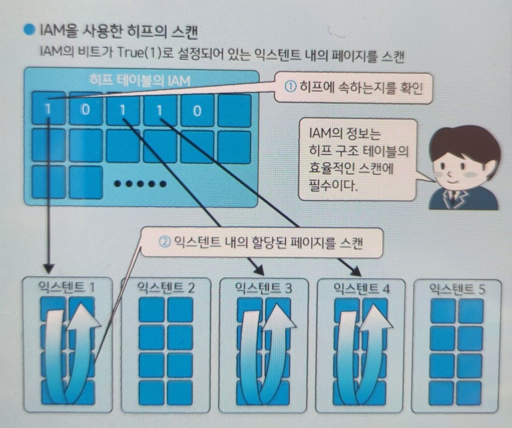

- 인덱스 탐색
  - 키 값을 토대로 최소 I/O수에 목적하는 데이터에 도달

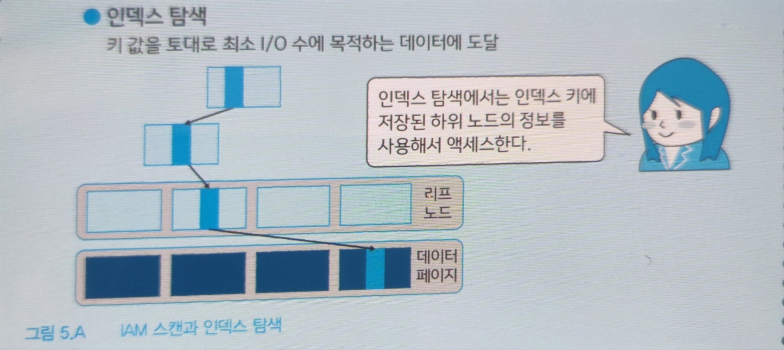

다음으로 완전히 같은 열 구조를 갖는 두 테이블에 다른 인덱스가 정의된 경우에 대해 생각해본다. 테이블 정의는 다음 표와 같으며 두 테이블(테이블 A와 B)과도 같다. 또한 저장되어 있는 데이터도 완전히 동일하다고 하자. 테이블 A와 B는 각각의 두번째 표와 같이 인덱스를 정의한다.

|          |            |
| -------- | ---------- |
| 회원번호 | INT        |
| 성명     | NCHAR(50)  |
| 주소     | NCHAR(400) |

| 테이블 A | 테이블 B |
| -------- | -------- |
| 회원번호 | 회원번호 |
|          | 성명     |

이러한 테이블에 대해 다음의 쿼리를 실행한 경우의 동작 차이를 확인해 보자.

```SQL
SELECT [회원번호],[성명]
FROM [테이블 A] 또는 B
WHERE [회원번호] BETWEEN 1 AND 1000
```

테이블 A의 경우는 [성명]열의 데이터를 취득하기 위해 데이터 페이지에 엑세스 해야한다.

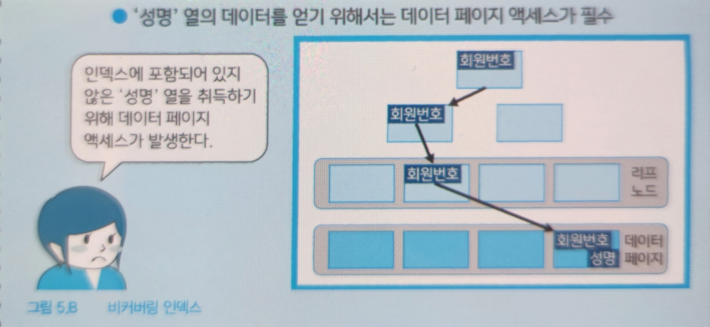

한편 테이블 B의 경우는 인덱스에 '성명' 열이 포함되어 있기 때문에 데이터베이스에 엑세스 할 필요가 없고, 인덱스의 리프페이지(리프 노드에 위치하는 페이지) 까지 충분하다.

아래 그림 때문에 취득하는 데이터 건수가 많아지면, 이를 위한 I/O의 수는 현저히 적어진다. 쿼리를 실행하기 전에 모든 I/O가 인덱스 페이지 내에서 완결되는, 이러한 동작을 커버링 인덱스라고 한다.

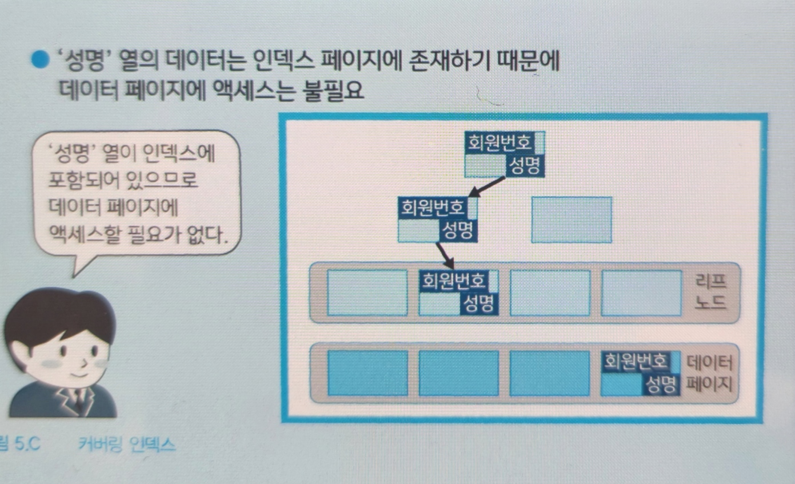

그러나 유감스럽게도 좋은 점만 있는 것은 아니다. 테이블 B의 각 인덱스 키는 테이블 A보다 100바이트 크기 때문에 인덱스 자체의 사이즈가 비대하다. 그 영향으로 필요한 디스크 스페이스가 증가한다. 또한 '성명'열을 갱신하면 데이터 페이지와 모든 인덱스 페이지를 갱신해야한다.
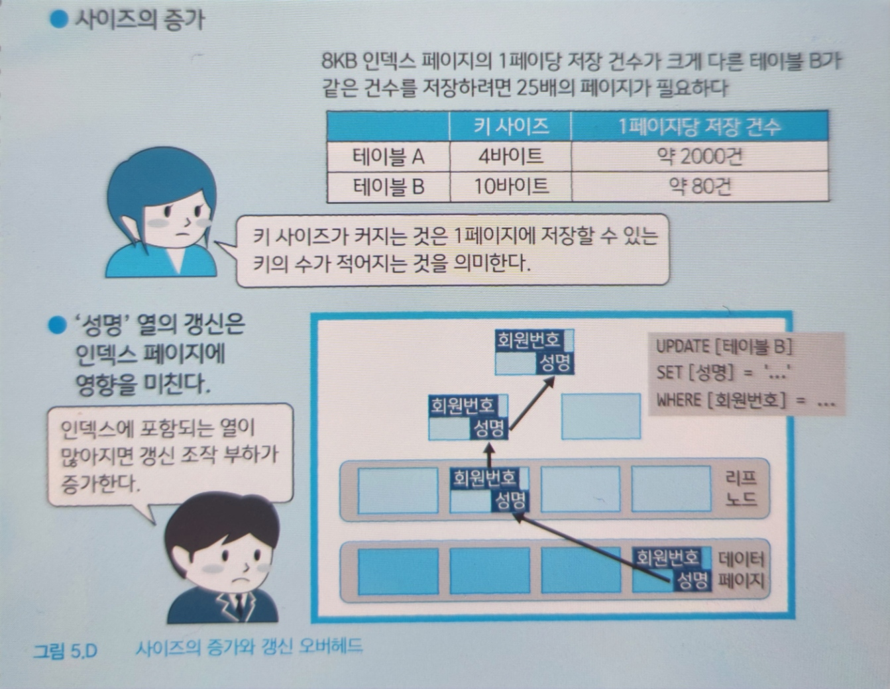

**부가 열 인덱스**</br>
비 클러스터화 인덱스와 클러스터화 인덱스의 좋은 점을 수용하기 위해 구현된 것이 부가열 인덱스 이다. 부가열 인덱스와 기존의 비클러스터화 인덱스의 차이는 리프 페이지의 구조에 있다. 인덱스의 루트 노드에서 중간 노드 까지 각 인덱스 페이지에는 차이가 없다.

통상의 경우 비클러스터화 인덱스의 리프 페이지에는 인덱스 키만 저장되어 있다. 한편 부가열 인덱스에서는 리프 페이지에 인덱스 키에 추가해서 임의의 열을 보관할 수 있다.

- 테이블 A에서는 데이터 페이지만

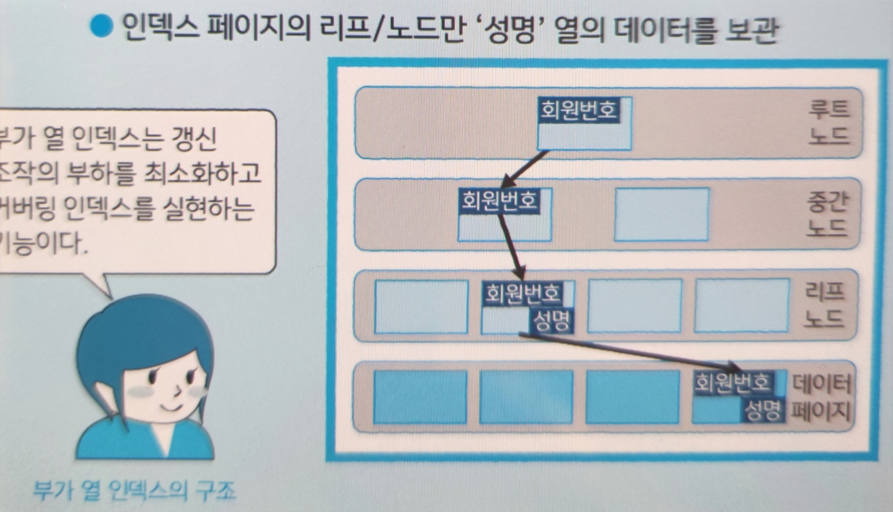

앞 항의 예를 토대로 생각해 보면 이점을 명확히 알 수 있다. 다음의 스테이트먼트를 사용해서 테이블 A에 비클러스터화 인덱스가 아닌 부가 열 인덱스를 작성한다.(NCLUDE 절이 부가 열 부분의 정의이다)

```SQL
CREATE INDEX [부가열 인덱스] ON [테이블 A]
([회원번호] INCLUDE ([성명]))
```

이로써 테이블 A의 인덱스는 인덱스 키인 [회원번호]에 추가해서 [성명] 데이터를 리프 페이지에 보관하게 된다. 따라서 다음의 쿼리를 실행해도 데이터 페이지에 액세스 할 필요는 없다.

```SQL
SELECT [회원번호], [성명] FROM [테이블 A]
WHERE [회원번호] BETWEEN 1 AND 1000
```

또한 리프페이지 이외에는 '성명'데이터를 보관하지 않기 때 문에 앞 항의 테이블 B의 문제점인 '인덱스 사이즈의 비대화'가 어느정도 경감된다. 또한 '성명' 데이터를 획득하기 위해 데이터 페이지에 액세스 할 필요가 없다. 즉 디스크 사용량의 삭감과 퍼포먼스 향상이 부가 열 인덱스의 장점이 된다.

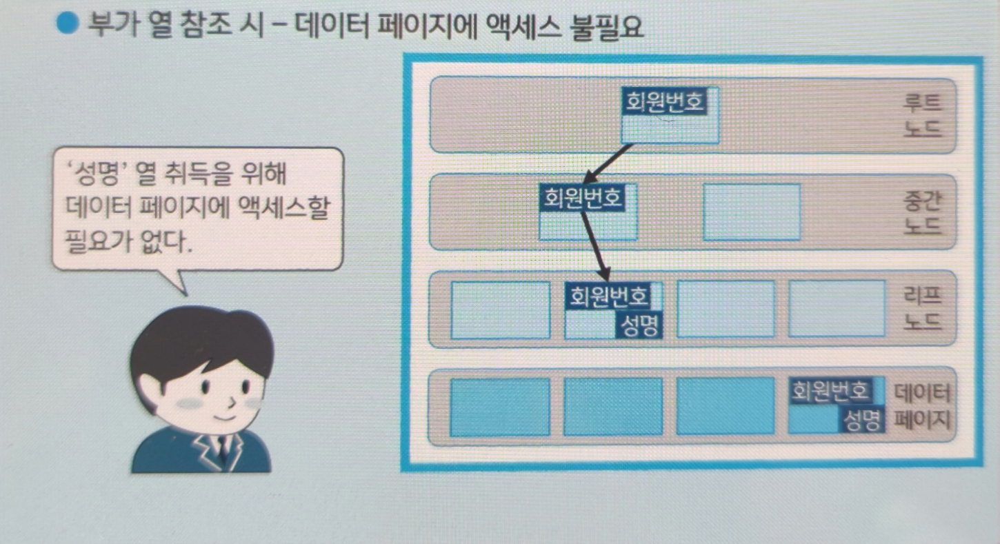

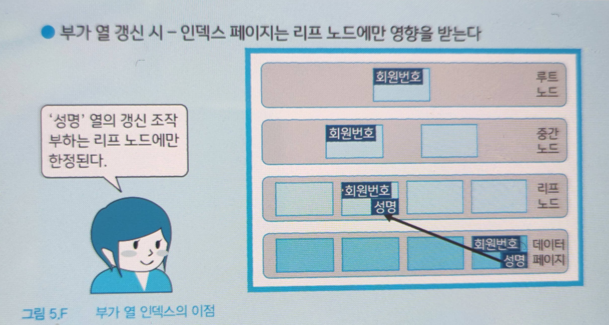

커버링 인덱스를 작성하려고 해도 인덱스 사이즈의 증가로 인해 주저했던 데이터베이스 관리자에게는 희소식이 아닐 수 없다. 테이블과 인덱스의 디자인을 검토할 때 선택지의 하나에 부가 열 인덱스를 추가해 보는건 어떨까.

### 5.5 DBCC PAGE에 의한 페이지 상세 정보의 확인

SQL서버의 각종 메뉴얼에는 공식적인 커맨드로 게재되어 있지 않지만, 데이터 베이스 내 8KB의 페이지를 덤프 출력하는 커맨드가 구현되어 있다. 이미 몇가지 서적과 웹사이트에 소개 되어 있으므로 이미 아는 분들도 있을 것이다.

그 커맨드는 바로 DBCCPAGE 이다. 여기서는 실제 테이블에 대해 이 커맨드를 실행해서 저장되어 있는 데이터와 관리 정보를 확인하려고 한다.
지금부터 사용하는 DBCC PAGE 및 DBCC INT 커맨드는 데이터를 표시하는 기능만 갖고 있으므로, 데이터가 파손 될 위험은 없다. 다만 정식으로 지워되는 툴은 아니기 떄문에, 가령 실제로 사용했을 때에 표시 내용이 바르지 않은 경우가 있다고 해도 이해하기 바란다.

- SQL 서버 2019 이후에는 이와 동등한 내용을 SYS.DM_DB_PAGE_INFO 동적 관리 뷰에서 확인 할 수 있다.

#### 5.5.1 준비

페이지 내의 상황을 확인하기 위한 샘프을 리스트 5.1의 정의 내용으로 작성한다. 이후의 커맨드는 모두 쿼리 툴을 사용해서 SQL 서버에 접속해서 실행한다.

```SQL
-- 페이지 내의 상황을 확인하는 샘플
CREATE DATABASE DB1
GO
USE DB1
GO

CREATE TABLE T1(C1 INT NOT NULL, C2 CHAR(10), C3 VARCHAR(10), C4 VARCHAR(10), C5 CHAR(10))
GO

INSERT T1 VALUES (1,'AAA','AAA','AAA','AAA')
INSERT T1 VALUES (2,'BBB','BBB','BBB','BBB')
INSERT T1 VALUES (3,'CCC','CCC','CCC','CCC')
GO
```

#### 5.5.2 테이블에 사용되는 페이지의 확인

DBCC IND 커맨드를 실행해서 테이블을 사용하고 있는 페이지 ID를 확인한다. 커맨드의 구문은 다음과 같다. 인덱스 ID에 '-1'을 지정하면 테이블 내의 모든 페이지가 출력된다.

```SQL
DBCC IND('데이터베이스명', '테이블명', '인덱스 ID')
```

```SQL
DBCC TRACEON(3604) -- 실행 결과를 클라이언트에 반환하는 설정이다.

DBCC IND('DB1','T1',-1)
GO

```

- 결과

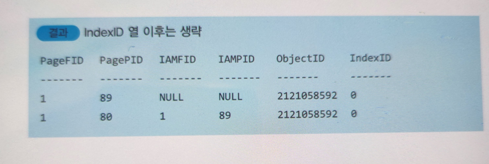

#### 5.5.3 페이지의 확인

DBCC PAGE 커맨드를 사용해서 페이지를 확인해보자. 커맨드 구문은 다음과 같다.

실행한 커맨드

```SQL
DBCC PAGE('데이터베이스명',파일ID, 페이지ID, 출력옵션)
```

파일 ID에는 DBCC IND 커맨드로 출력된 PageFID 열의 값을 지정한다. 또한 페이지ID에는 마찬가지로 PagePID를 지정한다.
출력 옵션은 '-1'DPTJ '3'까지의 값을 지정할 수 있다. 그러면 출력 옵션에 의한 결과의 차이를 확인해보자

**a. 출력옵션 : '-1' 또는 '0'**</br>

실행한 커맨드

```sql
DBCC PAGE('DB1',1,80,-1) 또는 DBCC PAGE('DB1',1,80,0)
```

다음과 같이 페이지 관리 정보만 출력된다. 이번 테이블은 히프이므로 [1]의 자리에 인데스 ID로서 0이 출력되었다.
[2]에서는 오브젝트 ID를 확인할 수 있다. 또한 만약 인덱스 페이지에 대해 이 커맨드를 실행한 경우는 [3] 및 [4]에 앞뒤의 페이지 ID가 출력된다.

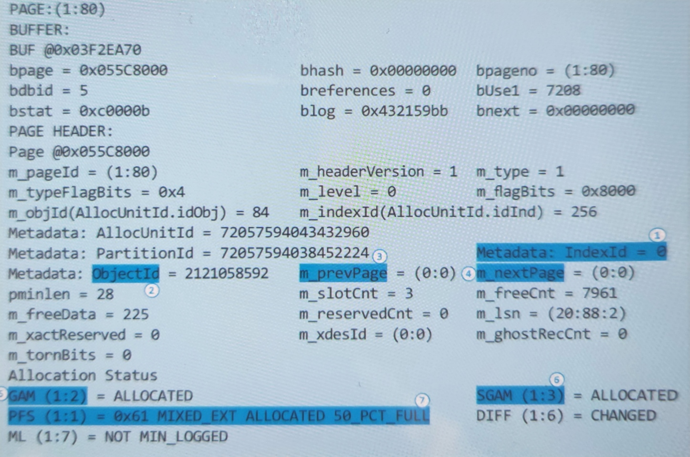

[5]와 [6]에는 앞 장에서 다룬 GAM과 SGAM에 관한 정보가 출력 됐다. 다시 말해, 출력되어 있는 GAM/SGAM페이지에 이 페이지가 포함되는 익스텐트의 관리정보가 존재하는 것을 의미한다. 또한 [7]도 마찬가지로 앞 장에 등장한 PFS에 관한 정보이다. 'INDEX_EXT_ALLOCATED'에서 이 페이지가 혼합 익스텐트에 할당되어 있는 것을 확인 할 수 있다. 또한 '50_PCT_FULL'에서는 페이지의 사용률이 약 50%인 것을 확인 할 수 있다.

**b.출력옵션 : '1'**</br>
실행한 커맨드

```sql
DBCC PAGE('DB1',1,80,1)
```

다음과 같이 헤더 정보에 추가해서 실제의 데이터 부분 내용이 출력된다.(헤더 부분의 출력 내용은 앞서 말한 a.와 같으므로 해설은 생략한다.) 데이터 부분의 정보는 페이지에 저장되어 있는 행별로 출력된다. 각 행은 Slot으로 표현되며 페이지 후반(밑선 8)의 오프셋 테이블 번호와 대응하고 있다. 실 데이터는 16진수로 표현되며 16바이트별로 성형되어 있다. 각 행의 오른쪽 부분에 표시가능한 문자열 등이 출력됐다.

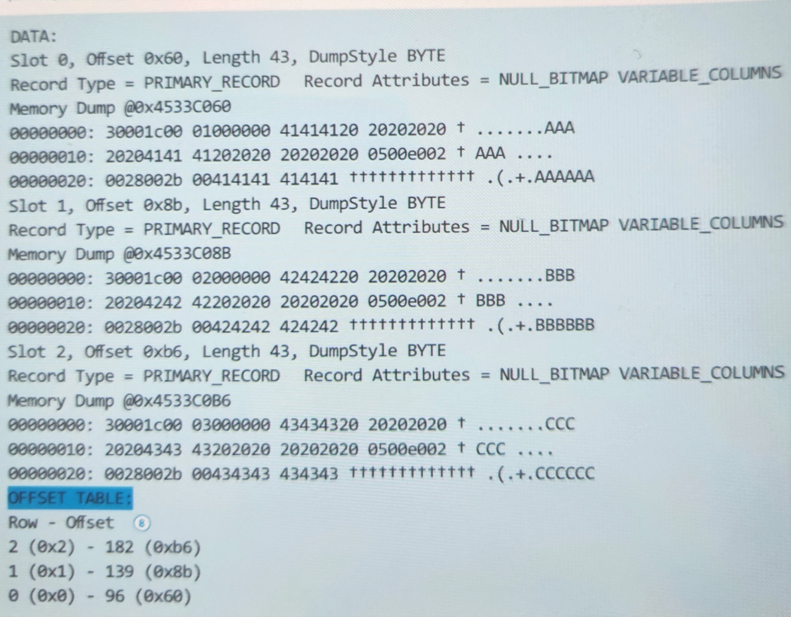

**c.출력 옵션 : '2'**</br>

실행한 커맨드

```sql
DBCC PAGE('db1',1,80,2)
```

출력 옵션 '2'를 지정하면 단순하게 페이지의 내용은 16진수의 덤프로 출력된다. 16바이트가 1행으로 성형되고 1페이지분(8kb)의 모든 내용이 출력된다. 아울러 표시 가능한 문자는 오른쪽에 출력된다.

준비단계에서 삽입한 'AAA'와 'BBB'와 같은 문자열을 확인 할 수 있다. 또한 헤더부분의 정보도 출력되지만 내용은 앞서 말한 a.와 같으므로 해설은 생략한다.

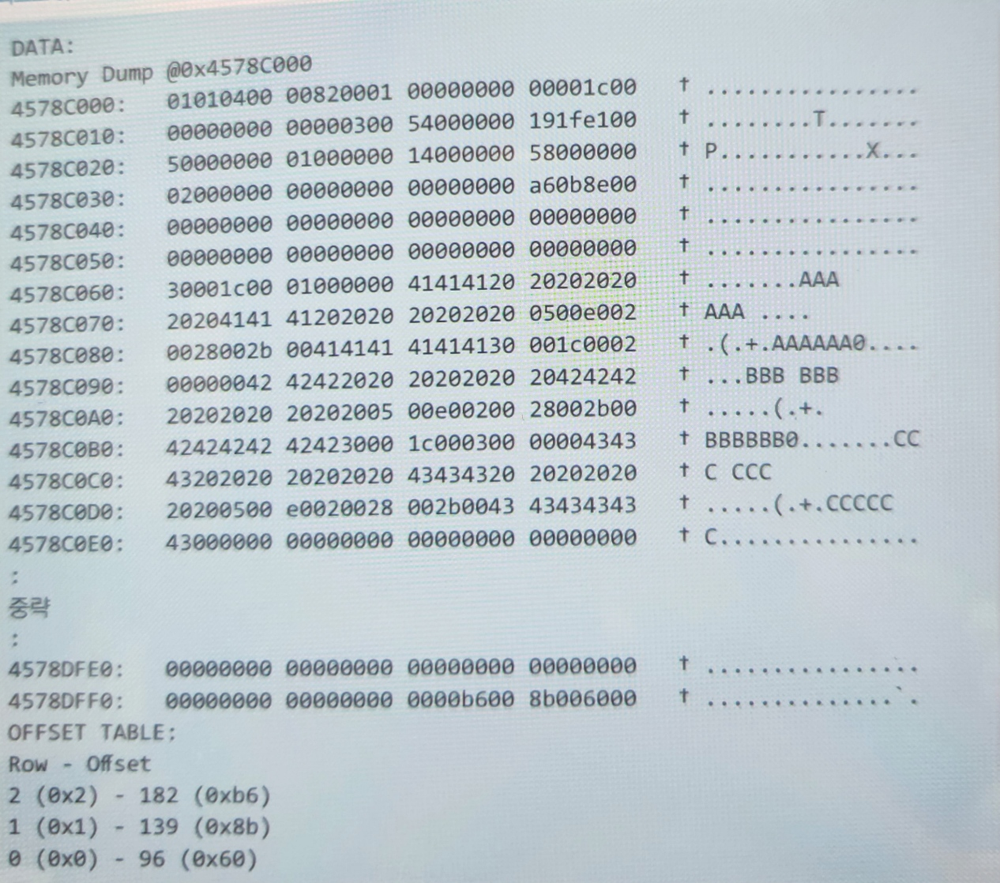

**d.출력 옵션 : '3'**</br>
실행한 커맨드

```sql
DBCC PAGE('db1',1,80,3)
```

출력옵션 '3'에서는 출력 옵션 '1'의 내용에 추가해서 각 열의 이름과 저장되어 있는 값이 각각의 행별로 성형되어 출력된다.

때문에 가장 이해하기 쉬운 출력 형식이라고 할 수 있다. 한편 앞서 말한 a. 및 b.와 중복하는 출력 내용은 생략한다.

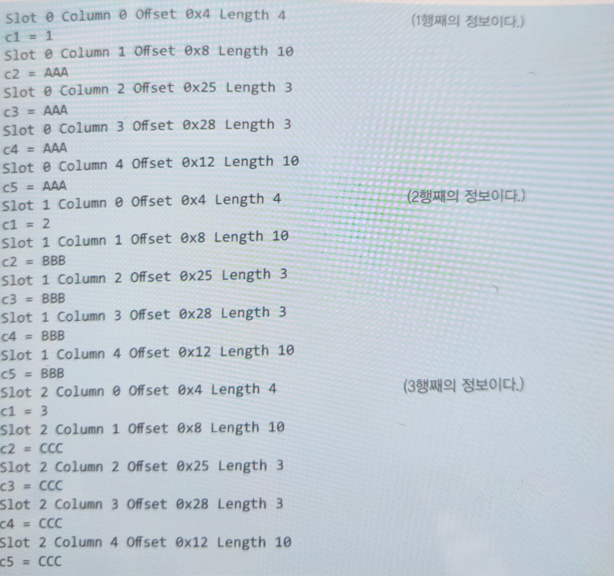

## 6장 칼럼스토어(Columnstore)형 오브젝트(칼럼스토어 인덱스)

앞 장에서 데이터를 테이블의 행별로 저장하는 로우스토어형 테이블에 대해 설명했다. 이 장에서는 이어서 열별로 저장하는 칼럼스토어형 오브젝트(칼럼스토어 인덱스)에 대해 자세하게 설명한다.

### 6.1 칼럼스토어 인덱스 도입 배경

SQL 서버 뿐만 아니라 구조화 데이터를 대상으로 한 대다수의 릴레이셔널 데이터 베이스 관리 시스템에서 데이터베이스 내에 데이터를 저장하는 방식으로 우선 로우스토어형이 채용됐다.

로우스토어형 데이터 저장방식이란 테이블의 정의에 따라서 1행별로 페이지에 배치되는 방식이다.

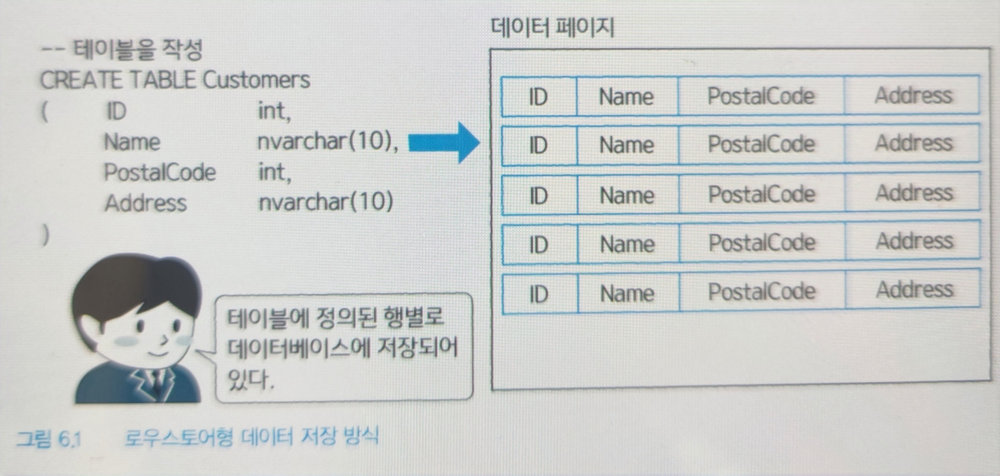

이 방식에서는 데이터를 보관한 페이지를 메모리에 읽어들이면 당연히 테이블에 정의된 모든 열이 메모리에 전개된다. 그러나 로우스토어형 데이터 저장소에 의한 데이터 액세스 방법이 항상 효율적인 것은 아니다. 왜냐하면 많은 경우 애플리케이션과 레포트가 테이블 내의 모든 열을 필요로 하는 것은 아니기 때문이다.

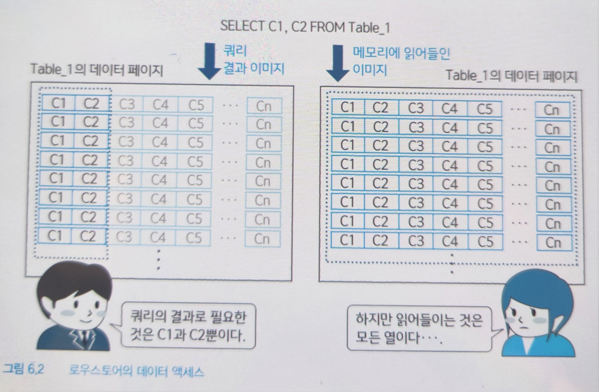

그럼에도 불구하고 모든 열을 항상 메모리상에 읽어들이면 불필요한 열을 디스크에서 읽어들이는 I/O의 오버헤드를 발생시킨다. 나아가 읽어드린 열을 보관하는 메모리 영역도 쿼리 단독으로 생각하면 낭비된다.

쿼리의 대상이 되는 행 수가 많아지면 많아질 수록 그런 오버헤드는 늘어난다. 그렇다고 해도 행 이미지로 데이터가 저장되어 있기 때문에 본래는 불필요한 열을 읽어들이는 동작을 막을 수 는 없다.

또한 이 동작을 시스템의 워크로드라는 관점에서 생각하면, OLTP를 위해 설계된 데이터베이스는 고도로 정규화되어 있는 일이 많기때문에 읽어드릴 필요가 없는 열은 비교적 적다고 할 수 있다.

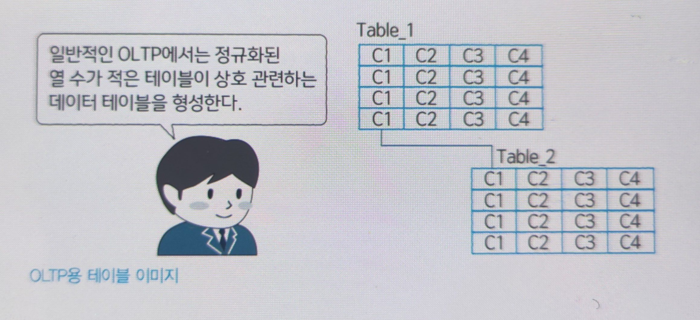

한편 축적한 데이터를 분석하기 위한 데이터를 저장하는 데이터베이스(데이터 마트나 데이터 웨어하우스)에서는 엄밀하게 정규화된 데이터 보다 농장으로 데이터를 유지하는 편이 효율적으로 분석/리포트를 실시할 수 있기 때문에 테이블 하나당 보관하는 열은 많아지는 경향이 있따. 이러한 경우는 행 이미지 데이터 오버헤드 영향을 크게 받는다.


SQL 서버는 대량의 데이터 처리가 필요한 데이터 웨어하우스 시스템에서 보다 좋은 퍼포먼스를 발휘하기 위해서는 이 동작을 개선할 필요가 있었다. 이를 위해 구현된 기능이 칼럼스토어 인덱스이다.

칼럼스토어 인덱스의 초기 버전은 SQL 서버 2012에서 구현됐다. 그러나 이 버전에서는 큰 제한 사항이 있었기 때문에 사용자가 많지는 않았다. 이후 버전마다 기능이 개선되어 SQL 서버2016 이후에는 수많은 시스템에서 채용됐다.

### 6.2 아키텍처/구조

그러면 칼럼스토어 인덱스의 구조를 확인하자. 기존의 데이터 구조에서는 테이블의 행별로 저장됐다. 한편 칼럼스토어 인덱스에서는 열 단위로 데이터를 저장한다.

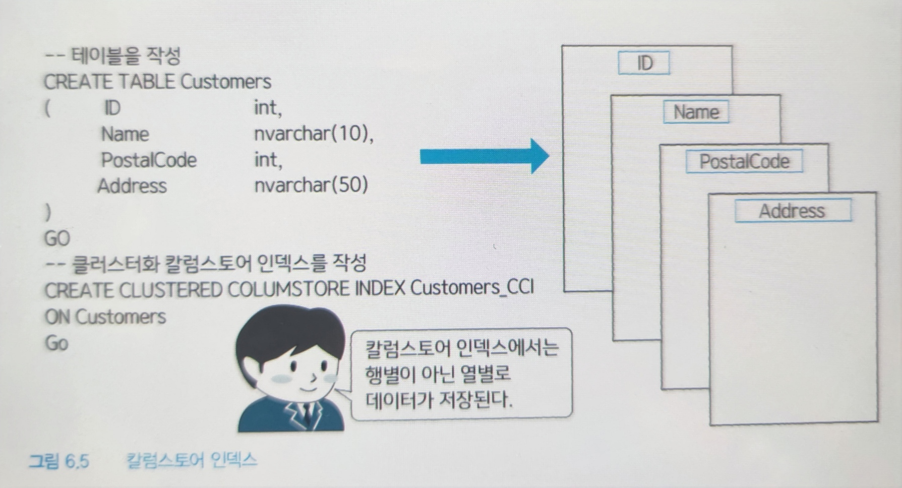
열별로 데이터를 보관함으로써 액세스 하는 대상을 쿼리에서 필요한 데이터에만 한정할 수 있다. 이로써 우선 필요한 디스크 I/O 수를 줄일 수 있다.

